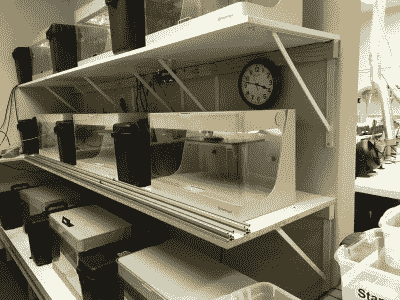
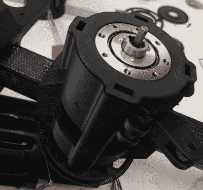
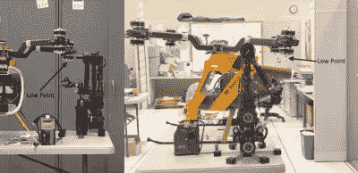

# Dexter 机械臂以首个微型工厂拥抱新制造

> 原文：<https://hackaday.com/2020/03/09/dexter-robot-arm-embraces-new-manufacturing-with-first-micro-factory/>

赢得 2018 年 Hackaday 奖的 Dexter 机器人手臂背后的公司 hadding ton Dynamics[已经开设了第一家微型工厂，为澳大利亚和东南亚制造机器人手臂](https://www.hdrobotic.com/blog/microfactory-australia)。

你可能还记得 Dexter 的构造和能力的结合让它在机器人项目中脱颖而出。全关节机器人臂可以进行运动训练；它记录了你如何移动手臂，并且可以高精度地回放，而不需要用代码来教授。高精度归功于[一个聪明的编码器组成，它利用 FPGA](https://hackaday.com/2018/11/15/an-in-depth-look-at-dexter-the-robotic-arm/)的能力来放大其光学编码的粒度。它采用先进的制造技术，将 3D 打印和胶合零件与大规模生产的齿轮、皮带、轴承和电机结合起来。

这是一个多功能的机器人手臂，成本只有之前的几分之一，具有巨大的定制潜力。我提到过它是开源的吗？

## 什么是微工厂？

3D-Printer farm used by Haddington Dynamics at their HQ. Note the rails designed for Dexter to remove parts from printers as they are completed

简单地说，微型工厂是哈丁顿动力公司团队在他们目前位于拉斯维加斯的总部所拥有的工具和技能的再创造。在他们的办公室里有四个生产站，每个能够一次制造两个机器人，这个团队一个月可以制造 30 个机器人。

微型工厂模式许可这项技术。那些将在新地点工作的人会到总部接受建造机械臂的培训。他们把这些知识带回去，用同样的工具和材料开始在他们自己的地方生产机器人。

第一个微型工厂生产的机器人手臂于 2020 年 2 月 24 日在澳大利亚图文巴完成，距离布里斯班内陆约 120 公里(75 英里)。目前有两名员工在新的 DCISIV Technologies 工厂工作，他们的近期目标是每月生产 32 台机器人，员工人数为 4 人。

## 为什么不是传统制造业？

A combination of 3D printed and carbon fiber materials being assembled into a Dexter robot arm

那么，为什么不干脆在传统工厂里开店，以最快的速度生产机器人手臂，并把它们堆放在货盘上呢？

首先，总销量还没有达到。但是现在大约有 300 个机器人分布在 20 多个不同的国家，不难看出它们确实需要提高生产能力。推动他们组装方法的直接因素是零件的复杂性，以及他们对定制和改进设计能力的渴望，而没有令人头痛的工厂重组。

目前的设计包括难以或不可能注射成型的零件，以及其他由碳纤维等材料制成的零件。因此，他们使用 3D 打印技术制造他们的许多部件，从 PETG 和尼龙材料，到碳纤维增强尼龙的组合([称为缟玛瑙丝](https://markforged.com/materials/onyx/))到[连续碳纤维丝](https://markforged.com/materials/carbon-fiber/)。对于多种材料的零件，在胶合过程中使用模具来对齐所有的东西。模具和 3D 打印机本身都是微型工厂模型专用设备的一部分。你可以在[的组装图片画廊](https://photos.app.goo.gl/jGmsnxtytvdYhgUi8)或者从这个[的十一集视频系列](https://www.youtube.com/watch?v=AYD2PSslqfU&list=PLEJQ7hsad17fC2tqTDGNFI_LPk1kX2aE6)中查看紧张的制造过程。

 地平线上出现了一些非常有趣的事情。在启动时，这些微型工厂中的每一个都被用来制造机器人手臂。但是没有理由它们不能用来做别的东西。哈丁顿动力公司希望看到机器人制造机器人。第一次迭代是 3D 打印机，我们假设它是一种机器人，制造机器人手臂。下一次迭代可能是机器人手臂做建筑。

同样值得注意的是，这种模式理清了复杂的供应链。大多数零件都是现场制造的。其余的是普通商品，如螺杆和紧固件。甚至轴承也来自普通的大规模生产项目，如摩托车轮毂轴承和直排轮轴承。如果这些部件出现短缺，完全有可能迅速重新设计制造的部件，以适应替换部件。

## 德克斯特的未来会怎样？

如前所述，Dexter 的一个主要特点是训练机械臂非常容易。下面的视频显示，两只手臂正在接受训练，从水龙头中取出一品脱啤酒。一个人使用特殊的末端执行器来拿起杯子，另一个人操作龙头。

 [https://www.youtube.com/embed/wVUsNT75h5I?version=3&rel=1&showsearch=0&showinfo=1&iv_load_policy=1&fs=1&hl=en-US&autohide=2&wmode=transparent](https://www.youtube.com/embed/wVUsNT75h5I?version=3&rel=1&showsearch=0&showinfo=1&iv_load_policy=1&fs=1&hl=en-US&autohide=2&wmode=transparent)

这是展示机器人能力的一个很好的方式，但是现实世界的应用离这种类型的技能并不远。这个团队告诉我，他们正在设计一套使用 Dexter 打坐的程序。对于那些无法亲自与人类教练联系的人，机器人手臂可以精确地记录和回放所用的动作。

Dexter project being tailored to serve as an inspection robot in NASA’s Fit2Fly program

他们还与美国宇航局合作，建立了一个商业无人机认证协议。送货公司正迫不及待地想让自动化无人机送货到位，美国联邦航空局试图跟上建立安全法规的步伐。大型无人机需要每飞行 100 小时检查一次机身，任何超出视线飞行的无人机(送货无人机的目的)都需要在每次飞行中重新认证其电子设备的完整性。这对于一个自主交付系统来说是劳动密集型的，德克斯特的任务是通过美国宇航局的 Fit2Fly 计划 (PDF)为机身和电子设备[进行自动化无人机检查过程。](https://nari.arc.nasa.gov/sites/default/files/attachments/02-Fit2Fly_2019_CAS_Showcase_v1.2.pdf)

Dexter 正在一所大学用于干细胞研究，杜克大学的机器人学生最近完成了将 Dexter 与机器人操作系统结合使用的工作。其中两个机器人将被送往劳伦斯利弗莫尔国家实验室，尽管该团队还不确定它们将扮演什么角色。回到制造自动化前沿，哈丁顿动力公司正在研究一项协议，使用机器人手臂来制造电缆线束，这是一项通常由人类完成的灵巧工作，如果实现自动化，机器将非常昂贵。

未来是自动化，德克斯特让这个未来看起来像一个美好的明天。