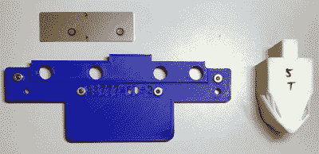

# 3D 打印工具冲压超过其重量，增加了硬件

> 原文：<https://hackaday.com/2020/03/09/3d-printed-tooling-punches-above-its-weight-with-added-hardware/>

Reddit 用户[thetelltalehart]一直在用 3D 打印的 PLA 制作压弯机模具，[最近分享了一张混合动力压弯机冲头](https://www.reddit.com/r/functionalprint/comments/feek7g/pla_is_starting_to_punch_out_of_its_weight_class/)的有趣图片，显示在右边，蓝色。

Printed in PLA, with 80% infill and 12 walls, the tool (right) failed at 5 tons.

在压力机中，通过在工具周围挤压材料，使材料(如金属板)成形。一些类型的工具可以 3D 打印，事实证明，打印工具不仅快速经济，而且具有惊人的弹性。你可以在我们之前关于这种方法的报道中看到这样的工具在起作用[这里](https://hackaday.com/2019/10/08/3d-printed-tools-for-quick-press-brake-jobs/)和[这里](https://hackaday.com/2018/01/14/aluminum-no-match-for-3d-printed-press-brake-dies/)。

[Thetelltalehart]之前的工作是在 80%填充和 12 面墙的情况下打印的，在 5 吨的时候失败了。新的混合工具增加了一些通用硬件，以很少的额外费用或复杂性增强了工具。这种新工具在失效前重达 7 吨。这是一个聪明的想法，而且显然是有效的。

这些 3D 打印工具的目标有两个:做短期工作，以及在开发“真正的”工具时减少昂贵的返工。因为工具在某些方面不太正确而不得不重新切割工具是昂贵且昂贵的，而使用 3D 打印代替金属来完成这一过程更容易也更便宜。