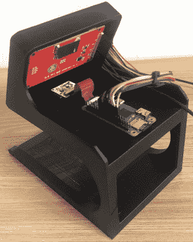

# 用这个物理比特币龙头来分配密码

> 原文：<https://hackaday.com/2020/03/09/divvy-out-the-crypto-with-this-physical-bitcoin-faucet/>

对于那些不熟悉这个术语的人来说，“比特币水龙头”通常被用作软件中的一种激励，希望引起你的注意。完成一个验证码或者看一个广告，你就会得到百万分之一的 BTC，诸如此类的东西。你永远不会因为其中一个而变得富有，但是大多数人也不会拒绝免费的钱。来自[TJ Bruno]的最新项目遵循了同样的概念,并将它带入了现实世界。但是你仍然不会因此而发财。

 这个有形的比特币龙头所用的硬件相当简单。你所需要的只是一个树莓派，一个摄像头模块和一个 2.8 英寸的触摸屏。当然，如果你想的话，你可以使用更大的屏幕，但是它不适合[TJ]开发的非常光滑的 3D 打印支架。我们可能会考虑升级到一个稍微快一点的 Pi，但是在演示视频中，Zero 似乎在很努力地处理 GUI。

使用水龙头很简单。你点击屏幕，将代表你的比特币钱包的二维码放在设备的托盘上，由摄像头扫描。几秒钟后，水龙头会在自己的屏幕上显示一个二维码，将你手机的浏览器指向交易细节，这样你就可以验证你的数字货币正在路上。

你可能想知道为什么你会想要一个设备，坐在那里等着支付一小部分 BTC 给任何愿意向它炫耀钱包的人。我们不完全确定，尽管这可能是一种提高对加密货币认识的有趣方式。不过在这个特殊的例子中，[TJ]说他只是在寻找一个项目，让他有机会磨练自己的 Python 技能。这些地方没什么问题。

[从我们独特的有利位置](https://hackaday.com/2019/01/29/now-thats-what-i-call-crypto-10-years-of-the-best-of-bitcoin/)观察加密货币的发展，我们可以看到黑客对比特币的兴趣是如何随着时间的推移而变化的。我们曾经看到人们[对建造定制采矿设备](https://hackaday.com/2014/02/10/wow-such-mining-rig-so-amaze/)感到兴奋，现在我们看到随着最后一枚硬币投入流通，计数器[滴答作响。看着这样的项目，黑客们似乎很乐意以一种有趣的方式把东西送出去。](https://hackaday.com/2019/01/31/raspberry-pi-counts-down-to-the-last-bitcoin/)