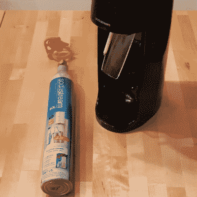

# 二手汽水缸变成 DIY 罐装空气

> 原文：<https://hackaday.com/2020/03/17/used-soda-stream-cylinder-becomes-diy-canned-air/>

 汽水贩卖机使用一个压缩二氧化碳的钢瓶来充碳酸气，对于机器来说是“空的”钢瓶实际上还有少量气体留在里面。用户[Graldur]分享了一个聪明的设计，通过将[变成一个临时的压缩气枪](https://www.prusaprinters.org/prints/24291-soda-stream-air-gun)，可以将面包屑或灰尘从键盘内部等不方便的地方吹出来。它是在 PETG 3D 打印的，上面有一个用 Ninjaflex 打印的印章。

[Graldur]的 3D 打印组件拧到一个“空”圆柱体的顶部，当底部的环像扳机一样被压下时，阀门会稍微打开，逸出的气体会通过前面的一个狭窄的孔转移。因此，它可以像一罐压缩空气一样使用。如果需要更高的精度，气体出口甚至可以容纳 WD-40 罐(或一次性压缩空气罐)中的狭窄塑料管。

该设计旨在用于几乎空的钢瓶，但即使如此，[Graldur]也指出，它被设计成无论如何用力都无法完全启动钢瓶的释放阀，所以不要不小心修改东西。我们还注意到，这种设计让用户的手和手指远离商业目的。

这个设备还让我们想起了过去的一个实验，利用 3D 打印技术制造出可使用的(尽管压力很低)定制形状的 3D 打印压缩空气罐。