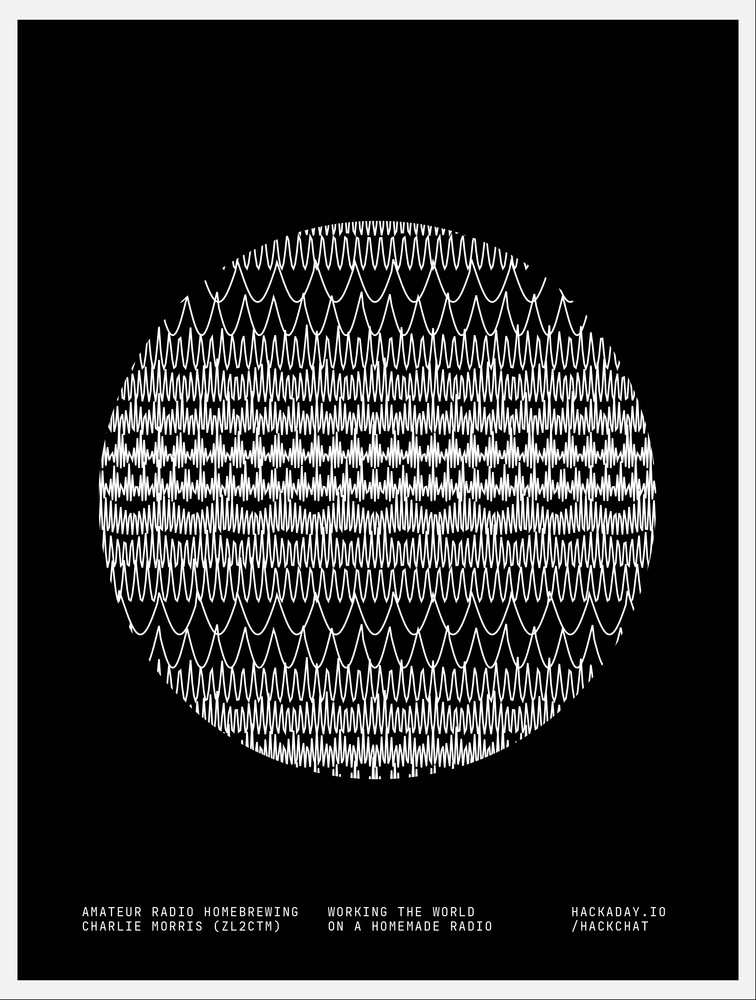

# 业余无线电家用黑客聊天

> 原文：<https://hackaday.com/2020/03/16/amateur-radio-homebrewing-hack-chat/>

加入我们太平洋时间 3 月 18 日星期三中午与查理·莫里斯的[业余无线电自制黑客聊天](https://hackaday.io/event/169987-amateur-radio-homebrewing-hack-chat)！

对许多业余爱好者来说，业余无线电最吸引人的部分是自制。持有一个不仅允许你使用公共电波，而且允许你自己构建这样做的方法的许可证是有一定声望的。自制收音机的设计范围很广，从只有几个晶体管和几个手绕线圈的简单设计，到在功能和质量上与商业收发器相媲美的成熟设备，有时甚至超过它们。从天线到背部的每一个齿轮都是火腿做的，在许多方面，家酿者推动了业余无线电技术，推动了艺术的发展。

不过，投身于自制葡萄酒可能会令人望而生畏。射频世界的神秘可能是一个进入的障碍，从“去过那里，做过那件事”的人那里得到一些指导可能是突破的关键。新西兰火腿查理·莫里斯(ZL2CTM)在他的 YouTube 频道上为具有冒险精神的家酿者充当了这样一个向导，在那里他以清晰简洁的步骤展示了他的电台项目。他带领观众经历了他构建的每一个步骤，详细描述了每个模块的设计，并仔细检查了每个组件的选择。他很快表示，他的视频不是教程，但它们确实教授了很多关于家酿艺术的知识，你会从每个视频中获得新的技巧或诀窍，值得在你的家酿设计中尝试。

查理将加入我们这个星期三的黑客聊天，讨论所有的事情。带着你在 DIY 业余无线电上迫切的问题停下来，询问一些 Charlie 以前的项目，看看他接下来要去哪里。

 我们的黑客聊天是 [Hackaday.io 黑客聊天群发消息](https://hackaday.io/messages/room/2369)中的社区直播活动。本周，我们将于太平洋时间 3 月 18 日星期三中午 12:00 坐下来讨论。如果时区让你烦恼，我们有[一个方便的时区转换器](https://www.timeanddate.com/countdown/generic?iso=20200318T12&p0=224&msg=Amateur+Radio+Homebrewing+Hack+Chat&font=cursive)。

点击右边的那个发言气泡，你会被直接带到 Hackaday.io 上的黑客聊天群，不用等到周三；随时加入，你可以看到社区在谈论什么。

