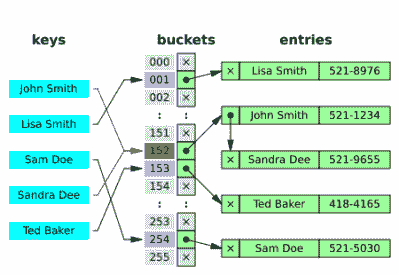

# 本周安全:SMBv3、AMD 和英特尔以及华为后门

> 原文：<https://hackaday.com/2020/03/13/this-week-in-security-smbv3-amd-and-intel-and-huawei-backdoors/>

准备好接受更多推测性的死刑消息了吗？希望如此，因为英特尔和 AMD 都是本周的新闻。

第一个故事是[加载值注入](https://lviattack.eu/)，读取任意内存的不同方法。LVI 没有尝试读取受保护的内存，而是通过将数据注入目标的数据来扭转局面。处理器基于该坏数据推测性地执行，最终发现错误，并解除执行。与其他类似的攻击一样，这种执行仍然以攻击者可以察觉的方式改变了处理器的底层状态。

LVI 可能成为问题的实际攻击媒介是什么？想象一个场景，其中一台服务器托管多个虚拟机，并使用英特尔的安全卫士扩展包来保护虚拟机的安全。这次攻击的低级性质意味着甚至 SGX 也不安全。

好的一面是，这种攻击很难得逞，对家庭用户来说不算什么威胁。另一方面，建议修复的[性能损失可能相当严重](https://www.phoronix.com/scan.php?page=article&item=lvi-attack-perf&num=1)。这个漏洞还处于生命周期的早期，所以请密切关注进一步的更新。

### AMD 的外卖 Bug

AMD 也发现自己在[的接收端受到了一次投机性的执行攻击](https://www.zdnet.com/article/amd-processors-from-2011-to-2019-vulnerable-to-two-new-attacks/) ( [PDF 原文此处](https://mlq.me/download/takeaway.pdf))。Collide+Probe 和 Load+Reload 是一个国际学术团队发现的两种特定攻击。这些攻击基于对用于加速缓存访问的哈希函数的逆向工程。虽然这不会像 Spectre 和 Meltdown 那样泄露受保护的数据，但它仍然会泄露 CPU 的内部数据。时间将会告诉我们这项技术在未来会走向何方。

为了真正理解这里发生了什么，我们必须从[散列表](https://en.wikipedia.org/wiki/Hash_table)的概念开始。这个想法是一个有用的代码范例，随处可见。Python 词典？引擎盖下的散列表。

Hash table image from [Wikipedia](https://en.wikipedia.org/wiki/Hash_table#Collision_resolution) by [Jorge Stolfi](https://en.wikipedia.org/wiki/Hash_table#/media/File:Hash_table_5_0_1_1_1_1_1_LL.svg)

假设您有一个包含一千个值的集合，并且需要检查某个特定值是否是该集合的一部分。迭代整个值集是一个计算开销很大的提议。另一种方法是构建一个哈希表。创建一个固定长度的数组，比如 256。技巧是使用哈希函数将值排序到这个数组中，使用哈希输出的前八位来确定每个值存储在哪个数组位置。

当您需要检查集合中是否存在某个值时，只需通过哈希函数运行该值，然后检查与哈希输出相对应的数组单元格。你可能在数学上领先于我——是的，那计算出每个数组单元大约有四个不同的值。对于哈希表来说，这些哈希冲突是完全正常的。查找函数只是检查适当单元格中保存的所有值。这仍然比搜索整个表要快得多。

AMD 处理器使用哈希表功能来检查内存请求是否出现在 L1 缓存中。外卖研究人员弄明白了散列函数，并可以使用散列碰撞来泄漏信息。当哈希值冲突时，L1 缓存有两个独立的内存块，需要占用同一缓存行。它通过在加载冲突内存时简单地丢弃旧数据来处理这个问题。攻击者可以通过测量内存查找的延迟来滥用这一点。检查

如果攻击者知道目标数据的内存位置，他可以在不同的位置分配内存，这些内存将存储在相同的缓存行中。然后，通过重复加载分配给他的内存，他知道自上次检查以来目标位置是否被访问过。那会导致什么样的真实攻击？其中一个有趣的是映射出 ASLR/KASLR 内存的内存布局。还有人建议，外卖可以和幽灵袭击结合起来。

这个故事有两个有趣的地方。首先，一些人指出，在论文的致谢中出现了对英特尔的感谢。"英特尔的慷慨捐赠提供了额外的资金."这听起来好像英特尔一直在资助 AMD 处理器的安全研究，尽管不清楚这具体指的是什么。

最后，AMD 的[反应平平](https://www.amd.com/en/corporate/product-security)。在撰写本文时，他们的官方声明是“AMD 认为这些不是新的基于猜测的攻击。”既然这篇论文已经公开发表，那份声明将很快被证明是准确的或是错误的。

### 闭源隐私？

Google play 商店和 iOS 应用商店充满了提供隐私的应用程序，无论是 VPN、广告拦截器还是其他一些令人惊叹的应用程序。然而，这些应用程序中的绝大多数都是闭源的，这意味着你只能信任应用程序发布者，以确保你的隐私得到真正的保护。在传感器塔的例子中，似乎[信仰被可悲地放错了地方](https://arstechnica.com/tech-policy/2020/03/analytics-firm-harvested-ios-android-user-data-with-vpn-apps-report-finds/)。

这是一个典型的骗局，造纸公司似乎提供了 Luna VPN 和 Adblock Focus 等应用程序。虽然在技术上提供了他们声称提供的服务，但这两款应用的真正目的是将数据发送回传感器塔。如果可能的话，开源是一条出路，但即使是开源应用也不能保护你免受恶意 VPN 提供商的攻击。

### 华为后门

我们没有太多谈论它，但美国政府和华为之间一直存在各种各样的世仇。几周前,《华尔街日报》发表了一篇文章，指责华为故意在他们的网络设备中嵌入后门。华为[在 Twitter 上发布回应](https://twitter.com/Huawei/status/1235128718869164032)，声称他们设备中的后门实际上仅用于合法访问。官方的否认[让我想起了某个瑞士公司……](https://hackaday.com/2020/03/02/project-rubicon-the-nsa-secretly-sold-flawed-encryption-for-decades/)

> “[#后门](https://twitter.com/hashtag/backdoor?src=hash&ref_src=twsrc%5Etfw)”这个词看起来吓人吗？这是因为它经常被错误地使用——有时是为了故意制造恐惧。观看了解后门和其他类型的网络访问的真相。pic.twitter.com/NEUXbZbcqw[#网络安全](https://twitter.com/hashtag/cybersecurity?src=hash&ref_src=twsrc%5Etfw)
> 
> —华为(@华为)[2020 年 3 月 4 日](https://twitter.com/Huawei/status/1235128718869164032?ref_src=twsrc%5Etfw)