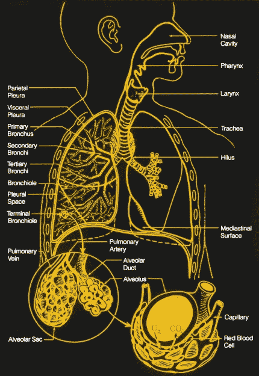
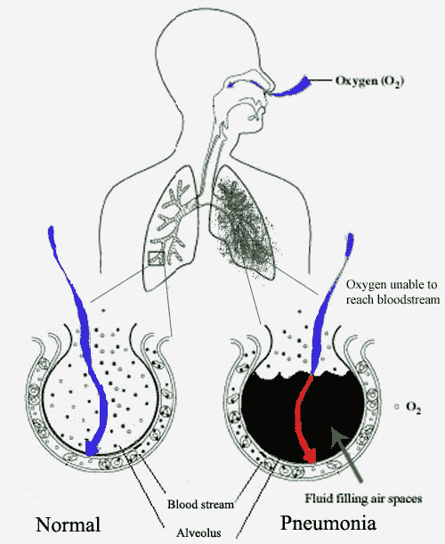
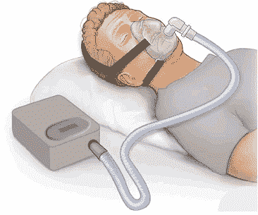

# 呼吸机 101:他们做什么和他们如何工作

> 原文：<https://hackaday.com/2020/03/25/ventilators-101-what-they-do-and-how-they-work/>

治疗最严重的新冠肺炎病例需要使用呼吸机。我们都听说过这个，也听说过这些设备的短缺。但是没有一种单一类型的呼吸机，并且当涉及到用于治疗的辅助呼吸时，这种类型的机器不是唯一的选择。信息就是力量，更好地理解这个话题将有助于我们更好地理解形势。

我们最近写了一篇关于一个脸书组织的文章，该组织专注于开源呼吸机和其他可以帮助新冠肺炎疫情的技术。有大量的支持，虽然社区在建造东西方面很棒，但很明显我们都需要更多关于医生目前正在处理的问题的信息，以及现有设备是如何解决这些问题的。

不过，这是一个又长又复杂的话题，所以去拿你剩下的检疫点心，让我们开始吃吧。

随着我们的深入，让我们来解决术语中的一个常见混淆点:呼吸器是旨在保护佩戴者的口罩，比如防止卫生工作者吸入携带冠状病毒的颗粒，而呼吸机是患者用来帮助他们充分呼吸的设备。

## 我们的肺是如何工作的

Image Source: [Wikimedia Commons](https://commons.wikimedia.org/wiki/File:Poumons2.jpg)

我们的呼吸系统做两件事:它将氧气带入体内，并将二氧化碳排出体外。它通过从大气中吸取空气，使其通过肺部越来越小的结构，最终到达毛细血管；这些微小的“静脉”能够让单个分子进出血流。

 最简单的方法是将这个呼吸系统想象成一棵倒置的树:一个大树干(气管)一遍又一遍地分支(细支气管)，以完成气体转移的微小叶子(肺泡)结束。肺泡是像葡萄串一样的微小结构，覆盖着毛细血管。毛细血管将氧气分子扩散到血液中，由血细胞携带，并将二氧化碳带走。这种机制是由血细胞中 O2 和 CO2 浓度与空气中 O2 和 CO2 浓度之间的压差驱动的。重要的部分是表面积，因为可用于实现气体转移的毛细血管表面积越大越好，这就是为什么肺是许多微小的球体而不是两个巨大的空腔。

呼吸(吸气和呼气)有助于气体转移。身体需要不断地排出富含二氧化碳的空气，并吸入新鲜的富氧空气，而这是通过改变肺部的容积来实现的。横膈膜(位于肺部下方)和肋间肌(位于肋骨之间)都起到扩张肺部的作用。这增加了肺部的容积，空气涌入并充满了每个小肺泡的容积。呼气是一个非常被动的过程；肌肉放松并恢复到自然状态，就像被拉伸的橡皮筋恢复到自然状态一样。主动呼气需要额外肌肉的努力。

在这个系统的内部，有一些叫做[纤毛的小毛发和产生粘液的细胞](https://en.wikipedia.org/wiki/Respiratory_epithelium)。他们的工作是捕获已经被吸入的废物和外来颗粒，并将它们向上推出，在那里它们进入食道和消化系统。

有很多事情会导致这个微妙的系统出现问题。如果分支被堵塞，比方说有太多的粘液，那么就有更少的表面积可供气体转移，人就不能以同样的呼吸量获得足够的空气。如果细支气管或毛细血管变得僵硬(例如，由于吸烟)或结疤，那么就很难挤出空气。如果肺部受损，肺泡会破裂，肺表面积减少，因此扩散受到损害。如果肺部发炎，气道就会收缩，很难让足够大的空气进出肺部进行气体传输。如果这个人呼吸太快，呼吸了很多空气，或者太慢，呼吸的空气不够，那么他们的血液气体浓度就会变得不正常。血液和身体中过多的二氧化碳会变成酸性，这是其他器官必须解决的问题。

在这个系统中还可能发生其他问题，例如大脑没有获得关于血液中二氧化碳和氧气含量的正确信号，或者大脑忘记告诉身体呼吸。这些并没有发生在新冠肺炎身上。

## 为什么呼吸成为一个问题

疾控中心有一份关于患者临床管理的良好指南，给出了疾病如何出现以及他们需要何种护理的统计数据。在经历新冠肺炎最严重症状的患者中，问题是肺炎(感染导致肺部充满液体)、呼吸困难(呼吸困难或吃力)和急性呼吸窘迫综合征(ARDS)。简单地说，病人呼吸不畅。

[https://commons.wikimedia.org/wiki/File:New_Pneumonia_cartoon.jpg](https://commons.wikimedia.org/wiki/File:New_Pneumonia_cartoon.jpg)

患者呼吸困难，因为肺炎导致过多的粘液产生和细胞感染，填充肺泡并阻塞分支，减少气体转移的表面积。可接近的肺泡仍然工作，但没有足够的肺泡来维持病人的生命。结果是呼吸困难和气体传输不足，这可能导致死亡。

根据世卫组织的数据，[大约 14%的感染者需要住院和氧气支持，5%的感染者需要入住 ICU](https://www.who.int/docs/default-source/coronaviruse/clinical-management-of-novel-cov.pdf?sfvrsn=bc7da517_10&download=true)。看看意大利的贝加莫，总人口的 14%在[压倒医院](https://catalyst.nejm.org/doi/full/10.1056/CAT.20.0080)，而在准备更充分的地方，或者曲线变平的地方，医疗保健系统压力较小。

意大利的医生表示，医院正在成为病毒传播的中心，如果可能的话，家庭护理可能是首选，特别是因为他们没有所需的所有资源。这就是促使 DIY 社区寻找快速开发这些资源的方法的原因。

## 我们如何提供辅助呼吸

有三种主要方法可以帮助那些难以将氧气吸入血液和排出二氧化碳的人:

1.  打开他们的气道以增加表面积
2.  增加空气中的氧气含量
3.  让他们更容易吸入大量的空气

由于空气中 78%是氮气，1%是氩气，21%是氧气(还有其他气体的痕迹)，通过增加氧气的百分比，在气体传输方面有很大的改进空间。二氧化碳比氧气更容易扩散，所以通常排出二氧化碳不成问题。在家里，这是通过氧气浓缩机或输送罐来完成的。在医院中，这是通过中央 O2 完成的。

另一件要做的事情是打开更多的这些通道，清除堵塞，并得到所有这些肺泡。其中一个方法和治疗睡眠呼吸暂停的方法一样；正气压。通过在所有分支中施加正气压，它有助于保持这些气道的开放，就像轻轻吹大一个气球可以防止它坍塌一样。唯一的问题是，我们在这里谈论的“气球”是由已经受压的脆弱组织制成的，过度加压是灾难性的。

我们还帮助在仍然可以到达的肺泡中进行更多的气体转移。这可以通过帮助病人努力吸气来实现，也是用正气压。对于患者来说，呼吸困难意味着他们只是为了获得足够的空气而筋疲力尽，因此辅助吸气是必要的，这通常是呼吸机成为治疗的一部分的原因。

这三件事的最终目标是给病人时间来产生抗体和对抗病毒，并清理肺部，因此病人可以在长达两周的时间内接受机械辅助。

## 通风机

呼吸机可以帮助解决这些问题。它不产生氧气，但是将提供的氧气通过它输送给病人。根据感染的严重程度有多种。理想情况下，你需要 NIV，或者使用外部面罩的无创通气。有创通气需要将气管造口术或气管内导管插入鼻子或嘴中向下进入肺部，这是一个非常困难和危险的过程，只能由医疗护理机构中的合格医生来完成，并且会导致其他并发症。

A CPAP machine creates heated, humidified, positive air pressure in the airway through a sealed face mask. By [PruebasBMA](PruebasBMA&action=edit&redlink=1) – Own work, [CC BY-SA 3.0](https://creativecommons.org/licenses/by-sa/3.0 "Creative Commons Attribution-Share Alike 3.0"), [Link](https://commons.wikimedia.org/w/index.php?curid=18885672)

为了更好地解释呼吸机，让我们从 CPAP 开始，一步步来。持续气道正压通气的简称，CPAP 吸入正常空气并将其压缩，然后通过软管将较高压力的空气输送至面罩。通常压力在 4-20 厘米 H2O 之间。如果你从未使用过，想象一下在游泳池中长大，头露出水面，肺部不断将水排出体外进行呼吸，几年后你才从游泳池中出来。你的肌肉需要做的工作要少得多，这样空气就很容易进入。CPAP 是同样的概念；通过供应更高压力的空气，你的肺部比其他情况下更少工作来吸气，并且他们可以进行更深更充分的呼吸。更重要的是，压力可以防止通道坍塌。呼气稍微困难一些，但是记住这是一个被动的过程；肺部和肌肉的自然弹性可以克服增加的压力，当然是在一定限度内。

BiPAP 是更上一层楼。通过一些奇特的感应，有可能检测到呼气开始，然后降低呼气的压力水平，使呼气更容易。你会看到一个 IPAP 和一个 EPAP 数，分别是吸气压力和呼气压力。注意，在这两种情况下，它仍然是正气压；我们也不能让通道在呼气时坍塌。另一个优势是，随着压力差的增加，你可以有更大的潮气量(每次呼吸进出的空气量，通常约为 500 毫升或 7 毫升/千克体重)，因为更大的 IPAP 允许更多的进入，而更低的 EPAP 允许更容易的呼出。

呼吸机是下一个合乎逻辑的步骤。它可以被动或主动调节压力，或两者都有特殊限制。例如，它可以允许患者在类似 BiPAP 的支持下自主呼吸，但确保患者每分钟至少呼吸一定次数，或者它可以完全接管呼吸过程，并在特定时间增加和减少压力，使患者在无法自主呼吸时呼吸。

有些呼吸机是为家庭使用而设计的，系统直接从病人体内排出呼出的空气，病人相对稳定。使用这些通气装置，导管可以连接到面罩或气管造口术导管上。

其他呼吸机是为医院急用而设计的。对于它们能够处理的各种治疗模式，它们具有复杂得多的接口。他们通常进行有创通气，将气管内导管插入鼻子或嘴中，并向下进入肺部。这里最大的因素是呼出的空气被系统捕获，过滤后才被释放。在患者患有传染性疾病的应用中，这一点尤为重要。

这些机器中的大多数都有一个额外的端口来接收供给的氧气。这可以是水箱，但不太可能，因为需要高流速。一台氧气浓缩机只能提供大约 10L/min 的氧气。在急性医院呼吸机的情况下，可能需要更多。大多数医院都有中央氧气供应系统，能够提供高达 50 升/分钟的氧气。

## 呼吸机设计的诸多挑战

现在你已经有了技术背后的基础，下面是一些具体的挑战。

*   你必须在人们戴在脸上的面具上有一个很好的封条。如果你密封不好，面罩就会漏气，你就无法保持正压。密封不良是这类装置失效的主要原因之一。
*   监控过期很重要。面罩必须允许呼出的气体离开，否则患者将会重新呼吸他们自己的空气。机器知道它排出多少，并在供应压力时考虑到这一点。当患者呼气时，呼出的空气不会进入机器，而是通过面罩的通风口进入空气中。在医院环境中，这将使病毒雾化，这将是非常糟糕的，这就是为什么医院有呼吸机设计，通过不同的管道收集呼出的空气并过滤。
*   你必须始终保持正压水平；如果有泄漏，你必须上升以保持压力水平，如果泄漏被堵塞，你必须立即下降。如果你超过预期的压力水平，你很容易对肺部造成伤害。压力通常在 4-40 厘米 H2O 范围内。这是一个非常重要的要求，因为搞砸了会造成很大的损失。
*   你必须加热和加湿空气。通常鼻窦在这方面做得很好，但在呼吸机上，这是不可能的，因为鼻窦可能被绕过。当空气太干燥时，会导致体温过低、支气管痉挛、额外的粘液产生(这是不好的，因为它阻塞了更多的通道)，或其他问题。
*   温暖潮湿的环境会滋生细菌，军团病是一种由细菌引起的严重肺炎，对已经患病的患者来说是一种严重的风险。不卫生的环境会很快导致比原有疾病更严重的问题。
*   你必须能够提供大量的氧气。便携式氧气浓缩机(POC)无法工作有几个原因；首先，它不能为目前需要补充氧气的病人抽出足够的氧气。第二，它只在检测到呼吸时释放氧气，但由于有正气压进入，POC 上的传感器不会工作。根据患者的需要，较大的氧气浓缩机可能就足够了，但是任何呼吸机设计都需要考虑氧气入口。
*   好消息是你只需要能够提供正压力；通风器不吸出肺部的空气。它们仅仅提供不同水平的正压，并让肋和隔膜的弹性来控制呼气。
*   要么你需要大量的传感器(除了流量和压力之外，还有 PaCO2、TcCO2、SpO2、FiO2)和复杂算法的能力，要么你需要一名专家持续监控患者。如果他们翻身并挤压管子，或移动并破坏密封，或变得激动，或他们的状况以任何方式改变，则可能需要改变机器的设置。在现有设备上运行的软件很复杂，这是有道理的。你可能不会考虑你一整天的呼吸频率，但你的身体会定期调整它需要的空气量，系统必须考虑到这一点。
*   一个成年男性的肺容积约为 5L，但潮气量约为 500mL。这意味着该系统需要能够为每次吸气提供至少 500 毫升的加压空气，并且可能需要为呼气保持施加压力。
*   任何设计都需要使用现成的现有零件进行制造。现在通风机短缺的原因是需求的增长速度超过了制造商的生产能力。他们已经拥有经过测试和验证的供应链、生产线、注塑模具和工作设计。唯一阻碍他们的是他们足够快地采购和组装零部件，然后分销的能力，你最好相信他们正在每个政府的帮助下，投入他们所能投入的一切资源，来解决他们现在面临的所有供应链问题。将曲线拉平的全部意义在于给每个人尽可能多的时间来解决问题。

## 使用呼吸机需要高技能的卫生保健工作者

除了机器的物理限制，你还需要训练有素的医生来监控病人。如果你能得到一个 DIY 的解决方案，这些是要考虑的其他事情。

*   每位患者都需要定期进行滴定和调整。这是一个计算给予患者治疗的正确水平的过程。有多个变量，如吸气压力和呼气压力，是机器还是人在引导呼吸循环，速率，传感器的灵敏度。由于疏忽而损伤病人肺部的风险很大。如果设置不完全正确，那么患者可能最终不得不做比没有机器时更多的工作来对抗机器，或者有不正确的血气平衡。例如，如果 EPAP 设置太高，患者吸入的可能多于呼出的，这显然不是可持续的解决方案。
*   供应气体中的氧气水平也是如此。由于增加氧气水平会导致易燃或易爆的情况，因此系统不泄漏以及传感器和保护到位以确保氧气以正确的量到达正确的位置非常重要。此外，供应过多的氧气会抑制大脑的“呼吸驱动”机制，这种信号告诉呼吸系统吸气和呼气，导致它们停止呼吸。
*   清洁是至关重要的，因为它可能会导致比原来的疾病更严重的问题，即使机器只使用了一周，保持机器清洁的能力也是至关重要的。
*   在大多数需要呼吸机的情况下，患者患有[共病(额外的医疗条件)，如高血压、糖尿病、心血管疾病和呼吸系统疾病](https://www.ijidonline.com/article/S1201-9712(20)30136-3/fulltext)(此处也称为)，这使得治疗更具挑战性。
*   最重要的是，如果患者的情况非常严重，以至于需要使用呼吸机，那么他们将需要立即护理，这意味着解决方案必须在医院环境中进行。[即使我们有多余的呼吸机，ICU 床位和重症护理人员的数量最终也会成为限制因素](https://www.sccm.org/getattachment/Blog/March-2020/United-States-Resource-Availability-for-COVID-19/United-States-Resource-Availability-for-COVID-19.pdf?lang=en-US)。
*   任何新设备都需要对护理人员进行培训，因此它需要像他们熟悉的现有设备一样工作，或者非常容易学习。
*   需要指出的是，适当的资源分配在这里很重要。我们不能让任何人囤积呼吸机以备不时之需，而人们却因为没有它们而濒临死亡。每台从生产线上下来的呼吸机都需要送到有需要的病人手中，我们应该尽可能地移动它们。

## 当前的制造工作

制造必要机械的公司很清楚这个问题，并且正在尽快提高产量。除了增加合适类型呼吸机的生产，他们还在寻找 CPAP 和 BiPAPs 以及非生命支持呼吸机，并探索采用这些医疗设备的方法，这些设备已经具备所有适当的安全机制和认证，生产线已经建立，并试图找到使它们适应新冠肺炎特定需求的方法。

他们目前最大的问题之一是供应链。中国关闭了很长一段时间。运输路线陷入混乱，航空公司航班减少，国家关闭边境，即使在最好的情况下，海运也需要一个月。我知道通用电气已经公开招聘工人在我写这篇文章的威斯康星州麦迪逊市的装配线上工作，我想世界各地的其他公司也在尽最大努力提高产量。班次增加了，流程尽可能并行化，注塑模具也预热了。建立额外的生产线可能会有所帮助，但这需要时间来制造所有必要的专用设备。即使新工厂可以快速重组，零部件的运输路线可能是更大的限制因素，而且很有可能一个专门的零部件将成为整个行业的限制因素。如果生产依赖于一个特定的零件，而一条装配线已经在以最快的速度消耗这个零件，那么增加第二条装配线并不会“[让婴儿](https://en.wikipedia.org/wiki/Brooks%27s_law#Explanations)变得更快。

一些人正在寻找创造性的方法来复用现有的呼吸机，就在上周，我们看到夏琳·巴布科克医生在一项急救医学可行性研究的基础上向 T2 展示了一种转换单一呼吸机供四名患者使用的方法。作为一项练习，试着与你附近的人同步呼吸并保持呼吸。即使你能让它工作很长一段时间，你也必须考虑到，在医院里，所有的病人都必须处于相同的设置，有相同容量的同步呼吸，他们都必须有相同的阻力，对其中任何一个的任何改变都可能意味着该病人不再与呼吸机上的其他病人兼容。基本上，只有当你让他们失去知觉时，它才会起作用，即使只是短暂的。

## 结论

DIY 社区很棒，有很多聪明的人，他们非常擅长各种各样的事情。我们已经看到 3D 打印零件来拯救我们了。个人防护装备(PPE)正在被黑客空间和 [3D 打印公司](https://hackaday.com/2020/03/20/prusa-advises-on-printed-medical-devices-releases-face-shield/)快速组装。然而，通风器是一种全新的野兽，其复杂性类似于宇宙飞船中的生命支持系统，尽管差异很大，以至于要求汽车公司制造一个就像要求通风器公司重新装备制造一辆汽车一样。不过，让一家汽车公司制造零部件来帮助解决供应链问题是有道理的。[参见英国提出的呼吸机解决方案要求](https://www.gov.uk/government/publications/coronavirus-covid-19-ventilator-supply-specification/rapidly-manufactured-ventilator-system-specification)以获得更全面的指导。

我的希望不是完全气馁；我的希望是这 101 将有助于指导一点，使努力不浪费在解决方案不能工作。有一种说法是“如果没有足够的呼吸机，病人被拒之门外，我宁愿有一个被黑掉的解决方案的微弱机会，也不愿没有解决方案的机会。现实更接近于“如果没有足够的呼吸机，黑客解决方案很可能弊大于利，占用已经紧张的医疗资源太多时间，并可能导致死亡。“虽然 Hackaday 社区不是一个逃避挑战的社区，但如果你要从某个地方开始，你应该从现有的接近且不短缺的解决方案开始，如氧气发生器、BiPAPs 和某些类型的呼吸机，并研究如何在不绕过内置安全机制的情况下修改它们，而不是从头开始。作为一个社区，我们可以而且应该尽可能地提供帮助。让我们在训练有素的健康专家的指导下做这件事，他们有能力处理辅助呼吸的需求和风险。