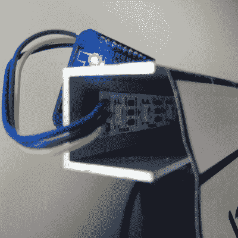
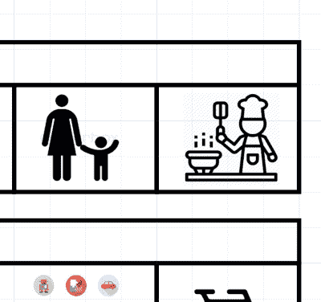

# 日冕钟

> 原文：<https://hackaday.com/2020/03/19/the-corona-clock/>

在复活节假期结束之前，德国的学校都是关闭的，这意味着我们快 6 岁的儿子 Max 将和我们一起呆在家里。好消息是我和我妻子在家工作，所以只要他每天能照顾自己八小时，压力就不会太大。坏消息是，一个幼儿园的孩子不可能长时间照顾自己，我们也不想把他放在电视机前。至少我们有两个人。

新的居家生活需要一些调整，但至少在最初的五天里(还在继续),情况相当不错。一个窍门是:我妻子想出了一个视觉时间表的主意，帮助 Max 将他的一天分成幼儿园大小的块，然后我们在它后面添加了一个 LED 条，将其变成一个线性时钟。我们用家里的东西做了这件事。

当然，这不是一个超级深入的黑客攻击，你们中的一些人可能用少量的 555 定时器就能完成。但它很快，完成了工作，而且，有了 NTP sync，它是世界上最精确的儿童时钟！所以，那些像我们一样被困在家里，试图平衡照顾孩子和在家工作的人，这里有一个快速的项目，可以增加家庭和谐，同时给你一个借口，订购更多的 LED 灯条。

## 佐料

 没有多少日冕钟。在我的例子中，运行 NodeMCU 固件的 ESP8266 通过 WiFi 连接，并在连接到引脚 4 的 WS2812 条上显示时间。在我们的例子中，我有一个一米长的 60 个 LED 灯带，我们需要覆盖大约 15 个醒着的小时，所以只是每 15 分钟点亮一个 LED。与编码或焊接相比，我们花了更多的时间来制定日计划和寻找剪贴画。我试着想出一些很酷的颜色，但最后还是用了我儿子最喜欢的颜色:蓝色。(有什么好主意吗？[随意叉](https://github.com/hexagon5un/corona-clock)让我知道。)

我把铝带安装到我在地下室里的东西上:一个方便的 1 米的铝制 U 形挤压件。如果你有一个标尺，或者一张足够长的硬纸板，你的状态就很好。LED 灯带有一个粘性的背衬，但也有少量的“神奇”胶带用于将其他东西保持在一起。你也许能想出更聪明的办法。对准钟面！

## 艺术、美学和用户体验

 其中一个诀窍是打印出时钟的单元格，以匹配发光二极管的间距。它们的中心到中心的距离是令人抓狂的 1.66666 厘米，这意味着我不得不打开 Inkscape 来完成这些艺术作品。但是这样你就自由了，因为在文档属性中，除了设置横向打印之外，你还可以设置任意大小的网格，甚至每四个网格或一个小时设置更暗的线条。启用“对齐网格”功能使我们所有的框的大小完全合适，我导入并缩放了我妻子找到的所有剪贴画。

如果你正在寻找一个很好的扩散 LED 外观，一个 20 毫米深的 U 形槽，一个纸质的前部作为扩散器可能是非常接近理想的。我跑了一些彩虹的长度，他们看起来很棒。但是对于一个不需要混色的“精确”时钟来说，可能有点模糊。反正是管用的。Max 可以知道它是他独自玩耍时间块中的最后一个 LED，并且还没有错过一个。对于一个还不会看时钟时间的孩子来说，能够说“爸爸，来看看时钟，是时候带狗出去了”是一个非常好的体验命令我们改变一下。当幼儿园重新开学时，我会报仇的。

## 科罗纳钟表公司。

有趣的是，像这样的小事可以将每天的冲突——为 Max 的时间表而争吵，以及他觉得这超出了他的控制——变成一种乐趣。诚然，当 Max 回到他的朋友们身边玩耍时，他会更开心，而我们不会为了弥补白天“失去的”几个小时的育儿时间而在晚上工作，我们也会更开心:自由时间暂时被推到了时间线之外的某个地方。但是花一个小时和 Max 一起在森林里骑自行车也是一种真诚的快乐。质量电晕时间？

你是在隔离还是在家和孩子一起工作？有没有什么很酷的项目，不管是不是黑客，都可以帮忙？把它们贴在评论里。