# 拆卸:伟易达神童便携式电脑

> 原文：<https://hackaday.com/2020/04/27/teardown-vtech-whiz-kid-luggable-computer/>

早在 20 世纪 80 年代初，忙碌的商业精英们会使用 Osborne 或 Kaypro 等公司的便携式电脑。由于当时的技术限制，这些所谓的“luggables”只比当代的台式电脑略小、略轻，但它们集成了显示器和键盘，因此更容易移动。几年后，第一代笔记本电脑将投放市场，不出所料，便携式电脑将失宠。今天，它们是相对罕见的收藏家物品；这是向真正的移动计算稳步前进的第一步，但在很大程度上被遗忘了。

[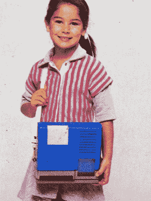](https://hackaday.com/wp-content/uploads/2020/03/whizkid_girl.jpg) 这使得 1984 年版的伟易达“神童”教育计算机成为一个特别独特的样本。该公司后来进入流行电子玩具系列的产品将采用(有一些变化)标准的笔记本电脑外形，但这个版本的特点是可能是有史以来为儿童制造的最真实的便携式电脑。当这个玩具被设计出来的时候，它将会是计算机技术尖端的反映，但是今天，它是一个迷人的提醒，最新最伟大的东西并不总是停留很长时间。

经典的便携标志都在这里。翻转键盘，小而奇怪的偏移显示屏，侧面甚至有凸耳，可以连接一条附带的皮带，这样年轻人就可以把它挂在肩上。另一方面，它只是一个玩具，这一事实允许它比真的东西有一些优势:它实际上可以靠电池供电，并且相对于它的尺寸来说相当轻便。

当我们最后一次窥视伟易达的产品时，我们发现[一台惊人强大的 Z80 机器，它比它的预计算机的名字](https://hackaday.com/2019/11/19/teardown-vtech-precomputer-1000-is-an-iconic-pc-in-a-toy-wrapper/)更名副其实。但这种基本兼容的设计源自 80 年代末，是作为下一代电脑用户的训练器专门推出的。1984 年的神童会被证明与成年人有相似的关系吗，或者这种相似只是表面现象？让我们找出答案。

## 功能之上的形式

当我看到神童包括一个肩带，我很自然地认为它会很重。但是如果没有安装四节 C 电池(只有 80 后的孩子会记得每一个使用 C 电池的玩具)，它实际上不到一公斤重。拿在手中，感觉这个笨重的塑料外壳几乎是中空的。事实证明，这与事实相差不远。

[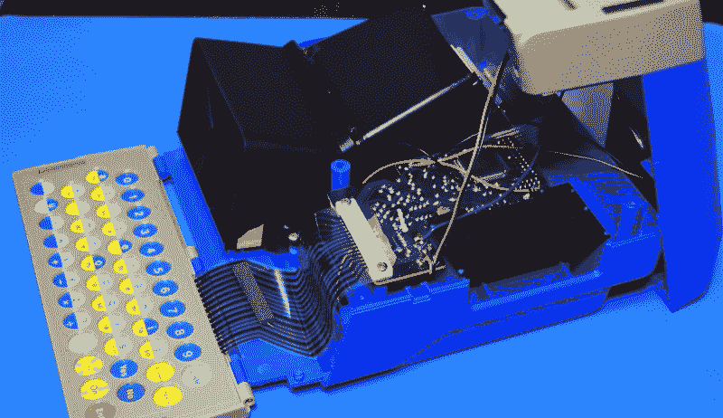](https://hackaday.com/wp-content/uploads/2020/03/whizkid_open_side.jpg)

打开后，我们可以看到这个神童的内心是多么的渺小。除了黑色 LCD 投影仪组件(我们稍后会谈到)之外，外壳下半部分唯一的东西就是相对较小的 PCB。由于里面都是空的，看起来箱子的尺寸并不是必须的。更有可能的是，伟易达在设计这款神童时，就已经考虑到了具体的外部尺寸，或者至少是比例。

## 叶老单片

任何从 20 世纪 80 年代拆下一件电子产品的人都知道，他们通常与集成电路一起游泳。这当然不足为奇，因为集成电路成本的快速下降催生了各种奇怪而奇妙的电子设备，而这些设备在以前是极其昂贵的。但在这种情况下，PCB 上只有一个明显的芯片:东芝的 QFP-92 设备。

[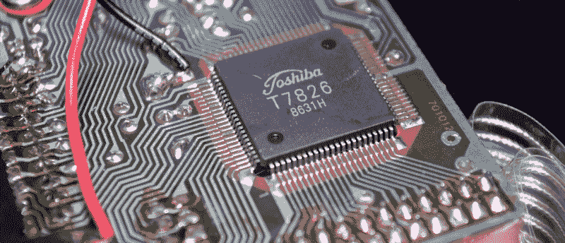](https://hackaday.com/wp-content/uploads/2020/03/whizkid_toshiba.jpg)

标记为 T7826，不幸的是，我找不到关于这个特殊设备的任何信息。但我们可以从痕迹中看出，它负责神童内部的一切，因为芯片的引脚直接连接到 LCD、墨盒连接器和键盘。今天我们称这个设备为微控制器，[，但是当时的术语有点不同](https://hackaday.com/2020/02/18/the-tms1000-the-first-commercially-available-microcontroller/)。当然，这只是 PCB 的一面。当然，当我们翻转它时，我们会看到一些支持 IC。

[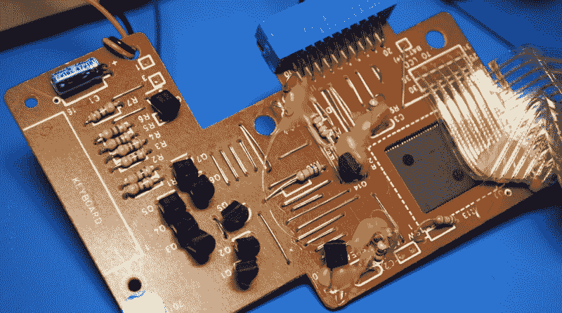](https://hackaday.com/wp-content/uploads/2020/03/whizkid_mainpcb.jpg)

或者不是。棋盘的背面非常明显地没有…嗯，几乎没有任何东西。有许多金属跳线在那个时代大规模生产的小工具的单面 PCB 上非常常见，但除此之外，只有少量的简单元件。由于神童上实际上没有物理电源开关，其中一些晶体管可能是软电源系统的一部分，大部分电阻似乎连接到键盘矩阵。

如今，在大规模生产的电子产品中，处理设备几乎所有功能的单个芯片相当常见。你肯定见过他们。过去几十年来，几乎光秃秃的 PCB 中间有一大块黑色环氧树脂已经成为令人沮丧的常见景象。但是即使在今天，你仍然期望看到一个[单独的芯片来存储设备的固件和其他数据](https://hackaday.com/2019/12/06/swapping-the-roms-in-mini-arcade-cabinets/)。这个东西应该是一台电脑，那么所有的游戏和程序都放在哪里呢？

## 一切尽在掌握之中

由于没有外部 ROM，扩展盒是可选的，所以所有的软件都必须存储在单个芯片中。这在今天不成问题，因为即使是 3 美元的微控制器也包括几兆的板载存储，但在 1984 年这样做确实是一个相当大的技巧。那么，他们是如何把所有的文本和图像打包的呢？

简单的回答是，他们没有。不管怎么说，不是你想的那种方式。神童借用了那个时代电脑游戏中常见的一个技巧:大量使用印刷材料来弥补有限的数字存储容量。在这种情况下,“游戏”采用插入系统前端的纸卡形式。每张卡的背面都解释了用户应该做什么，正面(可以通过透明的塑料窗口看到)印有适当的图像。大多数卡片都要求用户猜测和正确拼写与艺术品有关的单词。

 [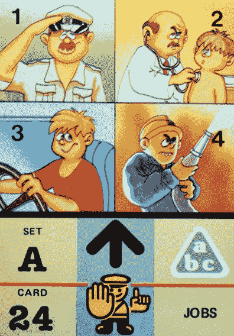](https://hackaday.com/2020/04/27/teardown-vtech-whiz-kid-luggable-computer/whizkid_jobcard2/)  [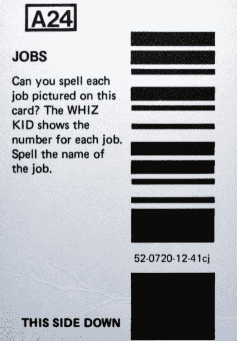](https://hackaday.com/2020/04/27/teardown-vtech-whiz-kid-luggable-computer/whizkid_jobcard1/) 

每张卡的背面都有一个线性条形码，由安装在托盘下的红外阅读器读取。这些代码似乎存储了某种查找信息(可能与代码中打印的字符串有关)，这些信息告诉神童用户应该拼写预先加载的单词。通过创造性地使用卡片上的说明和图像，VTech 能够创建许多不同的游戏和活动，这些游戏和活动最终都围绕着神童内部存储的单词列表。

 [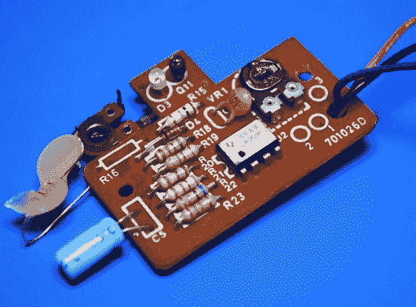](https://hackaday.com/2020/04/27/teardown-vtech-whiz-kid-luggable-computer/whizkid_reader2/) Clearly the variable resistor was an afterthought. [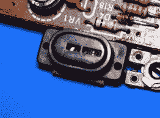](https://hackaday.com/2020/04/27/teardown-vtech-whiz-kid-luggable-computer/whizkid_reader3/) No one cared who I was until I put on the mask. [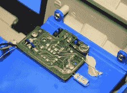](https://hackaday.com/2020/04/27/teardown-vtech-whiz-kid-luggable-computer/whizkid_reader1/) VTech not afraid to break out the hot snot.

阅读器本身很简单，和你在老鼠标上看到的并无不同。IR LED 和检测器被放置在外壳中，使得交替的白色和黑色条纹在它们前面经过时将在检测器中产生电压变化。这被馈入 LM358 运算放大器，以产生主 PCB 上的微控制器可以轻松读取的干净方波。主板和阅读器之间只有三条线，这使得将示波器挂在数据线上并实时观察这种交换变得很容易。

[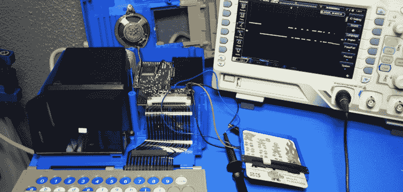](https://hackaday.com/wp-content/uploads/2020/03/whizkid_sniff.jpg)

我没有试图解码信号，所以请随意在评论中加入加分。但是从表面上看，代码至少保存了几个字节的数据。当然足以容纳两个十六进制字符，因为一包只有 50 张卡，这将提供足够多的组合来用作唯一的 ID。

## 滴答，你是时钟

[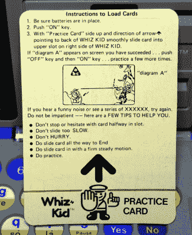](https://hackaday.com/wp-content/uploads/2020/03/whizkid_practicecard.jpg) 此时，特别敏锐的读者可能会注意到这个概念有些不太对劲。如果将卡推入读卡器会产生与条形码上的数据相对应的方波，那么卡插入的速度难道不是至关重要的吗？总不能指望年轻的操作员每次想换卡时都以*完美的*速度推进卡吧？

事实证明，伟易达一定对 1984 年的孩子们很有信心，因为这正是你要做的。让卡可靠地解码可能是我经历过的最令人沮丧的用户体验之一，很难记得小时候我会无聊到与这台机器战斗比踢石头更好。

“练习卡”的加入让我觉得，至少在伟易达，有人对这种特殊的数据输入方法有所疑虑。用户被指示使用该卡作为磨练他们插入技术的一种方式，直到它基本上成为肌肉记忆。

没有什么特别的诀窍，卡片上给出的提示也不是你自己最终也不会发现的。我只能想象，在 1984 年的圣诞节早晨，对于一个沮丧的 6 岁孩子来说,“做练习”这个提示有多不舒服。

## 大屏幕上的游戏

回到该设备的视觉外观显然对 VTech 非常重要的想法，他们显然需要一个与外壳其余部分成比例的屏幕。一排小小的 LED 字符是不行的，显然真正的 CRT 是不可能的。所以他们想出了一个背投液晶显示器，考虑到时间的限制，还不错。

[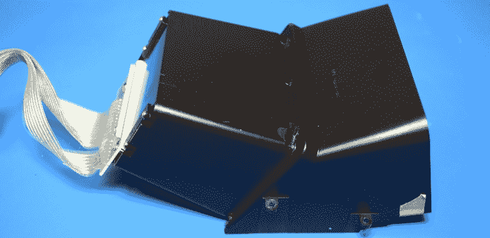](https://hackaday.com/wp-content/uploads/2020/03/whizkid_projector1.jpg)

这里的想法是，从神童背后的不透明窗口进来的光线穿过一个液晶面板，这与你在任天堂的*游戏&手表*手持设备中看到的没有什么不同。这个投影的图像被一个真正的玻璃反射镜反射回来，玻璃反射镜安装在观众俯视的房间底部。

从观看者的角度来看，您会看到一个漂亮明亮的图像，其表观尺寸大于物理 LCD 面板。由于一些有色滤光片，它甚至出现了彩色。好吧，至少是不动的部分。

[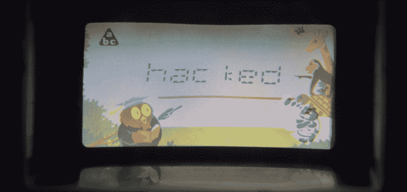](https://hackaday.com/wp-content/uploads/2020/03/whizkid_projector3.jpg)

缺点是你需要大量的光线通过背板进入。增加一个板载灯不会是一个很大的技术挑战，但可能被认为是毫无意义的，因为你仍然需要阅读卡片并看到上面的图片才能实际玩任何游戏。

## 毫无歉意地入侵

在我看来，你很有可能已经读到这里了，因为你想知道是否可以用一个神童的尸体作为覆盆子酱的基础。你当然可以，尽管有一些事情需要记住，从这些照片中可能看不出来。

[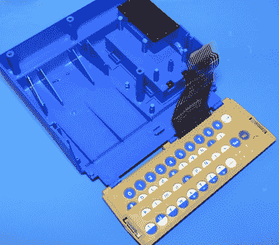](https://hackaday.com/wp-content/uploads/2020/03/whizkid_emptycase.jpg) 举个例子，它可能比你想象的要小。请记住，这是一个为小学生设计的设备。作为参考，键盘大约为 200 x 70 毫米(7.87 x 2.75 英寸)，根据你的安装创意，你只有大约 120 毫米(4.72 英寸)的对角线来放置屏幕。可行，但对于任何严肃的用途来说都相当狭窄。

当然，一旦你有一个键盘和真正的液晶显示器安装在它的前面，内部尺寸绝对是巨大的。你可以随心所欲地安装任何东西，包括像 Atomic Pi 这样的 x86 单板计算机。

在拆卸 VTech PreComputer 1000 的最后，我注意到这台机器似乎有足够的历史意义，不应该轻易拆除它。但坦率地说，1984 年的神童并不具有同样的重要性或魅力。它古怪的内部结构似乎不值得保存，令人愤怒的读卡器噱头使操作玩具对现代用户来说绝对是一件苦差事。

VTech 的目标是让这个神童的外表看起来尽可能像一台真正的便携式电脑，而没有考虑内部的电子设备。所以你为什么要这样做呢？