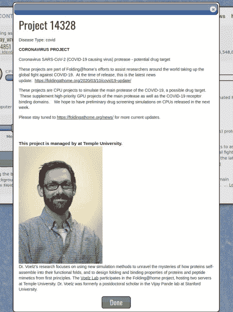
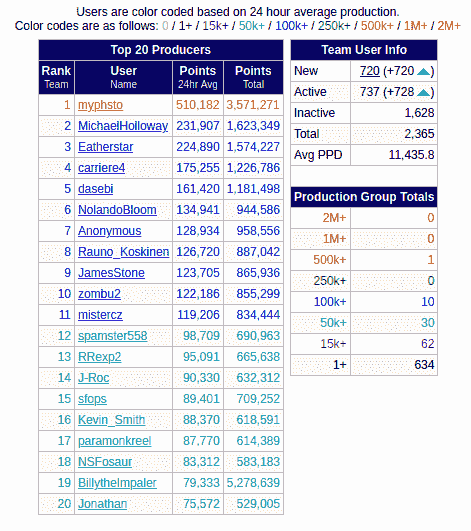

# 冠状病毒和折叠@ Home 关于您的计算机如何帮助医学研究的更多信息

> 原文：<https://hackaday.com/2020/03/22/coronavirus-and-foldinghome-more-on-how-your-computer-helps-medical-research/>

周三上午，我们请求 Hackaday 社区为冠状病毒研究捐赠额外的计算机周期。周四早上，贡献给团队 Hackaday 的人数翻了一番，周五又翻了一番。谢谢你让这些电脑为新冠肺炎的药物治疗工作。

我今天写这篇文章有两个原因，我们想保持这种趋势，并回答一些最常见的问题。Folding@Home (FAH)是一项模拟与几种疾病相关的蛋白质的倡议，旨在寻找有助于医学研究人员确定治疗方法的指标。这些都是复杂的问题，你现在的努力对更快找到治疗方法非常重要。FAH 加载研究管道，生成研究人员可以在该过程的每个步骤中跟踪的数据集，从确定哪些化合物可能有效以及如何提供它们，到测试假设并走向人体试验。

首先，这里有一个纲要，说明设置你的电脑来帮助 Folding@Home 对抗冠状病毒有多简单:

*   [下载并运行 Linux、Mac 或 Windows 的安装程序](https://foldingathome.org/support/faq/installation-guides/)。一些人向我们报告他们需要[备用下载链接](https://foldingathome.org/alternative-downloads/)。
*   选择任何一个名字来表明你在公共排名系统上的努力
*   使用团队 Hackaday 团队编号来增加我们的集体排名: **44851**
*   这是可选的，但我建议您获得自己的密钥——它是唯一标识您的努力的散列值，您可以在 FAH 密钥页面上通过电子邮件获得一个

好了，我们来回答一些问题吧！首先，这真的有影响吗？

## Folding@Home 有产生结果的记录

Folding@Home 项目始于 2000 年。在过去的 20 年里，我们已经取得了很大的成就，我鼓励你们去阅读维基百科页面上的 [*在生物医学研究中应用的冗长例子*](https://en.wikipedia.org/wiki/Folding%40home#Examples_of_application_in_biomedical_research) 部分，这些例子深入研究了这些影响。

这项工作已经确定了阿尔茨海默氏症和亨廷顿氏症的药物疗法，它已被用于对抗艾滋病毒和流感(两者都是病毒)的药物设计，并被用于研究癌症如何变异。现在我们有机会将其应用于新冠肺炎病毒。在“像我一样解释”的层面上，科学家们正试图模拟蛋白质折叠模式的每一种可能的组合，寻找可以让药物发挥作用的位置。

这是一个巨大的挑战，类似于尝试挂锁上的每一种组合，但这种锁需要令人难以置信的大量组合。研究科学家强调最有可能的解决方案在哪里，然后使用 Folding@Home 网络令人难以置信的巨大能力，开始运行模拟。FAH 网络有多强大？维基百科列出截至 2020 年 3 月初的 470 petaFLOPS，这意味着每秒 416 万亿次浮点运算。这相当于每秒钟解决 4.16 亿个数学问题！

但最棒的是，这个项目是非盈利性的，并根据其他研究人员的要求免费提供数据。

## 我能确保我的电脑只处理新冠肺炎问题吗？

 没有，但你不需要，因为该组织已经在优先考虑冠状病毒的努力。尽管该软件确实提供了在特定研究领域工作的选项，但新冠肺炎并没有被特别列出。这很可能是因为这个疫情正在快速移动，不值得尝试推出一个新版本的软件来添加这个设置。现在，让它保持缺省值“Any ”,只要有工作单元(WU)可用，您的计算机就可以在上工作。

您可以使用在`[http://localhost:7396/](http://localhost:7396/)`找到的内置网络界面来查看您的计算机当前正在解决什么问题。在这里，您可以看到当前正在运行的实例的“了解更多…”屏幕。这个星期，我只看到一次我的电脑在一个不同的项目上工作。

## 我的电脑已经设置好了，为什么现在处于闲置状态？

FAH 服务器以最快的速度分发这些 Wu，但现在随着越来越多的人将他们的计算机加入网络，网络正在增长。当所有暂存的 Wu 用完时，您的计算机将处于空闲状态，直到有更多 Wu 可用。这与你无关，项目维护人员正在努力保持这个缓冲区满。

## 这会产生疫苗吗？

我不是专家，但我相信答案是，这项研究旨在确定药物治疗方法，并更好地了解病毒中的蛋白质是如何工作的。这并不一定是为了研制疫苗。

 这仍然非常重要，这意味着研究人员正在寻找可以用来治疗病毒患者的药物。现在，新冠肺炎非常擅长躲避我们身体的自然防御——我们的免疫系统。如果发现削弱病毒的药物疗法，它可能会导致我们的免疫系统有一个立足点来对抗感染。

我们既需要疫苗，也需要药物治疗——以季节性流感为例，我们有疫苗保护人们免受感染，也有抗病毒药物治疗受感染的高危人群。对这两者的研究应该，也确实是并行进行的。

## 使用#44851 进行团队黑客日

这种努力是游戏化的，所以当你配置你的 Folding@Home 软件时，使用 team #44851 加入你的黑客伙伴团队。当我们第一次发布时，我们有 21 个活跃的团队成员，到周五下午已经有 737 个了。我们能在周末前赚到 7000 美元吗？