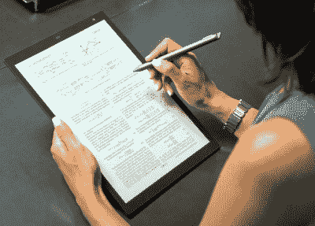

# 2020 年(终于)会是电子纸之年吗？

> 原文：<https://hackaday.com/2020/04/13/will-2020-finally-be-the-year-of-electronic-paper/>

如今，只要有可能，纸张就会被逐步淘汰，虽然我们还远未成为一个完全数字化的社会，但在过去的一二十年里，普通人每天处理的纸张数量已经大幅减少。至少，我们似乎比飞行汽车或任何其他我们通常与遥远未来联系在一起的概念更接近一个没有印刷页面的未来。

也就是说，在纸上阅读仍然有不可否认的吸引力。在一块薄木板上喷射墨水的想法对我们来说似乎越来越过时，但当你把它拿在手里时，它看起来确实很漂亮。这就是为什么如此多的努力被投入到以电子形式再现印刷纸张的外观；我们都喜欢纸质的体验，但传统的执行方式并不特别适合现代人的感受。

当然，电子“阅读器”，最著名的是亚马逊的 Kindle 系列，已经走了很长一段路来实现这一点。至少对于看书来说是这样的。但是，杂志、报纸，甚至我们放在长凳上用来记下测量结果或想法的小本子呢？一个 PDF 数据表，带有灰色调的图形？能够在你的包里装下一整个书架的小说是不可思议的，但是尽管科幻小说自 2001 年《太空漫游》以来就向我们承诺了什么，我们仍然在消耗大量来自枯树的媒体。

但这种情况可能很快就会改变。今年将会发布两款平板电脑，它们有望提供比我们以前见过的任何东西都更接近于在传统纸张上阅读和书写的体验。它们肯定不便宜，现在说有多少只是炒作还为时过早，但这些设备最终可能成为我们梦想的无纸未来的重要一步。

## 超越书本

如今市场上有许多电子书阅读器，它们在硬件方面都非常相似。无论你是从亚马逊买到 Kindle，从 Barnes and Noble 买到 Nook，还是支持失败者，买一台 Kobo，技术都没有什么不同。他们都将使用大约 6 到 8 英寸的前置照明 eInk 显示器，以 200 DPI 以上的分辨率显示单色文本和图像。当然，这种屏幕技术已经标准化很多年了，这并不奇怪；毕竟，无论如何，一旦你翻过了防尘套，大多数小说的页面看起来都大同小异。

reMarkable’s screen is designed to feel like real paper.

这些设备已经发展成为在旅途中阅读小说的近乎完美的工具，但它们在其他方面并不出色。偶尔也有试图扩展其核心功能的尝试:亚马逊曾经有一个带全 QWERTY 键盘的 Kindle，Nooks 有简单的网络浏览器，但现在都是过去了。很明显，每个制作电子书的人都非常乐意维持现状，只要它能让钱源源不断地进来。

幸运的是，并不是每个人都担心安全。2017 年，卓越推出了他们的第一款“纸质平板电脑”，专为重现使用标准记事本的体验而设计。该公司与台湾公司 E Ink Holdings 密切合作，推出了一种专有的纹理显示屏，当用户用手写笔在上面书写时，它的外观和感觉就像传统的纸张。这是一个令人印象深刻的硬件，但对于 700 美元的普通用户来说很难销售。

今年，该公司将开始发运 10 英寸的卓越 2 号(T1)，据说它在各方面都比原来的有所改进。这款新的 10 英寸平板电脑售价为 399 美元，电池续航时间延长了三倍，更重要的是，触控笔的响应时间缩短了一半，仅为 20 毫秒。这可能是任何传统笔记本的电子替代品最重要的方面，因为在落笔时显然没有延迟。

## 索尼没有放弃

大多数人可能会将 eInk 显示器与 Kindle 联系起来，坦率地说，这很难责怪他们。亚马逊主导了电子书阅读器市场，以至于他们的特定设备基本上是事实上的标准。但实际上是索尼，早在 2004 年，就向市场推出了第一款电子书阅读器。事实上，在亚马逊 2007 年发布 Kindle 之前，索尼的阅读器已经是第三代硬件了。

Sony’s large format Digital Paper. Maybe you can read a datasheet on it!

尽管率先上市，但索尼无法与零售巨头竞争，并在 2014 年搁置了产品线。尽管该公司再也不会发布 eInk 阅读器，但他们肯定没有放弃这项技术本身。在结束他们的电子阅读器销售后不久，他们推出了数字纸 DPTS1。1100 美元当然不适合普通用户，但几年后，随后的型号将价格降至更合理的水平。

2020 年，索尼计划用新的 13 英寸型号刷新数字纸生产线。除了它将在处理能力、RAM 和存储容量方面进行标准的增量升级，我们已经习惯了移动设备，人们对这种新的数字纸张知之甚少。与卓越的 2 相比，鉴于更大的屏幕尺寸，它几乎肯定会更贵，尽管预计它会保持在 600 美元以下的价格点，这是早期数字纸版本最终稳定的价格点。

## 定价出售

可能看起来不像，但事实是，这两款相当高调的设备今年都将以 400 至 600 美元的价格上市，这是一件相当大的事情。虽然它们很难被视为像我们这样的黑客的预算设备，但它足够低，你不一定要成为医生或律师才能证明购买是正确的。

亚马逊发布 399 美元的原版 Kindle 也不是巧合。这在今天看来很可笑，但在当时，这被视为如此先进的硬件的合理价格。你要记住，在这一点上，[电子纸是如此罕见，以至于大多数人在](https://hackaday.com/2008/10/14/how-to-make-an-e-paper-clock-and-hack-esquire-magazine/)之前甚至从未见过它。事实上，Kindle 这个名字之所以被特别选中，是因为人们相信这种设备会“点燃”数字阅读器；一个显然成为现实的预测。

这些价格差不多的纸质平板会不会自己火起来？很难说。最终成为电子书阅读器最佳选择的东西可能与电子纸平板电脑不同。但是不管发生什么，这两个设备都清楚地表明，技术不仅变得更好，而且变得更便宜。引人注目的 2 或新索尼数字纸可能不会在今年取代你值得信赖的台式笔记本，但受它们启发的下一代可能会有很好的机会。