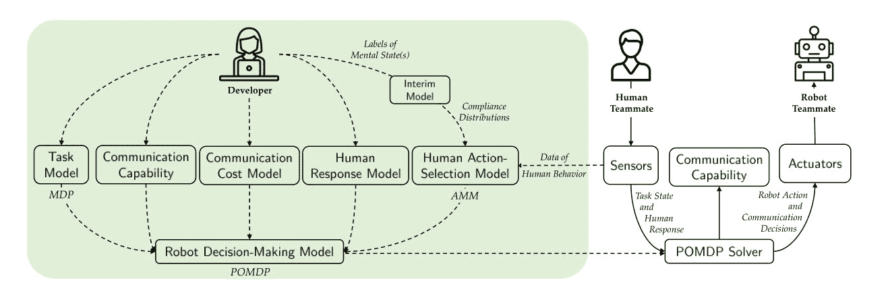
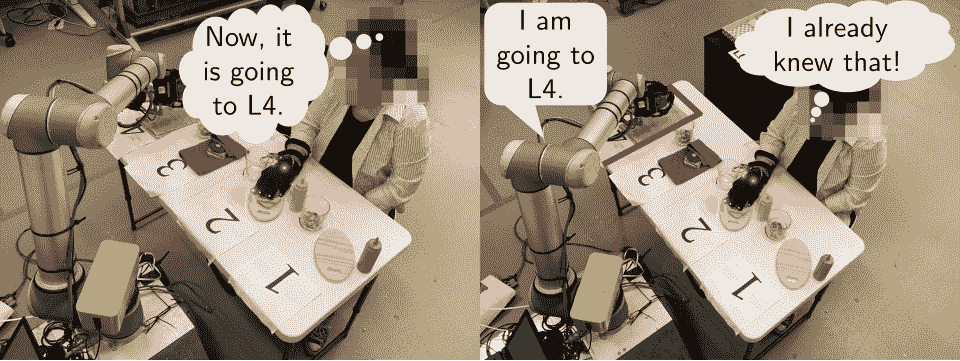
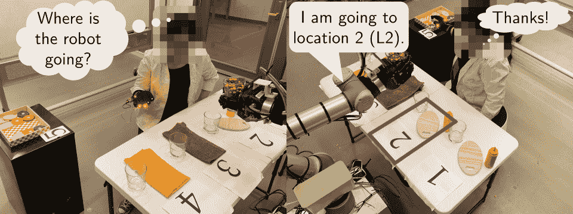

# 教机器人职场礼仪

> 原文：<https://hackaday.com/2020/04/01/teaching-robots-workplace-etiquette/>

大多数情况下，人类和机器人不必直接一起工作，而是在生产流水线的不同部分工作，或者由机器人代替人类执行任务。在这种情况下，任何人机交互都将是肤浅的。然而，如果人类和机器人不得不并肩工作呢？麻省理工学院计算机科学和人工智能实验室(CSAIL)的一群学生最近研究了这个问题的一些答案。

在他们关于人-机器人协作任务的论文中，他们涵盖了这种交互的三种可能模式:没有通信(“沉默”)，通信可以被预编程(状态机)，或者在这种情况下，基于 T2 马尔可夫模型的系统。他们展示的这个框架被称为 CommPlan，它使用人类受试者的观察数据来构建一个马尔可夫模型，该模型可以整合传感器数据，以决定其下一步行动。

在实验中，他们执行(一顿饭的准备；请看休息后的嵌入视频)，人类受试者必须与机器人并肩工作。在这三种不同的方法中，CommPlan one 是最快的，它只在认为必要时才使用语音交互。实验对象在此表达了对双向交流的偏好，就像人类工作者之间的交流一样。

HRI 和人与人互动的原则本质上是相同的:为了最佳的团队工作，每个成员都需要在正确的时间接收和提供他们或其他团队成员需要的信息。太早或太晚都会引起摩擦，省略信息会导致延误甚至更糟。冗余信息也会导致挫败感:

因此，CommPlan 框架的目标是使用其传感器和人类精神状态模型(在给定情况下什么是合适的),只给出其人类伙伴期望和欣赏的信息:

拥有一个像 CommPlan 这样的框架的好处是双重的:它不仅提高了整个过程的效率，还使交互更加顺畅，减少了摩擦和挫折。无论我们的队友是热血的人类还是伺服驱动的机械臂，在一天结束时，人类至少更喜欢对团队努力感到满意。

为了这一天，我们的机器人朋友将与他们的人类伙伴击掌庆祝合作解决一项特殊的困难任务。

 <http://people.csail.mit.edu/unhelkar/files/videos/2020_Unhelkar_Li_Shah_HRI_video.mp4?_=1>

[http://people.csail.mit.edu/unhelkar/files/videos/2020_Unhelkar_Li_Shah_HRI_video.mp4](http://people.csail.mit.edu/unhelkar/files/videos/2020_Unhelkar_Li_Shah_HRI_video.mp4)