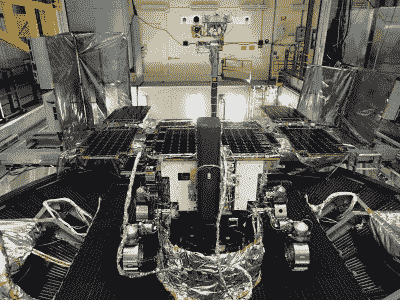
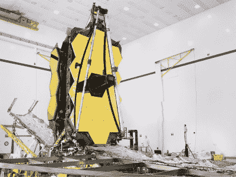
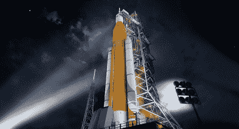
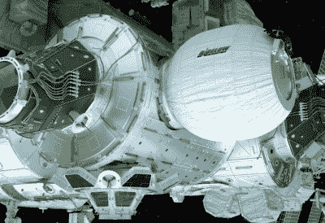
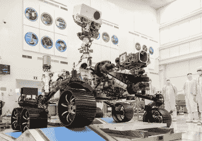

# 在疫情期间，去太空更难

> 原文：<https://hackaday.com/2020/04/06/getting-to-space-is-even-harder-during-a-pandemic/>

在这一点上，我们大多数人都痛苦地意识到新冠肺炎社交距离协议对我们日常生活的限制。任何可以在家工作的人，重大活动被取消，不必要的业务被关闭，旅行要么被强烈劝阻，要么被彻底禁止。在受灾特别严重的地区，生活和商业几乎陷入停顿，看不到明确的结束日期。

自然，这次关闭的深远影响超出了个人层面。大规模的项目也被减缓或完全停止，因为你只能远程做这么多。当涉及到硬件组装时尤其如此，这使得一些行业陷入了特别困难的境地。真正感受到压力的一个行业是航空业。世界各地的太空机构发现，面对新冠肺炎，他们精心制定的计划突然土崩瓦解。

在某些情况下，这是一个小麻烦，只需要对程序做一些调整。但是当涉及到行星的运动时，几周或几个月的延迟会改变一切。虽然事情仍然变化太快，无法列出一个详尽的清单，但我们已经知道一些任务在这个不确定的时期受到影响。

## 火星漫游者错过了飞行

当然，在这一点上受打击最大的任务是罗莎琳德·富兰克林漫游车，这是欧洲航天局(ESA)和 Roscosmos 的联合任务。欧洲第一辆火星漫游车，六轮车计划于 2021 年 3 月在红色星球着陆，以寻找过去生命的迹象。这似乎给了团队足够的时间来解决任何问题，但是星际飞行的轨道力学使得出发时间绝对关键。

*Rosalind Franklin* undergoing tests.

简而言之，火星每两年最接近地球一次。虽然从技术上讲，你可以在任何时候向火星发射飞船，但在这个两年一度的窗口期间发射是迄今为止效率最高的。当火星更远时，显然需要更多的能量才能将航天器置于拦截轨道上。根据航天器和运载火箭的质量，这可能是也可能是不可能的。无论如何，*罗莎琳德·富兰克林*号和它的发射器被设计成在这个窗口期间离开地球，任何超出这个窗口的偏差都是不能容忍的。

据报道，ESA 和 Roscosmos 团队非常接近于在 2020 年 7 月这个窗口打开之前完成 *Rosalind Franklin* ，但是对降落伞部署系统的担忧需要更多的测试。在正常情况下，他们可能会及时解决问题，但由于国际旅行的限制，[认为执行测试过于繁琐](https://www.esa.int/Science_Exploration/Human_and_Robotic_Exploration/Exploration/ExoMars/ExoMars_to_take_off_for_the_Red_Planet_in_2022)。该团队决定推迟到 2022 年下一次可用的发射窗口，而不是让火星车带着可能有缺陷的降落伞发射。

虽然推进到 2022 年肯定会让所有相关人员失望，但应该说这不是该任务第一次错过机会。它原定于 2018 年发射，但由于火星车的科学有效载荷问题而推迟。

## 詹姆斯·韦伯的测试被搁置

美国宇航局对新冠肺炎的回应意味着哈勃最终的继任者詹姆斯·韦伯太空望远镜(JSWT)的工作将被无限期停止。这个红外天文台 6.5 米(21.3 英尺)直径的金和铍主镜有望给人类提供迄今为止最好的观察对象，这些对象对于传统的光学望远镜来说太老太远了。

JWST at Northrop Grumman

将如此巨大的反射镜装入运载火箭的有效载荷整流罩的技术复杂性，以及许多其他问题，已经导致 JWST 的开发大大超出预算并落后于计划。美国宇航局于 1996 年开始开发望远镜，并希望在 2007 年发射，但 2005 年航天器的重新设计使该计划推迟了十多年。

至此，JWST 的基本建设实际上已经完成。但是考虑到投入天文台的大量时间和金钱，它目前正在由主承包商诺斯罗普·格鲁曼公司在加利福尼亚进行一项艰苦的测试计划。这种劳动密集型的过程根本无法远程完成，鉴于该州疫情的严重性，[美国宇航局已经决定没有办法不将工作人员置于危险之中](https://www.nasa.gov/press-release/nasa-leadership-assessing-mission-impacts-of-coronavirus)。

詹姆斯·韦伯太空望远镜将留在诺思罗普·格鲁曼公司园区的环境控制洁净室中，24 小时安全措施到位，以防止对价值 100 多亿美元的航天器进行任何可能的篡改。目前还不清楚这一停止将如何影响整个任务时间表，但可以肯定的是，计划中的 2021 年 3 月发射日期将再次推迟。

## SLS 生产关闭

另一个被暂时搁置的大型 NASA 项目是太空发射系统(SLS)。航天局声称，这种航天飞机衍生的火箭对他们超越低地球轨道的计划至关重要，但批评者说，在可重复使用火箭的时代，一次性助推器太昂贵了。SLS 是美国宇航局 Artemis 月球计划的一个关键要素，但除此之外，目前还不清楚哪些任务需要“超重型”额定助推器。

SLS stands ready for launch in this artist’s rendition.

3 月 20 日，美国国家航空航天局局长吉姆·布里登斯廷将米丘德组装厂和斯坦尼斯航天中心[调到最高应急响应级别](https://www.nasa.gov/press-release/march-19-administrator-statement-on-agency-response-to-coronavirus)，第一架可飞行的 SLS 的生产已经停止。这意味着所有工作暂停，只有在保护关键基础设施或人类生命所必需的情况下，工作人员才被允许留在现场。

就像 JWST 一样，很难说这会对已经落后于计划的项目产生什么影响。官方没有宣布第一次 Artemis 任务的延迟，但如果团队不能在几周或更长时间内完成硬件工作，很难想象助推器和猎户座飞船将准备就绪。

## 商业空间困境

像 NASA、ESA 和 Roscosmos 这样的机构都有各自政府的支持可以依靠，所以最终延误和停止工作的命令只会带来不便。这并不是说美国国家航空航天局担心盈利，或者在疫情清理之前面临资金耗尽的危险。当情况有所改善时，工作人员将会回来，工作可以再次继续。

Bigelow developed a module for the ISS in 2016.

但对于一些“新空间”公司来说，情况就不一样了。总部位于伦敦的初创公司 OneWeb 正在建造自己的[卫星巨型星座，以挑战 SpaceX 的 Starlink 计划](https://hackaday.com/2019/05/20/everything-we-know-about-spacexs-starlink-network/)，该公司已经宣布破产。

虽然众所周知，该公司在此之前就陷入了财务困境，但该公司发布的一份声明称，由于“与新冠肺炎病毒蔓延有关的财务影响和市场动荡”，他们无法获得额外的资金。在宣布破产和随后的裁员之前不到一周，该公司刚刚发射了另外 34 颗卫星，使其总数达到 74 颗。

在美国，可扩展空间栖息地开发商毕格罗宇航公司于 3 月 23 日解雇了全部员工。官方的说法是，这是自愿做出的，以响应内华达州州长的命令，即所有非必要的企业必须关闭，计划是在危机过去后重新雇用工人。但有传言称，该公司可能会利用关闭令作为永久关闭的借口。

## 2020 年火星车和国际空间站不受影响

不过，也不全是坏消息。美国宇航局的下一个火星漫游者，最近被称为*毅力*，仍然按计划在今年夏天发射。与*号一样，发射中的任何延迟都会将任务推迟两年，但目前没有任何问题会阻止发射如期进行。事实上，这项任务具有足够高的优先级，美国宇航局表示，即使应急响应级别没有降低，它也将继续进行。*

*Perseverance* undergoing final testing.

现在唯一比坚持不懈更重要的是国际空间站和上面的宇航员。无论地面上发生了什么，对于那些生活在低地球轨道上的人来说，都是照常生活。地面控制将继续一天 24 小时可用，定期补给任务和机组人员轮换飞行不会受到影响。虽然即使飞往空间站的航班被搁置，但在可预见的未来，机组人员仍有充足的供应留在船上。

即使在正常情况下，宇航员在飞往空间站前也要被隔离数周，所有材料在发射前都要仔细消毒。不出所料，太空疾病是美国宇航局及其国际合作伙伴一直小心避免的事情。即使美国国家航空航天局没有处于高度应急准备状态，新冠肺炎也永远不会进入轨道。

## 所有日期可能会更改

当然，一切都按计划进行……直到它失败的那一刻。除了国际空间站和空间站上的人类，几乎所有东西都是可消耗的。美国国家航空航天局不会仅仅为了避免再等两年发射“坚忍号”而让他们的工作人员冒生命危险，所以如果佛罗里达州的当地情况明显恶化，即使是最优先的任务也可能被搁置。当地新闻已经报道[肯尼迪航天中心至少有一名工作人员的新冠肺炎](https://www.wesh.com/article/kennedy-space-center-employee-coronavirus/31901293)检测呈阳性。