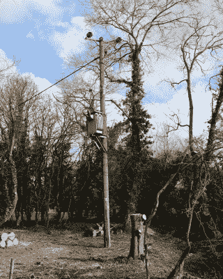
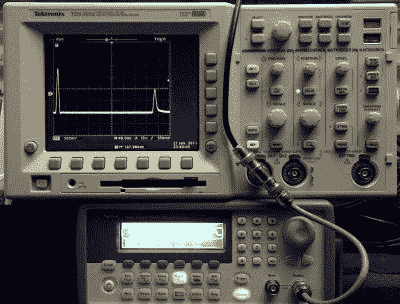

# 问问 Hackaday:我们的电网是否足够智能，能够知道什么时候没电了？

> 原文：<https://hackaday.com/2020/06/23/ask-hackaday-is-our-power-grid-smart-enough-to-know-when-theres-no-power/>

在我居住的英国乡村，为了加深即将到来的新冠肺炎禁闭僵尸启示录的感觉，我们停电了。在这里，在一个漫长的农村配电网络的末端，这种情况并不罕见，而[为停电做准备是我几年前写的东西](https://hackaday.com/2017/12/19/prepping-for-power-outages/)。但是这次比正常情况下要大一点，它带走的不仅仅是我们的村庄。我为另一个村庄的农民撞上 11 千伏的配电杆感到非常遗憾。

今天的文章首先想到的是断电监控的话题。当陷入黑暗时，我们都想知道电力公司是否知道这件事。最常见的反应肯定是:“电力公司当然知道停电了，是他们在制造停电！”。但这不可能，因为几十年来，公共服务公告一直敦促我们立即报告停电。

在我们这个非常现代的时代，电网是否会变得足够智能，能够知道什么时候，或许更重要的是哪里会停电？在下面的评论中把问题抛给你之前，让我们检查一些背景。

## 一个阳光明媚的下午停电了

事后，我在我的邻居中讨论这个问题，关于我们的电力供应商是否自动监控他们的网络，或者我们是否需要呼叫故障，出现了不同的意见。

We really have reached the end of the line.

电力公司的经营者似乎提出了没有监控的建议，但我的思绪回到了 20 世纪 90 年代中期的一个夏日午后。我们当时的邻居是一个一辈子的农民，几十年来一直在他身后无情的牛津郡重粘土上变戏法似的获得不错的产量，但那不是他的幸运日。他的一台机器车顶上长长的 CB 鞭状天线碰到了村里的 11kV 供电线路，我们家停电了。我从来没有看到它对不幸的 CB 收发器做了什么，但我记得他谈到他的惊讶，因为当他到达农舍呼叫它时，他发现电力公司的人在呼叫他。他们的监控设备发现了故障，并把范围缩小到了他的房产。

但是 2020 年这里的当权者告诉我现在的邻居我们没有，很明显两者都不可能是真的。最有可能的是，他们在一些电路上有它，而在其他电路上没有，但这种猜测并没有真正解决整个问题。

很容易确定我们村里的任何一根电线杆上都没有电力监控设备，只要简单地看一看，没有任何不良设备。我们正在全国范围内推广智能电表，因此如果我们的任何邻居有一个智能电表，它可能会通过蜂窝数据网络呼叫家里，并提醒他们的运营商断电。但是由于首次展示是可选的，而且没有强迫消费者购买，所以也不能确定村里有没有。因此，可以安全地假设任何电力监控设备都是集中式的，而不是分布式的。有鉴于此，有理由猜测某种形式的时域反射仪将会投入使用。

## 沿着你的电力线跳动的脉冲

Time domain reflectometry demonstrated on the bench, with the original pulse on the left of the screen and its reflection on the right. Constant314 / [CC0](https://commons.wikimedia.org/wiki/File:Time_Domain_Reflectometer_made_from_common_lab_equipment.JPG)

时域反射仪是一个极其简单的过程，它依靠行进波形的特性从传输线路的末端反弹并反射回其始发者。这是电子工程学生的标准实验室实验，可以很容易地用脉冲发生器、电缆线圈和示波器来复制。调整示波器以观察产生的脉冲的末端，过一会儿就会看到它的反射。发送脉冲结束和反射波到达之间的时间是通过电缆并返回所用的时间，因此可以计算出电缆的长度。

由于脉冲会从任何断层反射，因此也可以计算出到断层的距离。一旦断路器被故障触发，电力公司就可以测量距离，并派出维修小组进行修复。这正是埃尔塞贡多蒸汽发电厂如何在十英里长的地下电缆中找到故障的。

理论上是这样的，但直觉告诉我，即使有最先进的设备，也不太可能这么简单。例如，我们对村庄中 230 伏变压器的 11 千伏配电是线性的，随着距离变电站越来越远，一连串的农场和住宅群用它们自己的变压器接入，还是分支拓扑，线路分裂，再分裂？当线路有多个终端时，时域反射仪将是无用的。唯一的解决方法是等待人(或智能电表)给家里打电话吗？

有人告诉我，主电源终于在 20 世纪 50 年代到达了这个村庄，所以我很幸运地成为了一直拥有主电源的一代人。它是风景的一部分，我们不会真正注意到它，当然也不会欣赏它背后的努力，所以作为一名电子工程师，我有点惭愧，我不知道更多关于它的技术。电力工程师们，现在是你们大放异彩的时候了，给我们讲讲你们的艺术吧！

满足我的好奇心，Hackaday，自动配电系统监控的当前技术水平如何？请在下面的评论中分享你的故事。