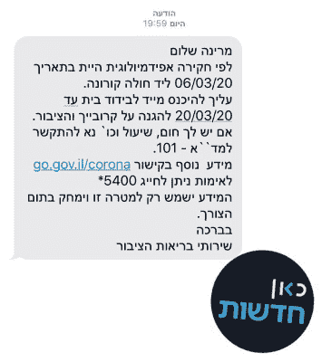
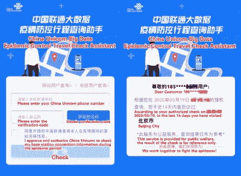

# 新冠肺炎·疫情战争中使用的手机追踪

> 原文：<https://hackaday.com/2020/04/03/cellular-tracking-used-during-covid-19-pandemic/>

正如大多数科技界人士所知，民族国家拥有一套强大的工具，可以用来追踪和监控手机。总的来说，在再次淡出公众视线之前，这个问题不时出现在关于隐私和立法的讨论中。然而，面对全球化的疫情，政府正在以许多人长期以来担心的方式使用这些工具——进行社会控制。这是地面上正在发生的事情。

## 时势

随着新冠肺炎席卷全球，其高传染性和住院率使当局急于遏制蔓延。前所未有的封锁已经到位，以试图拉平新病例的曲线，使医疗系统有能力做出反应。这一努力的一个关键部分是确保确诊病例遵守隔离规定，并自我隔离以避免疾病传播。几个国家也出台了规定，所有海外入境者都必须隔离，无论症状或状况如何。

“According to an epidemiological investigation you were near a corona patient on 06/03/20\. You must immediately enter a home isolation by 20/03/20 to protect your relatives and the public. If you have fever, cough, etc. call A-101\. Learn more at the link gov.il/corona” – An Israeli government text message. Source: @kann_news

为了实现这一目标，以色列已经开始使用蜂窝设备来追踪疑似冠状病毒病例。利用最初为反恐目的开发的技术，它允许以色列当局监控公民个人的行动。如果一个公民被检测到在感染者周围 2 米内呆了 10 分钟或更长时间，他们就会收到一条短信，指示他们在特定日期前进行自我隔离。这是一种非常有效的追踪可能的感染接触者的方法，同时也向以色列 Shin Bet 情报机构展示了难以置信的数据粒度。有了这种能力，出于强制执行的目的跟踪电话用户也将变得很简单。

韩国也一直在积极追查公民手机。[公共卫生组织已经发出文本，详细描述了感染者最近的活动，](https://www.theguardian.com/world/2020/mar/06/more-scary-than-coronavirus-south-koreas-health-alerts-expose-private-lives)透露了他们公民私人生活的隐私细节。在一个荒谬的案例中，一名据称在最近的一场车祸中受了重伤的女子被注意到正在前往婚礼和餐馆，在被互联网用户认出后，她受到了电视记者的盘问。

[伊朗尝试了一种更明显的方法](https://blog.avast.com/iranian-coronavirus-app-collecting-sensitive-information-avast)，要求用户安装一款承诺帮助诊断冠状病毒症状的应用。它秘密泄露了用户的生活位置数据，一旦这被公开，它就因违反谷歌服务条款而迅速从 Play Store [下架。这种方法对中等技术水平的用户来说是相当透明的，因此也很突出。当然，这并不意味着伊朗在幕后没有更强大的手机追踪能力，但它确实提出了一个问题，为什么要尝试这样一个明显的方法。](https://www.zdnet.com/article/spying-concerns-raised-over-irans-official-covid-19-detection-app/)

A screenshot of a Chinese website used to determine whether individuals have travelled to disease hotspots.

中国与新冠肺炎打交道的时间比任何人都长，在国内监控技术方面经验丰富。一个独立的消息来源证实这项技术正被用于建筑物的门禁控制。在入境点，人们扫描一个二维码，这个二维码会把他们带到一个电话提供商的网站。输入他们的详细信息，用户会看到他们在过去 14 天的位置记录。如果他们避开了疾病高发区，他们就被允许进入该机构。

## 正当理由？

理想的民主政体是在人民的同意下治理国家。虽然在正常情况下，人们可能会反对这样侵犯他们的隐私，但在危险时期，他们可能会愿意做出这种权衡。目前还不清楚上述国家中是否有人试图获得本国公民的同意。

在医疗危机结束后，是什么阻止政府使用这些相同的国内间谍权力？通常，即使它没有在主流中使用，在黑暗中运作的情报组织也可以不受惩罚地使用这些工具，即使违反了该国自己的法律。我们知道，许多人已经这样做了多年。如果说有什么不同的话，它是对公众的一个有用的提醒:没有任何移动设备可以被认为是安全的，不会受到多管闲事的政府行为者的攻击。

## 展望未来

重要的是要记住，基于手机的跟踪系统有一个主要的警告。那些不希望被跟踪的人总是可以选择不携带手机。目前还没有哪个国家强制要求携带手机，所以避免这种追踪的最好方法就是干脆完全退出这项技术。在这个现代时代，任何人做出这样的决定都是放弃了很多，这不是一个可以轻易做出的决定。然而，对于一些人来说，这根本不是一个选择——当手机被用于建筑物的门禁控制时，这是很难避免的。例如，在中国，最受欢迎的手机支付应用支付宝(Alipay)已经绑定了电晕追踪功能，一些城市要求使用公共交通工具时手机必须开绿灯。

世界各国政府已经表明了他们的立场，向公众清楚地表明，他们拥有一种非常强大和具有威胁性的技术，并且他们愿意在未经同意的情况下使用这种技术。虽然它目前被用于公共卫生服务，但潜在的影响显而易见。公民可能很难赢回在当前隔离期间被中止的公民自由。时间会证明一切。