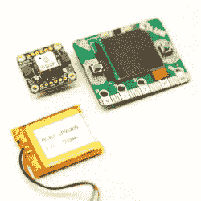

# 线索跟踪器使用 CircuitPython 为您指出一个目标

> 原文：<https://hackaday.com/2020/04/05/the-clue-tracker-points-you-to-a-target-using-circuitpython/>

The main components are an Adafruit CLUE, Stemma GPS, and a lithium-polymer battery. No soldering required.

[Jay Doscher]分享了他在周末设计并完成的一个快速 GPS 项目。这款设备名为*线索追踪器* ，有着简单的目标:它向用户显示他们当前的位置，同时也提供一个指向目标点的罗盘航向和距离。这个想法有点像地理藏宝，用户被指向一个目的地，但必须自己找到去那里的路。有一个 3D 打印的外壳，另外，不需要焊接。

线索追踪器使用 [Adafruit 线索板](https://www.adafruit.com/product/4500)(与 BBC micro:bit 大小相同)和 [Stemma GPS 传感器](https://www.adafruit.com/product/4415)，唯一的其他有源组件是锂聚合物电池。线索追踪器的软件方面使用 CircuitPython，【Jay】在 GitHub 上有[代码和外壳设计。](https://github.com/jdoscher/CLUE-Tracker)

[Jay]在注释和记录代码方面做得很好，所以这可以成为一个很好的 CircuitPython 入门项目。不需要焊接，这使得以后在其他项目中重用这些部件变得更加容易。这有助于在预算上抵消黑客的成本。

像这样的设备可以是一个下午或周末的项目，这一事实证明了一个事实，即对于硬件爱好者来说，时代从来没有这么好。CircuitPython 也是一个快速发展的工具，像这样的项目可以让入门变得简单有趣。