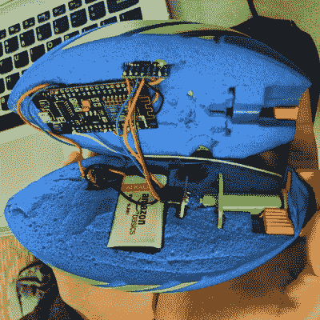

# ESP8266 和传感器组成了一个聪明的 NERF 球

> 原文：<https://hackaday.com/2020/04/03/esp8266-and-sensors-make-for-a-brainy-nerf-ball/>

在加州大学洛杉矶分校物理 4AL 项目的最后一个项目中，[【蒂莫西·卡纳斯基】使用了一个节点微控制器来清理一个仔细解剖的神经橄榄球](https://hackaday.io/project/170654-nerfornothing)。除了双 MPU6050 数字加速度计和一些数学运算，这个球可以计算出移动的距离和角速度。带着 9 伏碱性电池和一个电压调节板，它看起来很重；但是当然，在相当长的一段时间里，Hackaday 的员工中没有人投过球，所以我们可能不是这类事情的最佳评判者。

 即使你对完善你的投掷并不特别感兴趣，这个项目中也有很多令人着迷的科学；用漂亮的方程式来完成，让你记得你在数学课上表现有多差。

正如[Timothy]在文章中解释的那样，仅用两个加速度计来计算速度和行驶距离的数学方法与洲际弹道导弹(ICBMs)中使用的航位推算方法没有什么不同。既然我们已经看到了有自己发射井的模型火箭，看起来所有的部分都就位了。

NodeMCU 每 5 毫秒轮询一次加速度计，并在网页上显示数据，同时显示加速度和角速度的滚动图。当球背面的按钮被按下时，数据被保存到基本的逗号分隔值(CSV)文件中，该文件通过最小的 FTP 服务器提供给客户端。我们可能不太了解 sportsball，但我们肯定喜欢我们可以扔给人们的文件服务器的想法。

有趣的是，这不是我们第一次看到仪表足球。[回到 2011 年，完成这种事情需要一些非常复杂的硬件](https://hackaday.com/2011/01/09/data-logging-football/)，看到[最先进的技术已经发展到什么程度](https://hackaday.com/2020/01/31/the-internet-of-football/)令人着迷。