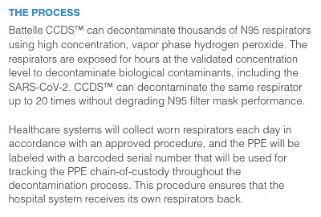

# FDA 表示，个人防护设备可以在通过集装箱净化系统后重复使用

> 原文：<https://hackaday.com/2020/04/02/fda-says-ppe-can-be-reused-after-trip-through-shipping-container-decontamination-system/>

我们在新闻中听到很多关于医护人员个人防护设备(PPE)短缺的报道。当涉及到生产的时候，工厂被要求去做不可能的事情，因为这种需求是如此的真实，如此的直接，如此的普遍。

快速消耗个人防护装备的问题是，一旦暴露于感染，它就被污染了，不能再次使用。身体上它可能是好的，但是它保留了感染其他人的能力。如果有某种方法可以有效地对其进行清洁和净化以重新使用，这将减少供应链的压力，并为所有需要的人提供更多的个人防护设备。

这是巴特尔的危急护理净化系统的承诺，这是一个集装箱大小的装置，已经以惊人的速度获得了 the FDA 的批准。

## 过氧化氢:不仅仅是火箭

via Battelle CCDS Overview PDF

每个容器都装有一个主室，受感染的个人防护设备被装入其中，受到气闸和一套过滤器的保护，净化魔法在暴露于过氧化氢蒸汽几个小时后发生。使用过氧化氢作为消毒剂的机制很简单，也很容易理解，这是一种容易降解为高活性羟基自由基的化学物质，羟基自由基反过来会攻击它们遇到的任何有机物质。这有效地中和了可能存在于 PPE 上的任何病毒或细菌，为其下一个用户留下干净和消毒的 PPE，并且从开始到结束包括装载和卸载的整个周期花费 12 个小时。该系统特别灵活的一面来自于它的运输集装箱基地，使得使用标准卡车和装载设备从一个地方移动到另一个地方变得非常简单。

所有这一切都令人印象深刻，并有可能在疫情最严重的时候改变压力重重的医院的游戏规则，但依赖任何一种解决方案都是危险的，从长期来看，最好的解决方案仍然是建立一个持续的生产努力，所有 PPE 都处于短缺状态。

【主要图片来源: [@PaigePfleger](https://twitter.com/PaigePfleger/status/1243972525262082048) 】