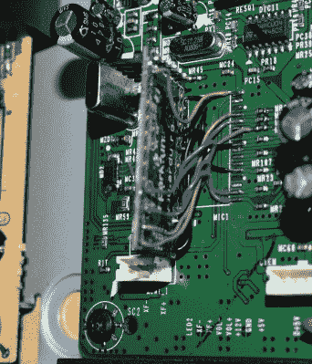

# 低音炮获得 Arduino 脑移植

> 原文：<https://hackaday.com/2020/04/06/subwoofer-gets-arduino-brain-transplant/>

三星 PS-WTX500 超重低音扬声器旨在用作 5.1 声道家庭影院系统的一部分，而不仅仅是任何系统的一部分。它包含所有通道的放大器，但它们只有在低音炮连接到匹配的接收器时才能工作。[亚历杭德罗·萨拉特]认为一定有某种方法可以解开系统的全部功能，而不局限于原来的接收器，[他只需要逆向工程如何低音炮工作](https://github.com/zarpli/PS-WTX500)。

All the wires tuck underneath the Arduino

其结果是一篇令人难以置信的详细记录文章，涵盖了整个过程，从[Alejandro]如何识别和研究 Pulsus PS9829B 数字音频处理器(DAP)开始。这种特殊芯片的文档似乎很难获得，但他能够找到来自同一制造商的类似芯片，这足以让他走上正确的道路。从那时起，他开始研究 DAP 和低音炮的 S3P70F4 微控制器之间的 SPI 通信。

在分析了两个芯片之间的通信之后，[Alejandro]将 S3P70F4 从电路板上取下，并在其位置上连接了一个 Arduino Pro Mini 328。Arduino 比最初的微控制器大了很多，但是通过一些仔细的布线，他管理了一个非常专业的安装。除了推出定制的 PCB 适配器，我们不认为它看起来会更好。

通过一些相对简单的代码和捕获的字节序列列表，Arduino 能够启动 PS-WTX500 的放大器，并作为独立设备处理输入的音频信号。

在过去的[中，我们已经在 ESP8266](https://hackaday.com/2019/10/24/esp8266-unlocks-hidden-features-in-sound-bar/) 上看到过类似的技巧，它还有一个额外的好处，就是可以通过 WiFi 控制扬声器。我们都支持给旧的硬件增加现代功能，[，即使你不得不把它挂在后面作为一个外部模块](https://hackaday.com/2020/02/12/sniffing-signals-to-teach-old-speakers-new-tricks/)。

 [https://www.youtube.com/embed/8eDIVF7A_ak?version=3&rel=1&showsearch=0&showinfo=1&iv_load_policy=1&fs=1&hl=en-US&autohide=2&wmode=transparent](https://www.youtube.com/embed/8eDIVF7A_ak?version=3&rel=1&showsearch=0&showinfo=1&iv_load_policy=1&fs=1&hl=en-US&autohide=2&wmode=transparent)

