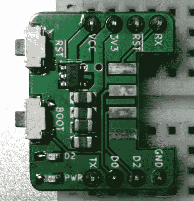

# 解决您的 ESP-01 试验板困境的适配器

> 原文：<https://hackaday.com/2020/04/04/an-adapter-to-solve-your-esp-01-breadboard-woes/>

ESP-01 在 2014 年推出了 ESP8266 革命，虽然今天你更有可能看到有人在 Wemos 或 NodeMCU 开发板中使用更高版本的芯片，但仍然有原始芯片非常适合的任务。不幸的是，它们在原型制作时很难使用，因为它们不是非常友好的试验板，[但是由[Miguel Reis]开发的这个适配器可以帮助](https://hackaday.io/project/170712-esp-01-breadboard-adaptor)。

 当然，主要问题是 ESP-01 有点不寻常的引脚排列。因为它被设计为插入另一个设备的子板，所以接头太紧，无法装入试验板。[Miguel]发明的适配器可以将它扩展到你可以把它放在你的试验板的中心线上，并且在它周围有足够的空间。

第二个问题是，ESP-01 是一个 3.3 V 设备，如果电路中的其他一切都在 5 V 上运行，这可能会很烦人，为了解决这个问题，适配器包括一个 SPX3819 调节器和足够的电容器，使有点不稳定的芯片获得它需要的稳定低压电源。

[Miguel]已经发布了原理图和电路板文件，所以你可以自己制作适配器的副本，[但是也可以从他的 Tindie 商店购买，价格大约为 3 美元](https://www.tindie.com/products/microinventions/esp-01-breadboard-adaptormount/)。