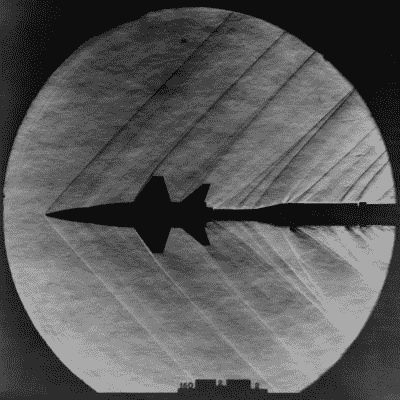

# 数学证明 USPS 标志中的老鹰速度很快！

> 原文：<https://hackaday.com/2020/04/18/mathematical-proof-the-eagle-in-the-usps-logo-is-fast/>

美国邮政署​的标志是一只长相凶恶的鹰。但一个真正的流体动力学爱好者可能会看到它，并意识到老鹰移动得如此之快，以至于引起了冲击波。但是它移动的速度有多快呢？[安德鲁·希金斯]提出并回答了这个问题，发布了他对这个标志的超音速旅行的分析。他声称是 4.9 马赫，但是，我们怎么知道？科学！

事实证明，如果某样东西跑得足够快，你可以用一张简单的图片来判断它到底有多快！我们都看过喷气式飞机突破音障的照片，这给了我们关于喷气式飞机速度的信息。

## 它是如何工作的？

想象一下:声音在海平面上以大约 330 米/秒的速度传播。如果一个物体以这样的速度在空气中运动，空气扰动就会以声波的形式传播。如果它的移动速度比声音还快，这些波就会分布到下游，移动物体的后面。这些波在运动物体后面的距离取决于物体的速度。

这就产生了一条被称为“马赫线”的相互作用线。找出马赫线和行进方向的角度差，就得到了“[马赫角](https://www.grc.nasa.gov/www/BGH/machang.html)”(用α或表示)。

用马赫角、声速( **a** )和物体速度( **v** ): `sin(µ) = a / v`来确定物体速度有一个简单的公式。 **v** 与 **a** 的比值称为[马赫数](https://www.grc.nasa.gov/www/BGH/mach.html)，(M)。如果一个物体的速度正好是音速，那么它的速度是 1 马赫(因为 v = a)。

由于马赫数(M)为`v / a`，我们可以将它作为`1 / M`从上面代入公式，并使用文章顶部图像中所示的【Andrew】的计算，马赫数角( )为~11.7:

真正的问题是，美国邮政总局选择 4.93 马赫作为对一些秘密政府邮政项目的暗示吗？或者，这仅仅是 1993 年[标志](https://uspsblog.com/the-history-behind-the-usps-logo/)设计者试图“捕捉延续至今的现代时代精神”？