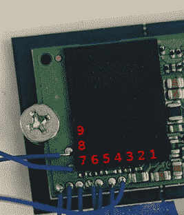

# JTAG 黑客指南

> 原文：<https://hackaday.com/2020/04/08/a-hackers-guide-to-jtag/>

如果你正在阅读 Hackaday，你几乎肯定听说过 JTAG。很有可能你已经用过一两次来刷新一个不守规矩的硬件了。但是你到底有多了解 JTAG 呢？更具体地说，你知道它在逆向工程硬件时有多有用吗？

 无论你是 JTAG 老手还是新手，[这本由【错误波特】](https://wrongbaud.github.io/posts/jtag-hdd/)撰写的现象级指南一定会教你一二。从界面实际工作方式的低级解释开始，该指南将带您探索未知目标上的 JTAG 端口，当前开源工具中与设备交互的最先进技术，最后展示一个提取和分析小工具固件的真实示例。

没有办法用一个细目或一个总结来公正地评价他的文章，所以我们甚至不会去尝试。舒服一点，喝一杯，然后投入进去。这当然不是一篇短文，但这一页上没有一个字被浪费掉。这个难题的每一个部分，从如何找出一个未标记的引脚排列到确定指令长度，都有你所需要的详细解释。这是一个黑客写的黑客指南，它展示了。

发现这个[不是第一次像这样](https://hackaday.com/2020/02/11/xbox-controller-provides-intro-to-swd-hacking/)进行深潜，可能不会令人惊讶。在过去的几个月里，我们一直在报道[的实用逆向工程指南系列](https://hackaday.com/2020/01/07/poking-around-inside-a-pair-of-classic-gaming-gifts/)，而[的每一篇都是无价的资源](https://hackaday.com/2019/12/06/swapping-the-roms-in-mini-arcade-cabinets/)。当全球疫情让你困在家里时，这是完美的学习指南。