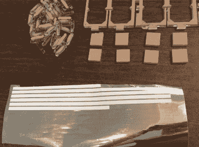

# 边缘照明 7 段时钟新常态

> 原文：<https://hackaday.com/2020/04/14/edge-lit-7-segments-clock-the-new-normal/>

人们一直说时间现在已经失去了所有的意义，但我们仍然在这里与黑客们分享日子。你在这里看到的大多数黑客都是开源的。但是如果你想要更透明的东西来衡量无意义，我们邀请你做一个非常棒的透明钟，碰巧两者都是。

 不过有一个警告——根据[GeekMomProjects]的说法，这是一个非常复杂的建筑，丙烯酸与丙烯酸或 LED 灯条的所有地方都有严格的公差。我们可以看到这就像把易碎的拼图拼在一起。因为整个东西是透明的丙烯酸树脂，所以光线会射向任何地方。

[GeekMomProjects]巧妙地通过在所有较小的碎片的边缘刻意应用不导电的粘合箔来阻挡逃逸的光。尽管做了这么多工作，但我们认为在家里的某个地方拥有这样一款神奇的手表来消磨时间是值得的。

从电子学的角度来说，这种美非常简单。灯光来自一辆小巧的 M4 快车，时间是用 ESP8266 单独获取的。[GeekMomProjects]玩得太开心了，她做了一个带秒的，一个不带秒的。休息之后看看他们的 RGB 舞蹈。

如果你更喜欢实用一点的 blinky 7 段钟，[这里有一个由搁板制成的钟](https://hackaday.com/2020/03/18/seven-segment-shelves-do-double-duty/)。

 [https://www.youtube.com/embed/t9mYP_DikMA?version=3&rel=1&showsearch=0&showinfo=1&iv_load_policy=1&fs=1&hl=en-US&autohide=2&wmode=transparent](https://www.youtube.com/embed/t9mYP_DikMA?version=3&rel=1&showsearch=0&showinfo=1&iv_load_policy=1&fs=1&hl=en-US&autohide=2&wmode=transparent)

