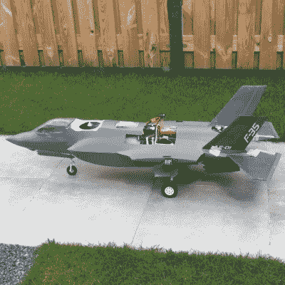

# DIY 功能性 F-35 不是一件简单的任务

> 原文：<https://hackaday.com/2020/04/27/a-diy-functional-f-35-is-no-simple-task/>

无线电控制飞机的廉价设备的出现使这一爱好变得非常容易，但也使人们有可能在预算内建造一些非常复杂的飞行器，特别是在与 3D 打印相结合的情况下。[乔尔·弗拉索夫]非常喜欢垂直起降战斗机，并且正在建造一架功能齐全的无线电遥控 F-35B。

F-35 系列飞机是迄今为止最昂贵的国防项目之一。能够垂直起降的“B”型飞机是一种复杂的机器，在飞机外部有 19 个门，用于武器、起落架和推进器。尾部的推进器可以向下旋转 90 度进行垂直起降操作，使用了一个有趣的 3 轴承旋转机构。

[Joel]希望他的模型尽可能接近真实的东西，并且已经将所有这些特征整合到他的构建中。推力由两个 EDF 马达提供，旋转喷嘴是 3D 打印的，由三组小型 DC 马达驱动，垂直起落飞机的所有 5 个门都由机头的一个伺服系统通过一系列连杆驱动。对于倾斜控制，来自主风扇的空气被引导到翼尖，并由伺服驱动阀控制。用于多旋翼飞机的飞行控制器用于帮助飞机在悬停时保持稳定。这种飞机的一次迭代在开发过程中失败了，但[Joel]已经成功地进行了悬停和传统水平飞行的试飞。真正棘手的部分将是飞行模式之间的转换，[乔尔]希望在不久的将来实现这一目标。

真正的洛克希德·马丁 F-35 闪电 II 项目因为反复的预算超支和时间延迟而备受争议，但项目中解决的工程挑战本身就令人着迷。将这些复杂的机器保持在空中的后勤工作令人生畏，不久前我们看到了海军陆战队地勤人员通过正常渠道难以获得的 3D 打印组件。

 [https://www.youtube.com/embed/mRH1vsU1JRQ?version=3&rel=1&showsearch=0&showinfo=1&iv_load_policy=1&fs=1&hl=en-US&autohide=2&wmode=transparent](https://www.youtube.com/embed/mRH1vsU1JRQ?version=3&rel=1&showsearch=0&showinfo=1&iv_load_policy=1&fs=1&hl=en-US&autohide=2&wmode=transparent)

