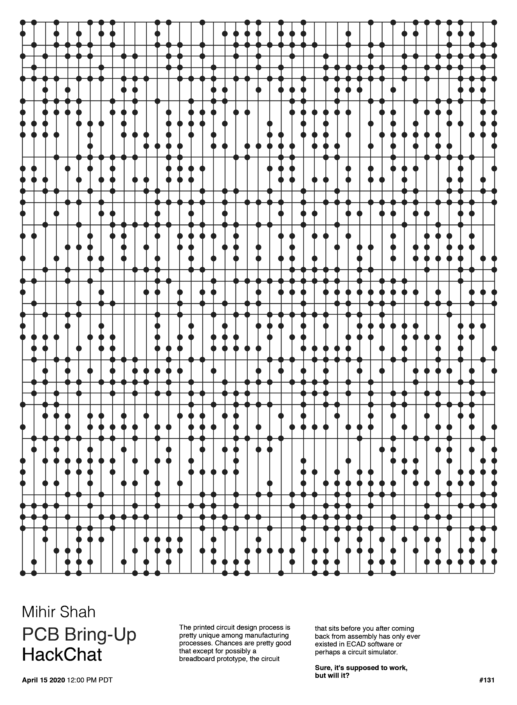

# PCB 调出黑客聊天

> 原文：<https://hackaday.com/2020/04/14/pcb-bring-up-hack-chat/>

加入我们太平洋时间 4 月 15 日星期三中午与[米希尔·沙阿](https://hackaday.io/mihirmshah8)和[利亚姆·卡迪根](https://hackaday.io/diggerleem)的 [PCB 升级黑客聊天](https://hackaday.io/event/169986-pcb-bring-up-hack-chat)！

印刷电路设计流程在制造流程中非常独特。很有可能，除了可能的试验板原型之外，组装回来后摆在你面前的电路只存在于 EDA 软件或电路模拟器中。当然，它应该是有效的，但是真的有效吗？

你可以——也应该——对新主板进行断电测试，但在某些时候，你必须扳动开关，看看会发生什么。PCB 启动过程需要小心处理，以免调试突然出现的任何问题变得比需要的更困难。来自 [inspectAR](https://www.inspectar.com/) 的 Mihir 和 Liam 将深入讨论启动流程，提供使事情尽可能顺利进行的提示和技巧，并演示 inspectAR 平台如何适应该流程，特别是对于分布在远程站点的团队。如果您的主板释放出神奇的烟雾，您会想知道这是您的设计问题还是组装问题，一个有组织的培养计划会有很大的帮助。

注:Liam 将通过 Zoom 同步进行 inspectAR 的网络演示。​

 我们的黑客聊天是 [Hackaday.io 黑客聊天群发消息](https://hackaday.io/messages/room/2369)中的社区直播活动。本周，我们将于太平洋时间 4 月 15 日星期三中午 12:00 开始讨论。如果时区让你烦恼，我们有[一个方便的时区转换器](https://www.timeanddate.com/countdown/generic?iso=20200415T12&p0=224&msg=PCB+Bring-Up+Hack+Chat&font=cursive)。

点击右边的那个发言气泡，你会被直接带到 Hackaday.io 上的黑客聊天群，不用等到周三；随时加入，你可以看到社区在谈论什么。

