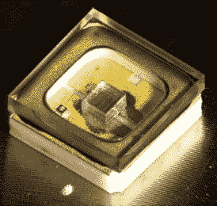
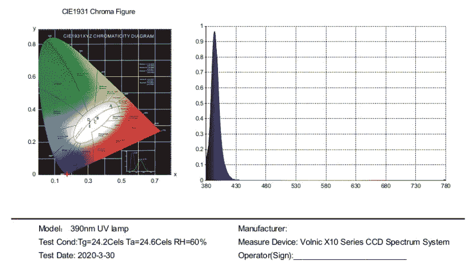

# 买家请注意:这种作为杀菌产品出售的 LED 灯泡不会释放紫外线 C

> 原文：<https://hackaday.com/2020/04/15/buyer-beware-this-led-bulb-sold-as-germicidal-doesnt-emit-uv-c/>

杀菌灯被设计成利用紫外线来消灭病毒和细菌。但是并不是所有的紫外线灯都能起作用，我曾经遇到过一个例子，一种被宣传为杀菌的灯，但是有些东西就是不对劲。

This is an [actual UV-C LED made by CEL](http://www.cel.com/pdf/press/cel_uvc-leds_03262019.pdf) (PDF) that emits 275nm. Note the clear glass that covers the LED.

我在亚马逊上订购了 UV-C 杀菌 LED 灯，前几天收到了。它从一开始就感觉到了怀疑:摆弄了许多不同的紫外发光二极管，我知道了不同紫外范围的寄生可见光对人眼来说应该是什么样子。此外，适当的 UV-C LED 透镜，如这里所示，是由石英玻璃制成的。与我收到的灯泡文章顶部的图像相比，它有一个软塑料透镜，在远紫外线范围内可能是不透明和可降解的。有问题的最重要线索是价格。很难想象，一盏波长为 253.7 纳米的 UV-C LED 灯，由 200 多个 LED 组成，并采用如此坚固的金属外壳，成本仅为 62.99 美元。

尽管有不公平的风险，我还是决定退货。在我的信息中，我虚张声势地说我用光谱发射仪测量了灯的光谱，它的输出不在 UV-C 范围内。第二天我收到了确认，证明虚张声势得到了回报:卖家回复说，他们是根据供应商的信息为产品做广告的，信息不正确是因为他们对产品信息缺乏了解。[他们还附上了实测波长的官方数据表](https://hackaday.com/wp-content/uploads/2020/04/390NM-UV.pdf):并不是宣传的 253.7 nm，而是峰值在 394.3 nm，主波长在 413.9 nm。它不是在远紫外线-C 范围内，而是在近紫外线-A 范围内，对消灭细菌毫无用处！卖家承诺产品会从他们店里下架，并且信守承诺。

如果你正在考虑买一个 UV-C LED 灯，也许你应该买一个老式的 CFL 杀菌灯。我不认为病毒太关心新技术。