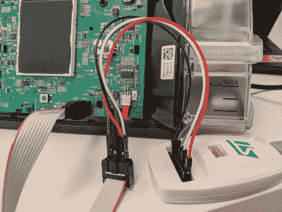

# CPAP 固件 Hack 启用 BiPAP 模式；设想用作临时通风器

> 原文：<https://hackaday.com/2020/04/15/cpap-firmware-hack-enables-bipap-mode-envisions-use-as-temporary-ventilator/>

在恒定气道正压通气(CPAP)机器与适当的呼吸机在电气或机械上相距不远的想法下，[【Trammell Hudson】进行了一些有趣的研究](https://airbreak.dev/)，研究这些广泛可用的机器如何在紧急情况下用作生命支持设备。虽然文件清楚地表明该项目是一个概念的证明，并且在目前的状态下**绝对不打算用于人类**，但迄今为止的发现肯定非常有希望。

出于这项研究的目的，[Trammell]将重点放在了 Airsense S10 上，它目前的零售价约为 600 美元。通常，该机器通过向肺部提供恒定压力来治疗睡眠呼吸暂停和其他疾病，但正如该项目所示，S10 也有可能在[所谓的双水平气道正压通气(BiPAP)模式](https://hackaday.com/2020/03/25/ventilators-101-what-they-do-and-how-they-work/)中发挥作用。本质上，这意味着该机器检测用户何时试图吸气，并增加空气压力以支持他们的自然呼吸。

Reflashing the firmware on the S10 CPAP

重要的是，这种变化完全是通过修改 S10 固件实现的。不需要额外的硬件，除了打开设备连接一个 STM32 编程器(这个过程[Trammell]已经仔细记录)，没有任何机械需要做机器在这个呼吸支持功能中操作。看起来至少有一些功能已经通过隐藏的诊断菜单包含在内了，这些菜单可以通过固件补丁来启用。

由于许多 CPAP 机器都具有蜂窝数据连接功能，可用于监控和无线更新，[Trammell]认为制造商应该有可能在受支持的设备上推出类似的修改固件。当然，在这种机器真正被用作急救、非侵入式呼吸机之前，食品和药物管理局必须批准类似的事情。他们还需要安装病毒过滤器，并增加一些远程控制设施，但这些都是相对较小的修改。

了解更多关于现在投入呼吸机的努力。从[这个叫做呼吸机 101](https://hackaday.com/2020/03/25/ventilators-101-what-they-do-and-how-they-work/) 的优秀硬件概述开始，然后看看[试图从零开始建造呼吸机的一些问题](https://hackaday.com/2020/04/09/what-does-a-dependable-open-source-ventilator-look-like/)。