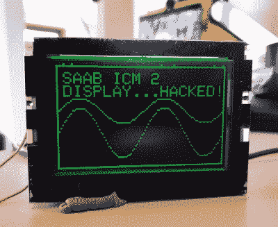

# 对北京汽车股份有限公司的仪表板显示器进行逆向工程

> 原文：<https://hackaday.com/2020/04/16/reverse-engineering-a-saabs-in-dash-display/>

对于[Leigh Oliver]来说，2003 款萨博 9-3 Gen2 的黑色仪表上的绿色有着不可否认的吸引力。也许是因为信息娱乐控制模块 2 (ICM2)屏幕给日常通勤带来了一点经典的 *Matrix* 氛围。不管是什么原因，看起来显示器应该比坚持显示近 20 年的用户界面更好。幸运的是，[你可以通过 I2C](https://hackaday.io/project/170893-saab-9-3-icm2-display-hacking) 来控制它。

虽然正如你所料，这个事实一开始并不明显。[Leigh]必须从拆开 ICM2 开始，对显示板进行逆向工程。使用万用表和 PCB 两面的高分辨率照片，在 KiCAD 中绘制并重新创建了所有迹线。这可能不是绝对必要的，但它确实是使用 KiCAD 的良好实践；对于其他希望积累创建原理图实践经验的人来说，这是一个有价值的提示。

[至于如何重新利用现有的显示器，这可能是最好的情况。它甚至允许基于`Adafruit_GFX`创建一个显示库，它提供的图形能力远远超过 ICM2 模块本身的能力。](https://hackaday.com/wp-content/uploads/2020/04/saabdisplay_detail.jpg)

尽管取得了如此大的进展，这个项目才刚刚开始。[Leigh]已经成功地在黑色和绿色的萨博显示屏上展示了一些令人印象深刻的图像，但硬件方面的工作仍在进行中。例如，由于新的库和隐藏在仪表板后面的 ESP8266，人们希望 I2C 多路复用器可以让显示器轻松快速地在“股票”模式和任何增强版本之间切换。

如果你没有足够老式的萨博来利用这个项目，不要担心。[用有机发光二极管显示器接入 OBD 港](https://hackaday.com/2020/04/13/a-tidy-little-obd-display-for-your-car/)可以在各种车辆上得到类似的结果。