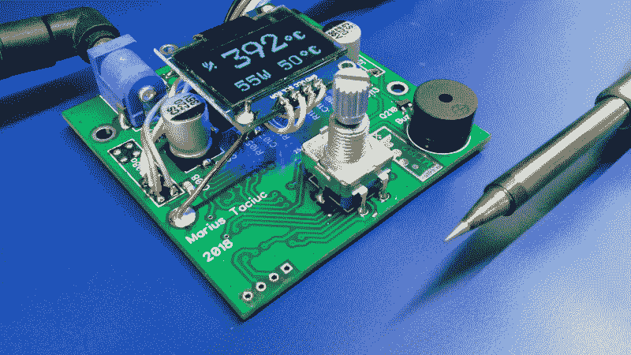
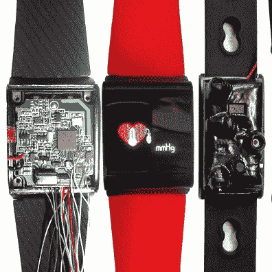

# 竞赛获胜者:在各种设备上进行机器学习

> 原文：<https://hackaday.com/2020/04/17/contest-winners-machine-learning-on-all-kinds-of-gadgets/>

与 Digi-Key 合作举办的[Train All Things 竞赛](https://hackaday.io/contest/169421-train-all-the-things)有近 60 个令人兴奋的参赛作品，已经接近尾声，今天我们很高兴分享获奖项目的消息。手头的挑战是展示一个使用某种类型的机器学习的项目，有很多关于这个主题的展示。

也许最令人印象深刻的项目是[tegwyn☠twmffat]的智能蝙蝠探测器，它获得了“边缘上的 ML”奖。如上图所示，他的项目不仅试图通过蝙蝠在回声定位过程中发出的声音来探测蝙蝠的存在，还试图识别蝙蝠的种类。经过多次迭代，基于 Nvidia Jetson Nano 和 Raspberry Pi 的蝙蝠探测器可以分类几种类型的蝙蝠，以及一组房屋钥匙(用于“控制”)。它也被无可挑剔地记录下来，并作为如何进入机器学习的一个很好的例子。

[焊接光剑](https://hackaday.io/project/170204-soldering-lightsaber)因在微控制器领域使用机器学习而获得“ML Blinky”奖。这个概念的巧妙运用寻求一件事:消除烙铁加热的等待时间。当熨斗加热时，读取温度是需要时间的，如果你能省去这一步，就会大大加快速度。通过对不同电压和加热时间的结果进行采样，机器学习建立了自己的指导方针，即如何在不检查反馈的情况下将电流注入加热元件，并以完美的温度从另一端出来。

  AI Powered Bulls*** Detector  Wearables Fitness Trackers for Mental Health

我们最后的两个获胜者是，[人工智能公牛****探测器](https://hackaday.io/project/170045-ai-powered-bull-detector)获得了“网关上的人工智能”奖，以及
[为精神健康而入侵可穿戴设备，以及更多赢得“云上的人工智能”类别的](https://hackaday.io/project/144350-hacking-wearables-for-mental-health-and-more)。

我们的发光便便表情符号项目背后的想法是检测人类的语言，并判断评论是否有效，或 BS。它通过利用先前被识别为 BS 的评论的学习集并与当前说出的单词进行关联来做到这一点。

用于精神健康的可穿戴设备是一个很棒的项目，之前在 2018 年 Hackaday 奖中得到[的认可。规模经济使得这些可穿戴设备非常实惠，可以作为一种将传感器套件添加到行为分析中的方式。但是，你当然需要一种方法来处理所有的传感器数据，这对于基于云的机器学习应用程序来说是一项完美的任务。](https://hackaday.com/2018/05/04/hacked-fitness-trackers-aim-to-improve-mental-and-physical-health/)

所有四名获胜者都获得了一张价值 100 美元的礼品券。别忘了去看看[所有其他参赛的有趣项目](https://hackaday.io/submissions/machine-learning/list)！