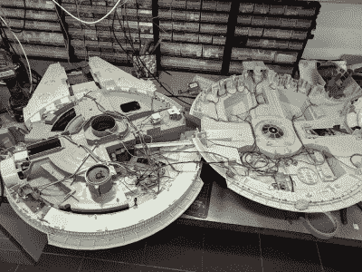

# 千年隼对接湾兼作桌子

> 原文：<https://hackaday.com/2020/04/22/millennium-falcon-docking-bay-doubles-as-table/>

玻璃桌子是展示对你来说很重要的东西的完美陈列柜，但是如果你想让你的宝贝远离灰尘，把桌子的边收起来可能是明智之举。这可能不是一个坏主意，把一些照明在那里，以确保一切都很容易看到。你也可以把灯做成 RGB 和遥控的，这样你就可以从房间的另一面随意摆弄了。当然，你可以全身心投入，把它做成一个立体模型…

不难想象说服[Erv Plecter]他[应该把一个简单的玻璃桌子变成一个*千年隼*](http://www.plecterlabs.com/shop/article_info.php?articles_id=132) 模型的停靠站的思路，看看最终的结果，我们认为这是正确的举动。凭借对细节的惊人关注，一张普通的桌子和一个不起眼的玩具被组合成一个互动的展示，甚至可以吸引最坚定的徒步旅行者。

 如果你曾经考虑过给一个模型打光，这个项目是一个很好的学习榜样。一开始的孩之宝玩具肯定不是你所说的工作室质量；它所使用的一点灯光甚至与电影中这艘船的样子都不相符。但有了一些参考材料、光纤电缆和足够多的 Arduinos 来驱动这一切，最终的照明确实是一个奇迹。我们会说引擎是我们最喜欢的部分，但驾驶舱里那些小小的发光面板很难被击败。

虽然猎鹰号显然是这场展览的明星，但停靠站本身肯定不是事后才想到的。背光面板，以其高深莫测的帝国设计美学，看起来棒极了。板条箱和桶等小细节的加入，加上地板所用的光滑的黑色 PVC 板，真的让整个场景栩栩如生。这几乎是一个耻辱，船本身是如此之大，作为一个较小的模型将有更多的空间扔在一些帝国冲锋队和机器人巡逻。

这不是我们第一次看到有人用额外的灯光效果来增强“玩具”级模型。虽然观众中的比例微缩模型爱好者可能会对这些低逼真度模型上的一些艺术自由嗤之以鼻，但我们认为任何正常人如果亲眼看到它们，都会被震撼到。

 [https://www.youtube.com/embed/073FzBJUlnM?version=3&rel=1&showsearch=0&showinfo=1&iv_load_policy=1&fs=1&hl=en-US&autohide=2&wmode=transparent](https://www.youtube.com/embed/073FzBJUlnM?version=3&rel=1&showsearch=0&showinfo=1&iv_load_policy=1&fs=1&hl=en-US&autohide=2&wmode=transparent)

