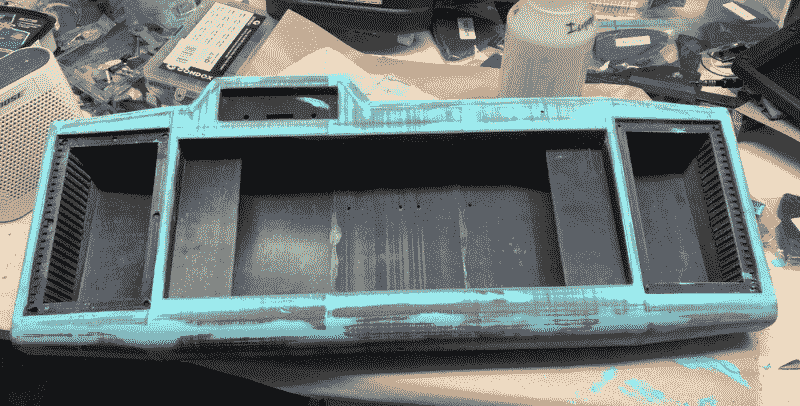
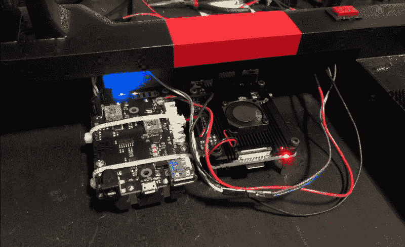

# 重量级的赛博达克是独一无二的

> 原文：<https://hackaday.com/2020/04/20/heavyweight-cyberdeck-is-in-a-class-of-its-own/>

受到他在网上看到的其他构建的启发，[BlastoSupreme]决定构建自己的网络平台。只有一个问题:他以前从未设计和组装过这样的东西。为了避免以后出现任何问题，他认为最安全的方法是把它做得很大，这样他就不用费力把所有东西都装进去了。有些人可能会说，以有史以来建造的最大战舰命名的“NX-Yamato”号最终变得“T4”号太大了。但那只是因为他们害怕。

A finish like the *Yamato’s* doesn’t come easy.

在他关于 [*的文章中，Cyberdeck Cafe*](https://www.cyberdeck.cafe/) 是一个致力于围绕这些未来个人电脑兴起的社区的网站，[BlastoSupreme]将建造这个 Cyberdeck 描述为一种变革性的体验。看着这个项目中令人难以置信的努力，我们可以相信它。从复杂的 CAD 工作到*大和的* 3D 打印框架的绝对非凡的完成，看不到任何偷工减料。

没错，这个网络平台的几乎每一个组件都是通过喷出热塑料变出来的。准确地说，大约两公斤。它被打印成垂直的块，然后用粘合剂和螺丝组装起来。这种模块化的建造技术让[BlastoSupreme]建造了他认为是有史以来最大的网络平台。听起来对我们来说是个挑战。

不可否认的是， *Yamato* 巨大的内部容积基本上没有被使用；现在它里面只有一个 Raspberry Pi 4 和一个 X705 电源管理板，允许甲板使用 18650 个电池。当然，所有这些空间都可以很容易地用于额外的设备，甚至是更大和[更强大的单板计算机(SBC)，如 Atomic Pi](https://hackaday.com/2019/05/08/this-atomic-pi-eats-other-pis-for-lunch/) 。侧面甚至有一个专门放零食的隔间，所以不用担心。正如[BlastoSupreme]所说，里面所有的空白都是*的一个特性*，而不是一个 bug。

Plenty of room inside for whatever hardware you want to take with you into the Sprawl.

自从我们第一次遇到这种由神经学家*和 T2 设计的产品[以来，已经过去了将近两年的时间，我们完全被](https://hackaday.com/2018/07/28/a-mobile-computer-to-make-william-gibson-jealous/)[这些*极度*的个人电脑](https://hackaday.com/2019/11/25/patrol-the-sprawl-with-this-battle-ready-cyberdeck/)日益增长的规模和复杂性震惊了。由于似乎只有一个相当松散的概念，即“适当的”网络平台在规范意义上应该是什么样子，这些构建可以自由地用一些非常古怪的设计来填补空白。其中一些已经获得了威廉·吉布森的个人认可。*