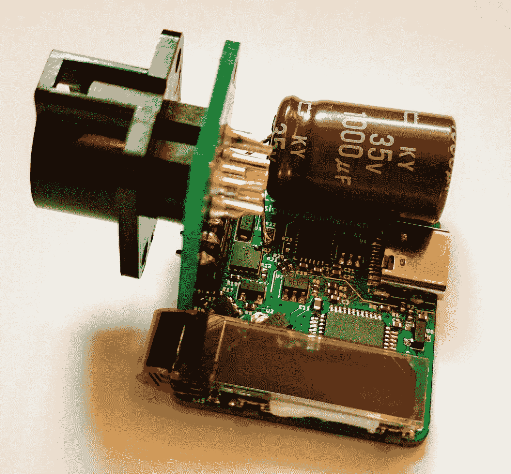
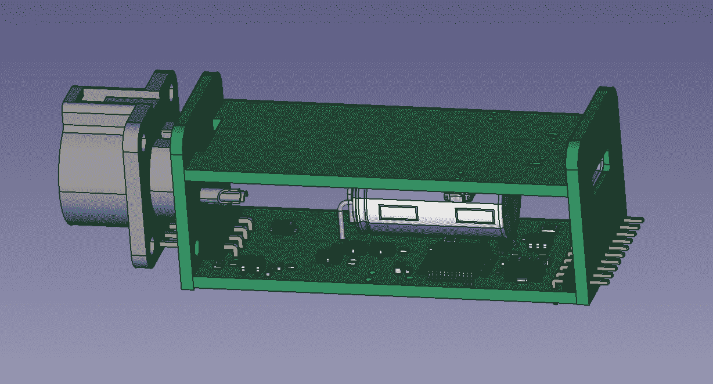

# 有 JBC 焊接手柄，将 USB-C 电源传送

> 原文：<https://hackaday.com/2020/04/21/have-jbc-soldering-handle-will-usb-c-power-deliver/>

频繁的工具到 USB-C 转换器[Jana Marie Hemsing]又来了，这次是用一个板来方便使用 [USB 供电给 JBC 烙铁手柄](https://twitter.com/_Jana_Marie/status/1249374621775912960)供电。上次我们看到[Jana]使用她的 USB-C 魔法是用[的水獭铁](https://hackaday.com/2019/12/26/adding-usb-c-to-the-ts100-but-not-how-you-think/)，它用专门建造的替代 PCBA 为可靠的 TS100 带来了电力输送。这一次，他采取了不同的方法，用一块小小的电路板和一个巨大的电容器完全取代了传统焊接站的“工作站”。

如果你接触过“AC fire starter”等级的烙铁，JBC 这个名字可能会很陌生。他们制造最常见的工具，如 [Metcal 的](http://www.okinternational.com/metcal/english/globalnavigation/products/hand-soldering-systems)和高端 HAKKOs 和 Wellers，放在返工技师和工厂车间的工作台上。像该类中的任何工具一样，每个焊接站都是分开的，每个组成部分(尖端、手柄、基座、支架等)都可以从制造商处单独获得，并在二手市场上以通常合理的价格出售，这就是[Jana]的用武之地。

Otter-Iron PRO 是一款小巧的 PCBA，一侧接受 USB-C 电缆，另一侧接受标准 JBC T245-A 手柄的连接器。JBC 使用一个相当典型的热敏电阻嵌入铁尖端的最末端，Otter-Iron PRO 感测该热敏电阻以提供闭环温度控制。[Jana]说它可以在 5 秒钟内从冷启动达到其温度设定点，这大致相当于原始 JBC 基站的性能！我们特别兴奋，因为这不需要对手柄或工作站本身进行任何修改，这使得它成为需要移动性的 JBC 用户的一个伟大选择。

想做一个自己的水獭铁职业选手吗？来源在顶部的链接中。听起来设计的 v3 很快就要来了，它将包括自己优雅的 PCB 外壳。休息后，请查看 CAD 渲染。还在想这些 USB-PD 是怎么工作的吗？看看我们去年写的[【杰森·塞鲁多洛的】精彩的穿越](https://hackaday.com/2018/08/17/the-wonderful-world-of-usb-type-c/)。

