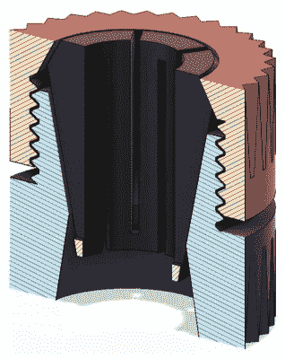
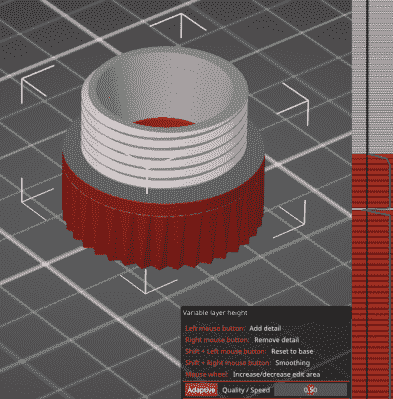
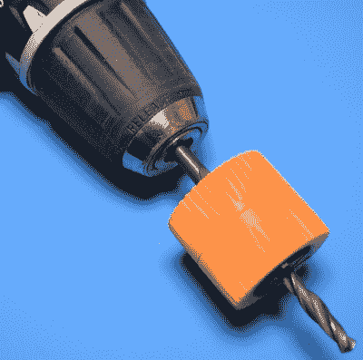

# 打印出来:夹头钻头停止

> 原文：<https://hackaday.com/2020/04/22/printed-it-collet-drill-stop/>

你可能会认为，被隔离在家里对像我们这样的黑客和开发者来说是完美的，因为我们都有一两个项目一直被搁置，因为我们没有时间去解决它。不幸的是，一些人发现现在的问题实际上是获得完成工作所需的零件和工具。当家得宝(Home Depot)外面有保镖和排队的时候，就像周六晚上的夜总会一样，在 COVID 的时代，即使是最简单的东西也很难找到来源。

这正是我最近发现自己处于的情况，当时我需要钻一堆同样深度的洞。这块太大了，不能放在钻床上，虽然我打算用一些胶带把钻头包起来作为临时的止挡，但我不相信它足够准确或可重复。我突然想到，设计和 3D 打印一套钻铤会很容易，但在我启动 OpenSCAD 之前，我决定看看网上已经有什么。

这就是我如何从 Adam Harrison 那里找到[“夹头钻头止动器”的原因。他的设计没有采用传统的圆环和固定螺丝，而是使用了一种可印刷的夹头，不用工具就可以在任意位置夹紧钻头。因此，我不仅可以通过打印出这个设计来避免去商店，它看起来可能会是对我所购买的产品的升级。](https://www.thingiverse.com/thing:3177276)

当然，在处理 3D 打印时，不要想当然，这是明智的。我能确定亚当的设计对我有用的唯一方法就是把它用在塑料上并进行试验。

## 塑料制造完美

塑料在许多应用中很棒，但在其他应用中却很糟糕。不幸的是，这是我们的桌面 3D 打印机目前唯一可以喷出的东西，所以这意味着它经常在不应该的时候被投入使用。

The collet needs to be flexible enough to compress when the nut is tightened.

但事实并非如此。永远不会有任何严重的负荷放在钻头止动器上，它只需要牢牢地抓住钻头，使其不会四处滑动。假设你有合适的种类，没有理由塑料不能用于这种应用。

这就是有些人可能会被这种设计困住的地方。正如 Adam 解释的那样，你真的需要使用两种不同的塑料来完成这项工作:一种是用于双面螺母的硬塑料，另一种是用于夹头本身的柔软和半柔性塑料，这样它就可以被挤压下来。他分别推荐解放军和 PETG，这是我个人的选择。对于夹头，你需要一种可以弯曲一毫米左右而不断裂的材料，但它仍然足够坚硬，可以承受一些虐待。

最后，与金属相比，使用塑料制造钻头止动件实际上具有相当大的优势。PETG 夹头的表面足够柔软，如果你钻到底，不会损坏或擦伤你正在钻的东西的表面。如果你只是在一块木头上钻几个洞，这可能没什么关系，但如果你试图在控制面板或类似的东西上开孔，可能值得打印出来，以确保你不会无意中撕碎任何东西。

## 得到正确的切片

正如材料的选择对打印很重要一样，切片机的设置也很重要。如果您只是使用正常配置打印出所有部分，事情可能不会对您很好。亚当建议 100%填充 PETG 夹头，这可能听起来很多，但不会真的对你的线轴有多大影响，因为它们是如此之小。在默认 PETG 设置的 Prusa i3 MK3 上，每个夹头在 100%填充的情况下打印需要一个多小时。

Variable layer height in PrusaSlicer 2.2.0

坚果是一个不同的故事。较低的填充对于这些零件来说不是问题，尤其是在 PLA 中，但是您确实需要确保以足够高的分辨率打印，以便清晰地显示螺纹。

唯一的问题是，每个螺母的一半没有任何表面细节。螺纹可能需要打印在 0.1 毫米，但滚花的身体会更高兴有一个较低的分辨率，不需要这么长时间打印。

传统上，您只需将切片器设置为 0.1 毫米，并处理延长的打印时间。但是现在[我们有了像可变层高](https://hackaday.com/2017/02/16/hands-on-with-variable-layer-height/)这样的技巧。PrusaSlicer 刚刚在 2.2.0 版本中添加了自动层高度调整[，如果你还没有玩过它，这篇文章是一个很好的例子，说明了它是如何有益的。](https://blog.prusaprinters.org/prusaslicer-2-2-0-is-out-hollowing-support-for-3rd-party-printers-and-more/)

当以 0.1 mm 的静态层高度切片时，坚果的每一面将花费大约两个小时来打印。但是通过启用可变图层高度并选择自适应模式，切片器将自动确定实际需要的分辨率。在图像中，您可以看到 PrusaSlicer 正确地得出结论，可以降低螺母下半部分的细节级别，并在到达螺纹时返回。通过在 0.25 毫米处进行大块打印，总打印时间减少到一小时多一点。

## 带着它兜了一圈

所以，在你花大约四个小时打印出坚果和几个不同尺寸的夹头之前，你可能想知道这个东西的效果如何。嗯，我很高兴地告诉大家，它比我预期的要好得多。

 螺母上的印刷螺纹异常光滑，PETG 的轻微弯曲使每个夹头能够适应不同尺寸的钻头，同时在螺母拧紧后夹紧。只要你选择了合适尺寸的夹头，这东西就不会跑了。即使用手拧紧，使止动块滑上钻头所需的压力也是相当大的，当然比钻井时施加在止动块上的压力要大。

也就是说，它并不完美。整个组件相当大，因此根据您尝试使用的钻头的长度，您可能无法在螺母后部进入卡盘之前设置合适的深度。螺母的直径也足够宽，如果你在狭窄的地方工作，你可能会有麻烦，尽管这可能更像是一种边缘情况。

从各方面考虑，说亚当·哈里森的“夹头钻头止动器”实际上比一套简单的金属钻铤更好可能有点牵强。但是免工具设计当然非常方便，只要你不是试图用非常短的钻头来使用它，它的性能对于我们大多数人从事的那种轻型工作来说应该是绰绰有余的。我知道在隔离解除后很久，它肯定还会在我的锦囊妙计中。