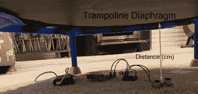

# 蹦床弹跳计数器有树莓皮自动远离你的父母职责

> 原文：<https://hackaday.com/2020/04/22/trampoline-bounce-counter-has-raspberry-pi-automate-away-your-parental-duties/>

如果你有一个蹒跚学步的孩子和一个迷你流浪汉，你会知道“妈妈，数数！”。如果你没有这两样东西，为你的家庭成员打造一个，成为英雄叔叔或阿姨，他们在过去的五个星期里一直和一个三岁大的怪物保持着社交距离。这个[蹦床弹跳计数器使用树莓 Pi 和距离传感器](https://ericescobar.com/?p=40)将弹跳计数传输到一个漂亮的小网络 GUI。

 硬件再简单不过了，而且很有可能你手头已经有了一切。HC-SR04 超声波距离传感器是初级微控制器套件中的必备组件。它简单地躺在蹦床底部朝上的地板上，通过电阻分压器连接到树莓派。

软件是[艾瑞克·埃斯科巴的]项目让你的生活变得容易的地方。他包括了一个简单的校准程序，当你在路上站着不动时，它会标记反弹的低点。甚至还包括一个 systemd 服务文件，以确保软件始终运行，即使在重启后。通过 AJAX 脚本可以在 Pi 提供的网页上看到累积的反弹计数。

有一个运行计数是一个伟大的第一步，肯定是蹦床的一个神奇的新功能，将会受到小家伙们的喜爱。如果这种惊奇感消失了，你可以通过添加每日或每小时的总数和一个高分板来使系统游戏化。

看来[埃里克]很擅长自动推卸责任。我们之前见过他用树莓皮控制鸡舍的门。

 [https://www.youtube.com/embed/oUcTvNFyzaw?version=3&rel=1&showsearch=0&showinfo=1&iv_load_policy=1&fs=1&hl=en-US&autohide=2&wmode=transparent](https://www.youtube.com/embed/oUcTvNFyzaw?version=3&rel=1&showsearch=0&showinfo=1&iv_load_policy=1&fs=1&hl=en-US&autohide=2&wmode=transparent)

