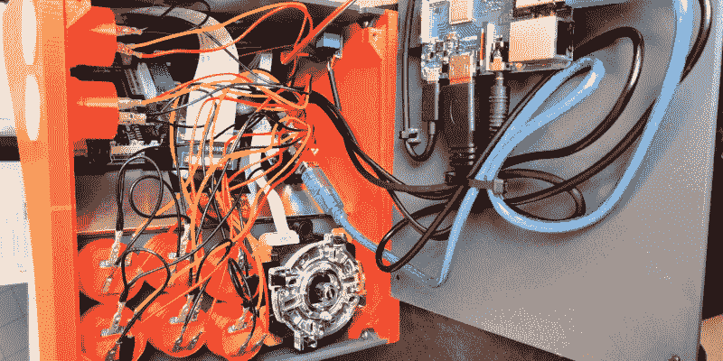

# 3D 打印到 Bartop Arcade 橱柜

> 原文：<https://hackaday.com/2020/04/22/3d-print-your-way-to-a-bartop-arcade-cabinet/>

在黑客和制造商圈子里，定制街机一直是一个相当常见的项目，但随着 Raspberry Pi 和交钥匙控制器套件的出现，它们真正起飞了。所有内部零件都整理好之后，你唯一需要弄清楚的就是橱柜本身。不幸的是，这通常是最棘手的部分。没有合适的木工工具，或者理想的 CNC 刳刨机，很难用传统的 MDF 面板建造一个看起来不错的橱柜。

但是如果你愿意留下木头， [[Gerrit Gazic]可能有一个解决方案给你](https://github.com/geaz/simplyRetro-D8)。这个 bartop arcade，他称之为 *simplyRetro D8* ，使用了全 3D 打印的橱柜。他费了很大的劲来设计它，所以没有可见的螺丝孔，所以它看起来像是从一大块纯合成微波矿石上砍下来的。他指出，这可能会使大会在一些地方有些棘手，但我们认为这是一个值得的妥协。

鉴于 simplyRetro 的矮胖轮廓，内部结构比我们习惯于在拱廊建筑中看到的更加紧凑。但对于树莓 Pi、八英寸触摸屏 HDMI 面板和所有控件来说，空间还是绰绰有余的。为了尽可能保持整洁，[Gerrit]甚至增加了集成的拉链安装点；一个有价值的 CAD 提示，当然不仅限于街机柜。

[Gerrit]不仅包括了该设计的 STL 文件，还包括了 Fusion 360 归档文件，如果您想进行任何修改的话。还有一份完整的材料清单，以及如何将它们组装在一起的详细说明。如果你曾经想要一台自己的街机，但对自己搞清楚所有的细微差别感到有点不知所措，simplyRetro 可能是你一直在等待的项目。

当然[如果你有 CNC 或激光切割机](https://hackaday.com/2018/01/14/bartop-arcade-cabinet-build-skips-the-kit/)，那么有[一些设计你可以生产得更快](https://hackaday.com/2016/03/18/bartop-arcade-retropie-powered-laser-cut/)。