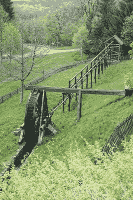

# 鲁布-戈德堡式的油井:扁平杆和挺举线

> 原文：<https://hackaday.com/2020/05/01/oil-wells-done-rube-goldberg-style-flatrods-and-jerk-lines/>

由于与新冠肺炎相关的需求下降，新闻充斥着创纪录的低油价。基准布伦特原油跌至每桶 20 美元以下，而西德克萨斯中质油进入负定价。一夜之间，我们都成了石油市场的观察者，对我们中的一些人来说，这就像钻进了兔子洞，去了解一点石油是如何被开采出来的。

我们中的许多人都见过海上石油平台或点头泵，但是在这个行业之外，有多少人对它有着非常肤浅的了解呢？在为好奇的技术人员提供启示的各种技术中，有一种来自该行业早期的好奇幸存者绝对值得研究，即 jerk line 油井泵。这是一种为油井中的往复泵提供动力的方式，不像在泵千斤顶中那样通过单独的发动机或马达，而是在一个杆系统中，通过往复运动从一个中心位置远距离传输动力。它非常简单，这可能是它在发明后的一个半世纪里在几个小规模油田存活下来的原因。

## 挺举线的诞生

The Kunstrad Bergbau flatrod system, Germany. Heinz-Josef Lücking / [CC BY-SA 3.0](https://commons.wikimedia.org/wiki/File:Kunstrad_Bergbau.jpg).

我们所知的工业化石油工业起源于 19 世纪下半叶的北美，尤其是加拿大。第一批商业油井于 19 世纪 50 年代开凿，19 世纪 60 年代初，约翰·亨利·费尔班克安装了第一条加加油管，从一台中央蒸汽机为多口油井供水。一个巨大的水平偏心轮可以提供推拉抖动线，从它向外辐射几英里远，悬挂在木制框架的摆臂上。早期石油业务的这一小段历史掩盖了一个更早的起源，即几个世纪以来在欧洲矿井中使用的扁平杆动力系统，用于将动力从水轮传输到远处竖井中的泵和其他机械。像 19 世纪 60 年代的油田系统一样，它们可以有效地将这种电力输送到很远的地方，而无需昂贵的维护费用，而且它们可以在陡峭的坡度上这样做，这样矿井就不必位于山谷底部的水道旁边才能使用它们。

少数幸存的使用 jerk 线的油田遍布北美大陆，作为一个感兴趣的虚拟游客，一个令人惊讶的是，与其他一些工业技术相比，它们吸引的在线记录是如此之少。看起来它们在 20 世纪 30 年代就已经在积极安装了，但是例如，维基共享资源上德国和瑞典采矿 flatrod 系统的图片比北美 jerk line 油田的图片多得多。

旧技术的另一个来源是专利系统，但出乎意料的是，与其他石油开采技术相比，与它们相关的专利申请似乎很少。这就好像除了少数满足好奇观众的 YouTube 视频之外，他们几乎未被注意地进入了第三个世纪，为我们的太空时代石化和汽车梦想提供了近乎工匠的原料。他们在网上的最佳描述来自约翰·亨利·费尔班克的曾孙查理，他仍然在安大略省油泉经营着家族油田，在下面的两个视频中，他解释了他们的经营以及他与石油的独特关系。如果你住在一个挺举线油田附近，确保你看到它，并在它消失之前记录下来。

 [https://www.youtube.com/embed/lcSMDiRBl1E?version=3&rel=1&showsearch=0&showinfo=1&iv_load_policy=1&fs=1&hl=en-US&autohide=2&wmode=transparent](https://www.youtube.com/embed/lcSMDiRBl1E?version=3&rel=1&showsearch=0&showinfo=1&iv_load_policy=1&fs=1&hl=en-US&autohide=2&wmode=transparent)

 [https://www.youtube.com/embed/4qVRYBes6g8?version=3&rel=1&showsearch=0&showinfo=1&iv_load_policy=1&fs=1&hl=en-US&autohide=2&wmode=transparent](https://www.youtube.com/embed/4qVRYBes6g8?version=3&rel=1&showsearch=0&showinfo=1&iv_load_policy=1&fs=1&hl=en-US&autohide=2&wmode=transparent)

标题图片:美国宾夕法尼亚州 Jerk line 偏心驱动。很好，约翰/ [公共领域](https://commons.wikimedia.org/wiki/File:VIEW_SOUTHEAST,_ECCENTRIC_HOUSE,_INTERIOR,_NOTE_DOUBLE_OVER_MOUNTED_ECCENTRICS_WITH_ATTACHED_ROD_LINES_ON_GEAR_ASSEMBLY._-_South_Penn_Oil_Company,_G._M._Mead_Lot_492_Lease,_HAER_PA,62-CLAR.V,1-12.tif)。