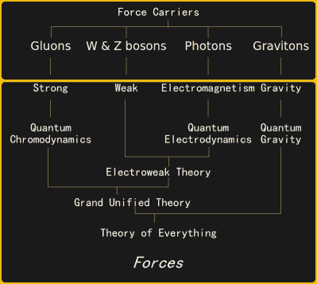
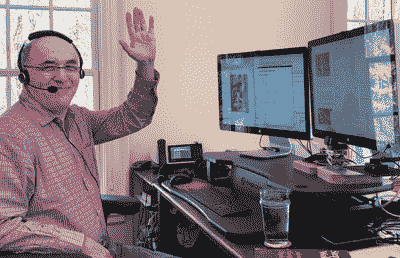
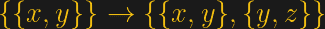
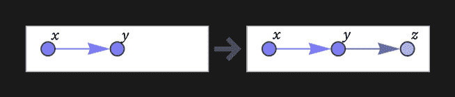
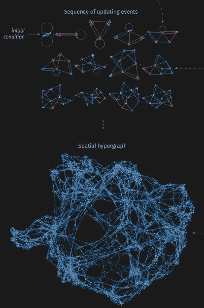

# Wolfram 物理项目寻求万物理论；是揭露还是夸大？

> 原文：<https://hackaday.com/2020/04/30/wolfram-physics-project-seeks-theory-of-everything-is-it-revelation-or-overstatement/>

Wolfram 计算语言和 Mathematica 软件的发明者史蒂夫·沃尔夫勒姆宣布，他可能已经找到了一条通往物理学圣杯的道路。即使使用虚拟语气，这肯定是一个强有力的陈述，但应该受到一些质疑。

什么被认为是物理学的基本理论？在我们目前的理解中，自然界有四种基本力:电磁力、弱力、强力和引力。目前，对这些力的描述分为两部分:[广义相对论](https://en.wikipedia.org/wiki/General_relativity) (GR)，描述了在天文尺度上主导物理学的引力本质。[量子场论](https://en.wikipedia.org/wiki/Quantum_field_theory) (QFT)描述了其他三种力，解释了所有的粒子物理学。

## 生命、宇宙和一切终极问题的答案

 

[粒子物理概述](https://commons.wikimedia.org/wiki/File:Particle_overview.svg)BY head MB【CC-BY-SA 3.0】

到目前为止，由于广义相对论和量子场论是在不同的数学框架内制定的，因此无法将它们统一起来。特别是，在 QFT 的形式主义中处理引力会导致无限项，这些项在普遍接受的重整化框架中无法被抵消。两个最受欢迎的尝试是给出引力的量子力学描述的[弦理论](https://en.wikipedia.org/wiki/String_theory)和鲜为人知的[量子环引力](https://en.wikipedia.org/wiki/Quantum_loop_gravity)。前者被认为是描述自然界所有力的基本理论，而后者仅限于描述重力。

除了 QFT 和 GR 的不相容性，粒子物理学中还有几个未解决的问题，如暗物质和暗能量的性质或中微子质量的起源。虽然这些现象告诉我们，当前的粒子物理学标准模型还不完整，但它们仍然可以在 QFT 和 GR 的当前框架内得到解释。当然，基础理论也必须为这些突出的问题提供自然的解释。

## 一种有争议的科学

史蒂夫·沃尔夫勒姆最出名的是他在计算机科学方面的工作，但他实际上是从物理学开始他的职业生涯的。他在 20 岁时获得了理论粒子物理学博士学位，是历史上获得著名的麦克阿瑟奖的最年轻的人。然而，他很快就离开了物理学，继续他对细胞自动机的研究，这导致了 Wolfram 代码的发展。在创建了他的公司 Wolfram Research 之后，他继续开发 Wolfram 计算语言，这是 [Wolfram Mathematica](https://www.wolfram.com/mathematica/) 软件的基础。一方面，显而易见，Wolfram 是一个非常有天赋的人，另一方面，人们有时批评他是一个自大狂，正如他的品牌命名惯例巧妙地暗示的那样。

Stephen Wolfram at [his home office](https://writings.stephenwolfram.com/2019/02/seeking-the-productive-life-some-details-of-my-personal-infrastructure/) in 2019.

2002 年，史蒂夫·沃尔夫勒姆出版了他 1200 页的巨著《一种新的科学》,其中他将自己对细胞自动机的研究应用于物理学。这本书的主要论点是，简单的程序，特别是[规则 110 细胞自动机](https://en.wikipedia.org/wiki/Rule_110)，可以通过重复应用一个简单的规则来生成非常复杂的系统。它进一步声称，这些系统可以描述所有的物理世界，宇宙本身是可计算的。这本书得到了有争议的评论，一些人发现它包含了[丰富的思想](http://sjsu.rudyrucker.com/~rudy.rucker/wolfram_review_AMM_11_2003.pdf)，另一些人批评它是[傲慢](https://www.theguardian.com/books/2002/aug/03/featuresreviews.guardianreview2)和[夸大了](https://www.kurzweilai.net/reflections-on-stephen-wolfram-s-a-new-kind-of-science)。其中最著名的批评家是雷·库兹韦尔和诺贝尔奖获得者史蒂芬·温伯格。正是后者[写了](https://www.nybooks.com/articles/2002/10/24/is-the-universe-a-computer/)这样的话:

> Wolfram […]忍不住试图将他在数字计算机程序方面的经验应用于自然法则。[……]他得出结论，宇宙本身将成为一个自动机，就像一台巨大的计算机。这是可能的，但我看不到这些推测的任何动机，除了这是 Wolfram 和其他人在他们的计算机工作中已经习惯的那种系统。因此，一个木匠看着月亮，可能会认为月亮是木头做的。

## 从图到超图

沃尔夫拉姆物理项目是《T2》-《一种新的科学》-《T3》中提出的想法的延续，它诞生于两位参加过沃尔夫拉姆暑期学校的年轻物理学家的合作。主要的想法没有改变，也就是说，宇宙的所有复杂性都可以通过计算机算法来描述，该算法通过反复应用一个简单的规则来工作。Wolfram 认识到细胞自动机可能过于简单，无法产生这种复杂性，因此他现在专注于[超图](https://en.wikipedia.org/wiki/Hypergraph)。

在数学中，[图](https://en.wikipedia.org/wiki/Graph_(discrete_mathematics)#Graph)由一组成对相关的元素组成。当考虑到元素的顺序时，这被称为有向图。最简单的(有向)图示例可以表示为一个图表，然后可以将规则应用于该图表，如下所示:

该规则规定，只要出现与`{x,y}`匹配的关系，就应该用`{{x ,y},{y,z}}`替换，其中`*z*`是新元素。将此规则应用于图形会产生:

通过反复应用这一规则，最终会得到越来越复杂的图形，如下例所示。还可以通过允许自循环、涉及相同关系的副本的规则或依赖于多个关系的规则来增加复杂性。当允许两个以上的元素之间的关系时，这就从图转移到了超图。

Credit: wolframphysics.org

这和物理学有什么关系？Wolfram 推测，宇宙可以用一个进化的超图来表示，其中空间中的位置由一个节点来定义，时间基本上对应于渐进的更新。这引入了新的物理概念，例如，空间和时间是离散的，而不是连续的。在这个模型中，对基础理论的探索相当于找到正确的初始条件和潜在规则。Wolfram 和他的同事认为他们已经确定了正确的规则类别，并构建了重现广义相对论和量子力学一些基本原理的模型。

## 计算不可约性及其他问题

该模型的一个基本问题是 Wolfram 所谓的 c *计算不可约性*，这意味着要计算超图的任何状态，必须从初始条件开始进行所有迭代。这将使计算运行足够长的时间，以便通过与我们当前的物理宇宙进行比较来测试模型变得几乎不可能。

Wolfram 认为，一些基本原则，例如空间的维度，可以从规则本身推导出来。Wolfram 还指出，尽管生成的模型宇宙可以通过观察进行测试，但框架本身并不容易被实验证伪。一般来说，基础物理学早已脱离了基于实验观察的假设的科学方法。弦理论也被批评没有做出任何可检验的预测。然而，弦理论在历史上是从核物理发展而来的，而 Wolfram 并没有给出任何为他的框架选择进化超图的动机。然而，一些物理学家也有类似的想法，比如诺贝尔奖获得者杰拉德·特胡夫特，他最近发表了量子力学的细胞自动机解释。此外，Wolfram 的同事 Jonathan Gorard 指出，他们的方法是在环圈量子引力中使用的[自旋网络](https://en.wikipedia.org/wiki/Spin_network)的推广。

## 这一切将走向何方？

在他的网站上，Wolfram 邀请其他人参与这个项目，尽管这是如何运作的还不清楚。一般来说，他们需要人们计算出他们模型的潜在可观测预测以及与其他基本理论的关系。如果你想深入这个话题，网站上有一个 448 页的技术介绍，他们最近在 T2 开始了一系列的直播，他们计划发布 400 小时的视频资料。

Wolfram 的模型当然包含了许多有价值的想法，不能简单地把它当成是一种空想。尽管如此，大多数主流物理学家可能会对离散计算宇宙的总体想法持怀疑态度。Wolfram 倾向于夸大他的发现，并通过自己的媒体渠道发表，而不是通过同行评审的物理期刊，这一事实并没有为他赢得任何额外的可信度。