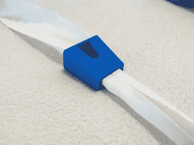
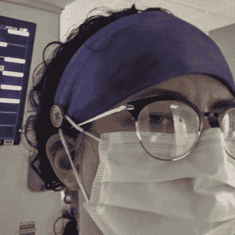
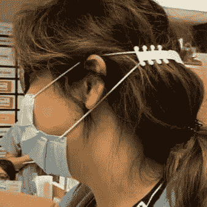

# 3D 打印的 COVID 材料，不是面罩或通风设备

> 原文：<https://hackaday.com/2020/04/23/3d-printed-covid-stuff-thats-not-face-shields-or-ventilators/>

今年来自黑客社区的最酷的故事是回应新冠肺炎的快速制造努力。但是[马克·雷霍斯特]经常出现在这些页面上，因为他对 3D 打印的巧妙理解，分享了一些非常有用的打印作品，与我们所看到的不同:[斜胶带文件夹和耳朵保护装置](https://drmrehorst.blogspot.com/2020/04/covid-19-printing-projects.html)。

Initial bias tape folding jig design [by ongaroo](https://www.thingiverse.com/thing:4232886)

世界各地的裁缝已经在基层口罩生产上穿针引线。缝制面罩的劳动强度较大的部分之一是紧固机构。有了松紧带，环的大小需要刚刚好，但是当松紧带用完了，你需要缝上带子。斜纹布是一种很受欢迎的材料，但折叠和固定它进行缝纫是很挑剔的。[Mark]听说了这一需求，并从 Thingiverse 获得了一个斜带文件夹设计。这些工作有点像拉链，在一边拉进未折叠的带子，在另一边拉出，很好地折叠以便针线接管。但当然，他做得更好，改进了最初的设计，使用更少的塑料，更快地获得更多的部件，使用更少的材料——胜利，胜利，胜利。

说到口罩带，原来你的耳朵后面不喜欢在医院连续 12 小时轮班时被摩擦。我们已经看到卫生工作者，他们本身就是熟练的黑客，建议[在头带](https://www.reddit.com/r/pics/comments/fq6ols/sewing_a_button_to_a_headband_to_keep_masks_from/)上缝上纽扣来固定面罩带。

  Button/Headband earsaver  3D-printed earsaver  Mark’s revised earsaver design

但是 3D 打印世界有一个“护耳器”,它在你头后的塑料带上提供了一系列挂钩。[Mark]再一次重复了标准设计，寻找减少材料使用的方法，同时在一个打印机床上安装更多的单元。

这些功能性印花各有千秋。我们喜欢看到努力工作的 3D 打印物品，但当我们看到它们随着每个新版本变得越来越好时，我们就更喜欢了。背景故事和改进版本的设计文件可以在他的项目报告中找到[。去吧！](https://drmrehorst.blogspot.com/2020/04/covid-19-printing-projects.html)