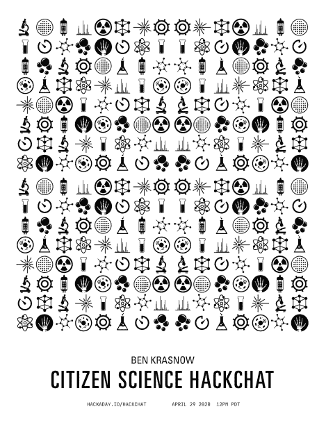

# 公民科学与本·克拉斯诺的黑客对话

> 原文：<https://hackaday.com/2020/04/27/citizen-science-hack-chat-with-ben-krasnow/>

加入我们太平洋时间 4 月 29 日星期三中午与[本·克拉斯诺](https://hackaday.io/hacker/54318-ben-krasnow)的[公民科学黑客聊天](https://hackaday.io/event/170717-citizen-science-hack-chat)！

在人类历史的大部分时间里，没有职业科学家这种东西。那些涉猎“自然哲学”的人主要是男人——偶尔也有女人——拥有特权和财富，愿意花时间观察世界的运转。大多数人去他们感兴趣的地方，探索地质学的这个方面或天文学的那个方面，经常合并学科或转向他们喜欢的新学科。他们有探索宇宙的自由，没有“出版或灭亡”的压力，但他们仍然经常设法拉开遮蔽世界亿万年的无知和迷信的帷幕，至少在某种程度上是这样。

他们的脚步跟随今天的公民科学家，与大学年复一年培养的大量专业科学家相比，这是一个相对较小的群体。但是，在这些有资质的从业者经常过度专注于高度专业化学科中的某个特定子领域的地方，公民科学家享有更多探索宇宙的自由，就像他或她的自然哲学家祖先所做的那样。这些公民科学家——他们中的许多人也有传统的资格证书——正在做重要的工作，有些人甚至在主流期刊上发表他们的发现。

应用科学 YouTube 频道的所有者本·克拉斯诺就是这样一位公民科学家，他的最新发现总是受到欢迎。我们已经报道了本的大量实验和构建，从他的 [DIY 电子显微镜](https://hackaday.com/2014/09/03/ben-krasnow-hacks-a-scanning-electron-microscope/)到他的[穿透钢铁的红宝石激光器](https://hackaday.com/2014/05/23/ben-krasnow-and-his-ruby-laser/)，以及最近他的[自制质谱仪](https://hackaday.com/2019/12/04/ben-krasnow-builds-a-mass-spectrometer/)或他的[对核磁共振成像导致的 iPhone 死亡的调查](https://hackaday.com/2018/11/20/ben-krasnow-gasses-mems-chips-for-science/)。本的实验室总是会有一些有趣的东西出来，他会顺便来看看 Hack Chat，讨论当今公民科学的状况以及实验室里正在发生的事情。

 我们的黑客聊天是 [Hackaday.io 黑客聊天群发消息](https://hackaday.io/messages/room/2369)中的社区直播活动。本周，我们将于太平洋时间 4 月 29 日星期三中午 12:00 坐下来讨论。如果时区让你烦恼，我们有[一个方便的时区转换器](https://www.timeanddate.com/countdown/generic?iso=20200429T12&p0=224&msg=Citizen+Science+Hack+Chat&font=cursive)。

点击右边的那个发言气泡，你会被直接带到 Hackaday.io 上的黑客聊天群，不用等到周三；随时加入，你可以看到社区在谈论什么。

