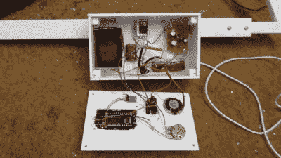

# 智能 DIY 金属检测机

> 原文：<https://hackaday.com/2020/05/02/a-smart-diy-metal-detector/>

如果你曾经想过成为一名寻宝者，这个由[mircemk]设计的简单的 DIY 金属探测器可能是一个不错的开始。

该设计基于一款名为 [Smart Hunter](https://neco-desarrollo.es/smart-hunter) 的开源金属探测器。这种甚低频(VLF)金属探测器使用所谓的双 D 几何结构的发射器和接收器线圈。发射器线圈由信号发生器模块驱动，该模块以 4.74 kHz 的谐振频率工作。

由此产生的振荡磁场将在附近的金属物体中感应出涡流，进而在接收器线圈中感应出信号。该信号然后被馈入智能手机的麦克风端口，并由定制的金属探测器应用程序进行分析。[mircemk]还在设备中包含了音频放大器和小型扬声器。

事实证明，该探测器非常灵敏，可以检测到 25 厘米远的硬币和 1 米远的较大金属物体。现代金属探测器还可以通过分析检测信号的相移来区分不同类型的金属,这可能是改进设计的一种方法。

休息后的视频。

 [https://www.youtube.com/embed/BolEUTYOES0?version=3&rel=1&showsearch=0&showinfo=1&iv_load_policy=1&fs=1&hl=en-US&autohide=2&wmode=transparent](https://www.youtube.com/embed/BolEUTYOES0?version=3&rel=1&showsearch=0&showinfo=1&iv_load_policy=1&fs=1&hl=en-US&autohide=2&wmode=transparent)

