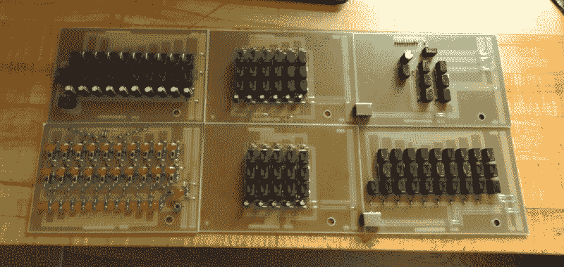

# DIY 10 位继电器加法器

> 原文：<https://hackaday.com/2020/04/29/a-diy-10-bit-relay-adder/>

说到了解计算机，有时候最好先把基础的东西了解清楚。数据是如何存储的？机器如何处理这些信息？为了多回答一点这些问题，开始学习编程，【Nakazoto】[用继电器搭建了一个 10 位二进制加法器](http://usagimotors.com/2020/03/09/electronics-a-10-bit-full-adder/)。

构建是从头开始设计的，包括使用数控机床铣削的 PCB。有六块板:输入板、序列发生器板、两块和寄存器板、一块进位寄存器板和一块 1 位 ALU 板。输入板上有 32 个发光二极管，以及开关来打开或关闭每个位。总共使用了 96 个继电器，你可以在页面上的视频中听到它们断断续续的声音。最后，有一个单独的开关将加法器设置为减法模式。

通常，[Nakazoto]的网站大多是关于汽车的，但这是一个很好的转移。这篇文章有很多关于设计和构建的细节，以及加法器背后的理论。网站上关于二进制加法器的其他文章包括使用更大继电器的[这个](https://hackaday.com/2014/04/26/4-bit-adder-built-from-mechanical-relays/)，以及使用 555 个定时器的[这个 2 位加法器](https://hackaday.com/2011/02/28/2-bit-full-adder-using-just-thirty-six-555-timers/)。

 [https://www.youtube.com/embed/doikkohxiog?version=3&rel=1&showsearch=0&showinfo=1&iv_load_policy=1&fs=1&hl=en-US&autohide=2&wmode=transparent](https://www.youtube.com/embed/doikkohxiog?version=3&rel=1&showsearch=0&showinfo=1&iv_load_policy=1&fs=1&hl=en-US&autohide=2&wmode=transparent)

