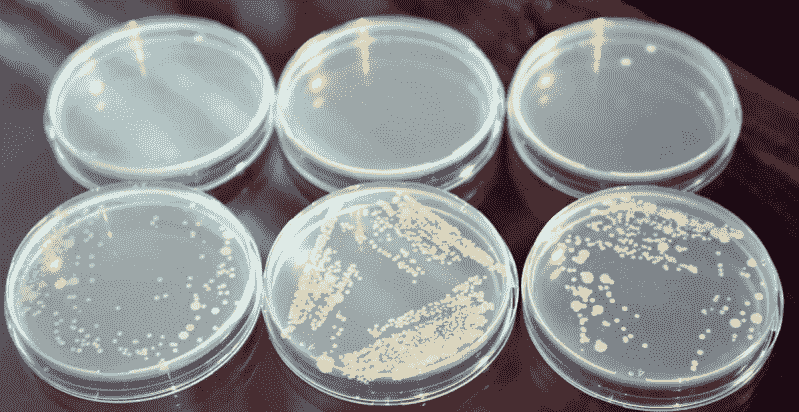

# 用两万伏的电压洗手

> 原文：<https://hackaday.com/2020/04/28/washing-your-hands-with-20000-volts/>

最近几周，我们都被提醒洗手的重要性。这并不复杂:你只需要肥皂、水和大约 30 秒的努力。必要时，你甚至可以使用含酒精的洗手液。但是如果有更好的方法杀死我们手上的细菌和病菌呢？一个简单，快速，甚至不需要你接触任何东西。可能有，如果你有一个高压发电机。

在他最新的视频中，【Jay Bowles】提出了一个新颖的概念:利用[高压电晕放电产生的臭氧进行快速彻底的手部杀菌](https://www.youtube.com/watch?v=y61ulskoGnI)。他解释说，有大量的研究证明臭氧气体作为去污剂的有效性，由于它是通过电晕放电大量产生的，他实验的这种高压发生器可以兼作视觉上引人注目的洗手液。

为了检验这个理论，[Jay]用琼脂平板做了一个实验。他用在未洗手的手上摩擦的棉签接种一半的平板，然后在他的手经过高压发生器大约 15 秒后重复这个过程。由于使用了他的微波炉作为临时培养箱，培养皿被保存在相对恒定的 23 摄氏度(75 华氏度)下。48 小时后，两组盘子之间的差别非常明显。

尽管在接触臭氧发生器后，他手上的细菌似乎几乎被完全消灭了，但[Jay]很快指出，他并不是想通过这段视频给出任何医学建议。这个简单的实验并没有涵盖所有形式的细菌，他也没有测试这种方法对抗病毒的设备。你现在能做的最安全的事情就是遵循疾病预防控制中心等机构的指导方针，用传统的方式洗手；但是这里概述的概念确实值得进一步的讨论和实验。

他的频道的老观众可能会注意到，这个视频中的设备实际上是他去年用于电子照相实验的硬件的改进版本。

 [https://www.youtube.com/embed/y61ulskoGnI?version=3&rel=1&showsearch=0&showinfo=1&iv_load_policy=1&fs=1&hl=en-US&autohide=2&wmode=transparent](https://www.youtube.com/embed/y61ulskoGnI?version=3&rel=1&showsearch=0&showinfo=1&iv_load_policy=1&fs=1&hl=en-US&autohide=2&wmode=transparent)

