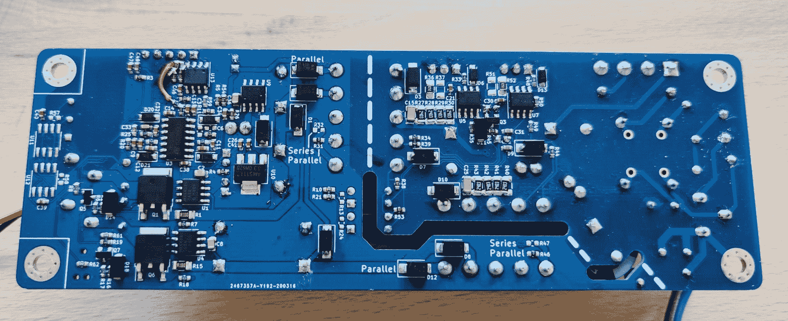

# 为您的 LED 驱动器付出更多努力

> 原文：<https://hackaday.com/2020/05/04/go-the-extra-mile-for-your-led-driver/>

可寻址的 RGB LED 灯条可能风靡一时，但这种寻址能力是有代价的。如果不是你期望显示白色的颜色，你可能会发现一串单色发光二极管发出的光不那么闪烁，光谱更宽，并且供应良好。当然，有许多方法可以驱动这样一个地带，但这是每天*黑*一次，而不是每天*全球速卖通*(尽管我们可能会分享电子商务的甜蜜甘露)。[Niklas Fauth]一定是跃跃欲试，因为为了让他的单色 LED 灯条获得最平滑的褪色，他[从头开始构建了一个完整的软件定义的双 50W 开关模式交流电源](https://twitter.com/FauthNiklas/status/1246770867050291206)。他称之为他的“第一个先进的空调设计”,我们对此印象深刻。

开关模式电源是将任意输入交流或 DC 电压转换为 DC 源的一种非常常见的方式。一个典型的项目可能使用完全集成的解决方案，形式为嵌入式模块或壁式电源插座，或者集成度稍低的控制器 IC 和无源器件。但是[尼克拉斯]一路走来，从头开始设计他的。提供控制，他有无处不在的 ESP-32 来驱动供应的控制节点，并提供无线连接的额外奖励(一个人的闪光灯必须总是协调一致)。我们不禁注意到，PCBA *也*展示了 RS485 和 can 收发器，这些收发器目前似乎尚未使用，或许是为了将来扩展到有线控制？

Check out that concern for creepage and clearance!

供应本身是为了易于复制而设计的。[Niklas]选择了价格低廉且易于从通常的海外来源找到的组件。他认为 ESP-32 的 PWM 波动太大，不适用于这种专用应用，因此他使用了外部 IC。但专用模拟 DAC(按此出售)过于昂贵，因此他换了一个双通道 I2S 音频 DAC，以更低的价格获得相同的性能。变压器被选择为容易获得的标准组件，甚至 PCBA 的占地面积也被压缩到另一家商业供应商的 T2 机箱中，给了这个项目一个完美的外观。

要了解供应的实际情况，请查看休息后的推文(顶部有链接)。想造一个吗？[消息来源于【尼克拉斯】GitHub](https://github.com/NiklasFauth/esp32-led-smps) 。

> 另一个我想做一段时间的项目:
> 一个用于 LED 照明的软件定义的交流/DC 电源。由 ESP32 控制，因此可以通过 WiFi 变暗。
> 
> 测试高达 2x50W。视频中 35W (15-24V，0-1.5A)恒流。
> 
> 还有，这是我第一次建议自己动手做空调设计。[pic.twitter.com/NBkv56HV6F](https://t.co/NBkv56HV6F)
> 
> —尼克拉斯·福斯·🦦(@福斯尼克拉斯)[2020 年 4 月 5 日](https://twitter.com/FauthNiklas/status/1246770867050291206?ref_src=twsrc%5Etfw)