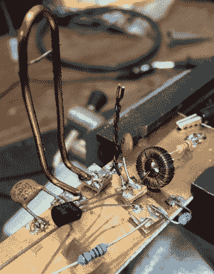

# 从头开始构建新的射频遥控器

> 原文：<https://hackaday.com/2020/04/30/building-a-new-rf-remote-from-scratch/>

我们已经看到不少使用 ESP8266 或 ESP32 为现有家用电器添加“智能”功能的项目，通常是通过将微控制器与无线电或红外发射器配对。如果你的设备有一个现成的遥控器，将它集成到一个定制的家庭自动化系统中通常只是得到一些便宜的模块化组件，并编写一些简单的代码将它们粘合在一起。

但是如果你想控制的电器没有使用共同的频率呢？[这是[eigma]最近不得不回答的一个问题](https://foulab.org/projects/eigma/fan/),因为他发现卧室吊扇的遥控器工作在有点不寻常的 304 MHz。像 MAX1472 这样的芯片可能已经被调谐到这个频率，但该芯片似乎不像流行的 315 MHz 发射机那样可以在交钥匙模块中使用。

 有几个可能的选择，包括使用软件定义无线电(SDR)，但[eigma]不想在这个项目上花费大量资金，也不想等待几个月才能从海外运来零件。最直接的解决方案是设计一个定制的发射机，使用分立元件调谐到适当的频率；对于我们这些被模块化组件的高可用性宠坏的人来说，这是一种黑暗的艺术。

接下来是对一个真正白手起家的发射机的设计、测试和故障排除的精彩介绍。你在这里找不到任何集成电路，载波信号只是由一个晶体管、一些经过仔细测量的导线和一些无源元件产生的。通过用 ESP32 调制信号，[eigma]成功地使古怪的吊扇成为物联网的荣誉成员。

如果你发现自己需要定制发射机，那么[eigma]所做的报道绝对是无价的资源。它很容易被列为我们报道过的一些最有价值的无线电逆向工程工作之一，你最好把它归档以备将来参考。也就是说，你将遇到的大多数新硬件[可能会使用一个广泛支持的频率，如 433 MHz](https://hackaday.com/2018/08/29/raspberry-pi-as-433-mhz-to-mqtt-gateway/) 。