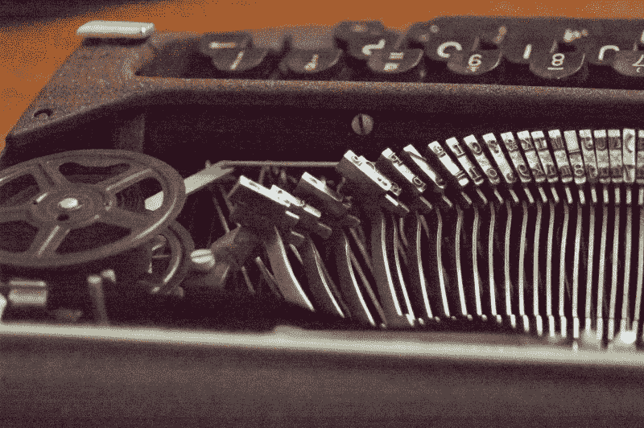
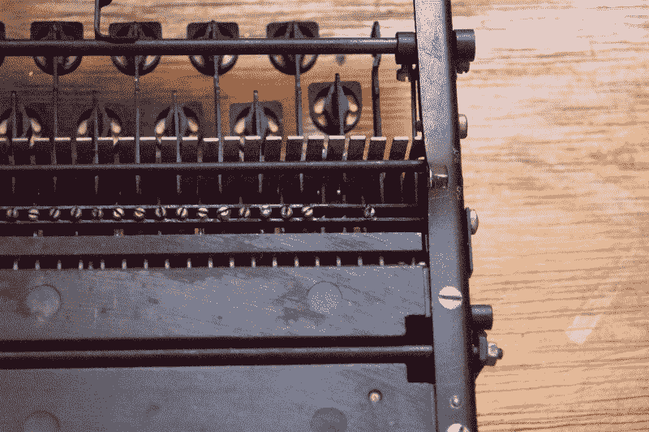
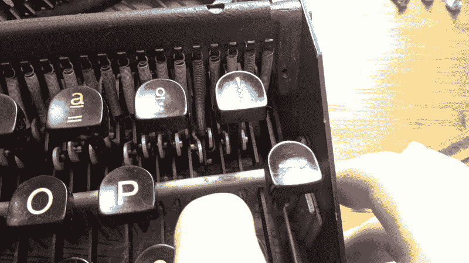
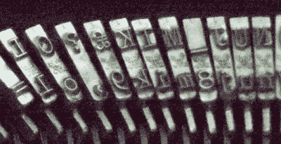
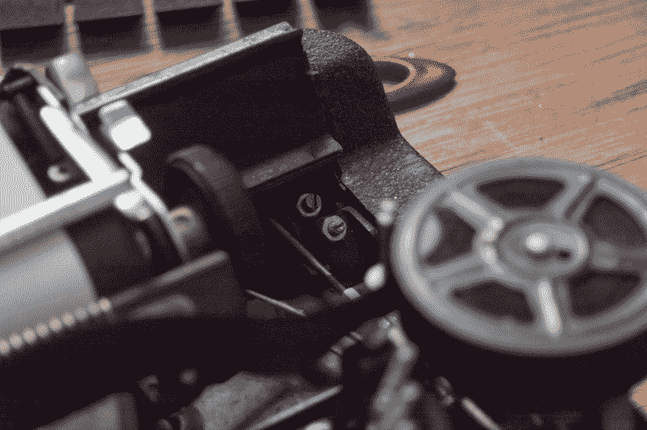
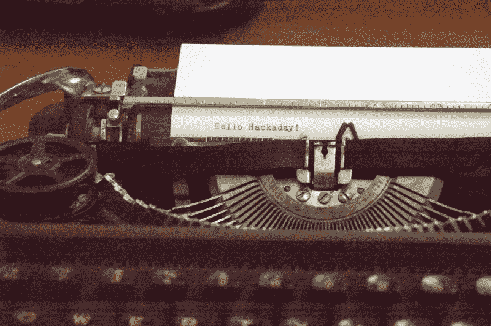

# 时间终于够了:复兴一台传家宝打字机

> 原文：<https://hackaday.com/2020/05/04/time-enough-at-last-reviving-an-heirloom-typewriter/>

你可能会发现自己生活在有趣的时代。两个月前我们所熟悉的世界已经一去不复返了，我们终于有足够的时间来完成那些因为这样或那样的原因而被推迟的项目。今天，我想探索并可能修复一台属于我已故姑妈几十年的身份不明的旧打字机。

一个小小的免责声明，虽然，我不是一个狂热的打字机收藏家或鉴赏家。我喜欢观察和使用它们，但我绝不想声称自己是它们历史或内部运作的专家——毕竟我是个黑客。接下来是一个外行人对她第一次打字机修理的冒险，一个探索打字机解剖和故障排除的激动人心的故事。让我们开始吃吧。

## 打字机和它的怪癖

这是我已故姑妈的打字机。它的型号封面不见了，我想这是唯一的识别信息，因为除了一个标明进口公司的小铭牌，整个机身没有任何品牌。我在网上看了看，问了一些人，没有人能找到它，我能找到的其他超便携打字机看起来都不像它。你说什么，哈卡黛，有人知道我这里有什么吗？我们最多可以把它定位为 20 世纪 40 年代后，它看起来可能像一个史密斯-科罗纳摩天大楼，但有许多不同之处。

我记得我小时候被允许玩这台打字机，那是在它从过去任何重要的工作中退役很久以后，从那以后它也有了一些新的怪癖。最明显的是，两个重音键一直处于轻微按下的状态，并且一直按下它们不会移动它们各自的打字头，它们也在错误的位置闲置。这是最令人难以置信的问题，也是我经常被告知“无法解决”的问题，或者“太贵了，无法找人来解决。”另一个问题是，大写和小写没有对齐，如果你试图大写单词，任何印刷文本看起来都不稳定。

## 矫直型棒材和清理浆料

像这些机械打字机的工作方式是通过浸透墨水的色带将打印头击打在纸上。打印头上有您要在其中键入的字母的浮雕镜像，该操作会使用色带中的油墨将其打印到纸张上。随着您使用打字机的时间越来越长，墨水可能会堵塞打印头，使它们变得“暗淡”,从而导致打印模糊。

这很容易补救，用一把浸过异丙醇的旧牙刷擦洗所有的打印头，直到它们干净为止。如果你想彻底，你可以一个接一个地画，但是在它们静止的位置上一次画出很大的笔画可以让我的字体更清晰。

These type heads have seen better days, between ink build-up and the two bars resting in an odd position.

当我试着用焕然一新的头脑打字时，我注意到一些打字杆会在行程结束时卡住。看着这个关于打字机修复的网站，这个网站在整个磨难中是一个无价的资源，我找到了原因，可能包括弯曲的打字杆和一个弹起的部分(固定打字杆的部分)。果不其然，用一把细螺丝刀轻轻刮了一下槽，然后稍微弯曲了一下棒条，棒条继续粘在那里，一切看起来都很正常。就打字体验而言，这台打字机已经开始成形了。

## 坏掉的钥匙

这两个重音键的残破状态似乎是这次修复中最令人生畏的部分。我在年轻时就被劝阻不要尝试修理这台打字机，但现在已经没有多少人关心它了，我可以随心所欲地检查它们。

起初，在我从网上其他型号打字机收集到的信息的指引下，我试着查看机械装置的底部，寻找任何可能断裂的链接。移除底盖后，我惊讶地发现，这个模型几乎完全被装箱，让我很少或根本无法通过这里接触到任何钥匙。然而，我确实注意到了两个丢失的螺栓，它们对应的钥匙没有放在正确的位置。起初我以为这可能是相关的…

If you look closely, you can see two missing bolts towards the right side.

…但后来我发现这些螺栓是为了让所有的打字键都能同样地启动推动马车前进一个字符的机制。在两个重音键的情况下，这些螺栓是故意缺失的，使它们成为所谓的“死键”，这样重音就可以在不移动车厢的情况下键入，然后可以在下面键入字母。

You can see an unhooked link just behind the key it corresponds to. To get it back in place, you just need to wrench it out of the way a little and push them together so the pin on the key bar hooks into the slot of the type bar.

所以我又抬头看了看，注意到钥匙后面还有一个盘子，我可以把它拿掉，在那里我找到了罪魁祸首。就在按键本身的后面有一排弹簧，它们是将按键返回到起始位置的系统的一部分。一旦我暴露了这个机制的其余部分，我注意到两个坏了的键已经从它们与打字条的链接上分离了。幸运的是，这是一个简单的事情，在酒吧之间拧一把螺丝刀，然后将它们扣回原位，以便再次钩住它们，在几十年的疏忽之后，钥匙突然工作了。

## 对齐不当的棘手案例

 除了坏掉的键盘，唯一让这台打字机无法保持最佳状态的是大小写不准。如果你再次仔细观察有字头的图片，你会注意到每个键在同一个字头上有它们的常规字形和它们的移位字形。

打字机之间转换的方式是，打字机上的 shift 键会将整个滑架向上移动，这样替代的字形就会打印在页面上。对于字母，它在大写和小写之间移动，对于符号，它可以是一个完全不同的符号，尽管机械功能是相同的。调整托架的静止和移动位置会影响两组之间的对齐。

The carriage shift alignment screws for this typewriter. The top one adjusts the height of the resting position, and the bottom one adjusts the height of the shifted position.

每台打字机都将有一个稍微不同的机制，所以为了找到我的，我只是不停地在滑架附近寻找，看看在我移动它时哪些部件在移动。在马车的两边，我发现了两个螺丝，一个固定在车身上，另一个是马车移动时的一部分。移动的那个撞在打字机的机身上，决定了它的静止位置。另一个在滑架向上移动时撞击滑架，确定滑架在移动位置的停止位置。

One last glamour shot of a happily working typewriter.

考虑到这一点，首先我试着调整变速箱的高度，但无论我怎么试，螺丝都不会动。因此，我调整了马车的小写位置，并将其与大写对齐。虽然这导致车厢比正常情况下低了一点，擦伤了身体的一部分(已经有刹车痕迹，我想知道这是不是过去有人故意错位的原因)，但文本现在完全对齐了。

## 总结

一切都运转良好，我开始把这台打字机的外壳重新组装起来。虽然我意识到我不需要拿走那么多的盖子就可以得到这个相对简单的修复最终需要的部件，但我很高兴我这样做了，因为这让我对这台机器有了新的欣赏。这也让我反思，仅仅因为它看起来复杂和令人生畏，就拒绝自己或他人尝试学习某样东西如何工作或如何修理是多么容易。当然，我们中的大多数人在 Hackaday 上可能不会这么容易被说服，但如果不是因为我对这台机器的持续兴趣，它可能仍然躺在我妈妈的存储库中，被蜘蛛网和失去的记忆所包围。

你将利用新获得的空闲时间从事什么项目？