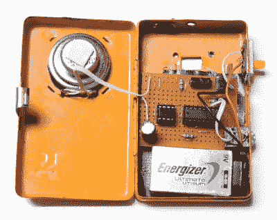

# DIY 合成器的 DIY 色带控制器

> 原文：<https://hackaday.com/2020/05/03/diy-ribbon-controller-for-a-diy-synth/>

制造乐器有一种特殊的乐趣，不管它们有多简单或复杂。即使它是一个直截了当的噪音制造者，那也是你可以引以为豪的噪音。此外，噪音加节奏等于音乐。

每当你准备好享受下一层乐趣时，试着为你的 DIY 工具制作控制器。各种类型的合成器通常由各种类型的电位计控制。虽然制作自己的标准扭转式电位计肯定是一项有趣的工作，但[lonesoulsurfer]表明[制作带状控制器相对容易](https://www.instructables.com/id/Make-a-Ribbon-Controller/)。

 色带控制器本质上是一个解构的电位计，用你的手指来驱动雨刷。这里的雨刷由 Velostat 制成，这是一种有趣的低成本导电材料，也是压敏材料。带状控制器的其余部分是安装在木质底座上的薄铜板和不导电塑料的夹层。

但是，如果没有有趣的乐器来控制，那么有趣的控制器是什么呢？作为一个特别的奖励，[lonesoulsurfer]基于 4046 hex 反相器制作了一个小型方波合成器，并附上了原理图。把你的手指滑过裂口，把它们都检查出来。

根据你手头的资料，制作类似于[这个橡皮筋 boinger](https://hackaday.com/2020/03/19/rubber-bands-can-secure-your-sanity/) 或它的乡村兄弟[手推车贝斯](https://hackaday.com/2020/04/02/wheelbarrow-bass-drives-a-sound-garden/)的模拟乐器可能会更容易。

 [https://www.youtube.com/embed/jzylmjtmIkI?version=3&rel=1&showsearch=0&showinfo=1&iv_load_policy=1&fs=1&hl=en-US&autohide=2&wmode=transparent](https://www.youtube.com/embed/jzylmjtmIkI?version=3&rel=1&showsearch=0&showinfo=1&iv_load_policy=1&fs=1&hl=en-US&autohide=2&wmode=transparent)

