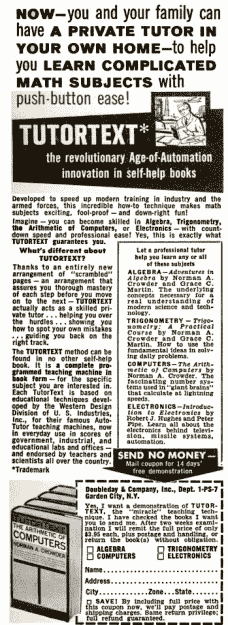
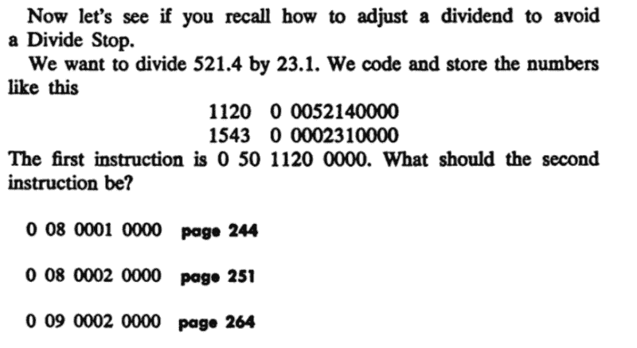
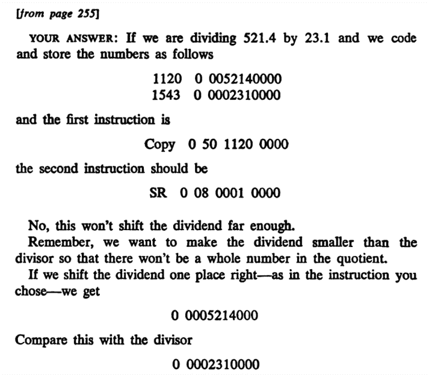

# 辅导课文的故事

> 原文：<https://hackaday.com/2020/08/28/a-tale-of-tutor-texts/>

你有过那种让你自己选择冒险的书吗？你知道，书上会说“恶霸让你交出秘密信息。如果你想逃跑，翻到 48 页。如果你想和他打，翻到第 70 页。”虽然这通常是儿童文学的主要内容，但有一系列被称为辅导教材的培训书籍使用这种格式教授技术主题。

事实上，其中一本书是我多年前第一次接触计算机编程的书籍，尽管我不愿意承认。但这不仅仅是电脑编程。有来自同一出版商的关于三角学、计算尺，甚至如何打桥牌的书籍。我拥有四本这样的旧书，这让我开始思考我们如何在网上传递信息。也许这些书超越了他们的时代。

## 优势

 假设这样一本书结构良好，这是个不错的主意。一本普通的书只是告诉你一些事情，然后——也许——问你一两个问题，看看你的想法是否正确。如果你不这样做，你就不得不回去重读那些一开始对你没有意义的材料。

如果你回想一些你努力掌握的技能，你可能会发现在同一主题上获得第二次甚至第三次机会的价值。例如，考虑学习系鞋带甚至领带。现在看起来可能毫不费力，但教你的人可能必须向你展示几种不同的方法。骑自行车也一样。

导师文本教学法——在技术上被称为程序教学——并不是这样的。给你一个问题，如果你选择了错误的答案，你会得到一个新的不同的解释。偶尔，文本会简单地给你一个解释，并告诉你回去再试一次，但通常错误的答案页面会带你走上一条弯路，在重新加入书的主线之前纠正你的想法。

顺便提一下，还有其他一些技术也属于程序化教学、培训或学习的范畴。就这篇文章的目的而言，我的意思是按照导师教材的风格进行编程教学:问一个多项选择问题，然后在继续之前解释为什么它是正确的或不正确的。据我所知，这项技术起源于美国空军，心理学家诺曼·克劳德在 20 世纪 60 年代用它来有效地训练维修人员。

## 例如

例如，在该书的计算机编程版本中，他们使用了一种名为 TUTAC 的假想机器，该机器可以处理十进制数——这在 20 世纪 60 年代并非闻所未闻。(我们之前已经讨论过 TUTAC 和当时的其他组合机器。)

这里有一个问题示例:

老实说，我不记得答案了——从 12 岁开始，我就没有真正读过这本书。但是让我们随机选择第一个答案，翻到 244 页:

哎呀。从这个答案的上下文来看，我猜正确答案是在第 251 页。那一页不仅报告你是正确的，而且在提出新问题之前解释你为什么是正确的。有时新问题前有新信息，有时只是多部分问题。

## 问题是

虽然更好的题目会在你犯错时引导你更多的练习题，但是更复杂的题目往往会给你一个解释，然后让你回到问题上再试一次。为什么？如果你尝试自己写这样的东西，你会发现它很快失去控制。你解释了一个，但读者不明白。所以你又解释了一遍，但还是没用。所以你回顾过去的一些事情，然后再问。没什么。现在怎么办？你分支多少必须有个限度。

有时很难预先知道人们不会理解的话题。如果你曾经试图教别人打领带或骑自行车，你知道我的意思。一旦你知道怎么做，这就很容易了。但是直到你到达那个点，这几乎是不可能的，更糟糕的是，一旦你知道了，你会忘记为什么开始时会这么难。理想情况下，你希望设计的问题有答案，指出哪里有误解。

例如，如果我展示一张两个电阻并联连接到 10 V 电池的图片，我可能会问:这两个电阻两端的电压是多少？正确答案当然是 10 V，但我可能会用 5 V 作为诱饵，因为有些人可能会认为电阻会分压。另一个答案可能是 10 除以电阻的总和，以防有人认为这是欧姆定律的问题。

还有组合爆炸的问题。假设你有一个关于解释数据转储的话题，从读者选择的答案中，你意识到他们不知道十六进制。没问题，你只要写一个主题就可以了。但是现在你意识到他们不理解指数。这样的链条可以一直延续下去。

## 现代

在你的网络浏览器中，你确实会不时地看到编程指令，但你会认为它会无处不在，但事实并非如此。很多培训课程只不过是把幻灯片转换成幻灯片。然而，这似乎是一个错失的机会。

想想吧。有了电脑文本，你会有更多的选择。比如优秀的 [EDx 电气工程课](https://www.edx.org/learn/electrical-engineering)，可以给你随机的练习题。我假设作者可以给出一系列的值和关系(例如，R1=5K 到 10K，R2=(1.8 到 2.2)*R1)。计算机解决问题，知道答案。因此，如果你做同一个练习题四五次，每次都会得到不同的答案。

想象一下，有一份报告显示哪些错误的答案有最多的点击量，哪些没有。哪些主题第一次回答错误的比例很高？也许那段文字需要一些额外的思考。学生看一个题目多久才回答？大量的数据可以挖掘，使材料变得更好。

有趣的是，如果你在谷歌上搜索“程序化教学”，你得到的大部分都是关于该技术的教学文章。还有一些其他的书使用了这种技术。然而，莫尔使用了 B. F .斯金纳提出的另一种形式，即在一小段文字之后出现问题和答案。“鲍比·费舍尔教象棋”是一个很好的例子，快速微积分也是。

Radio Shack 有一个名为“从 5 瓦到 1000 瓦”的业余无线电课程，它自豪地宣称这是一个编程课程。虽然很多在线课程确实像这些书一样插入了活动，但很少有像导师教材那样采用多项选择/解释的形式。

## 将来的

也许有一天这种程序化指令会再次流行起来。建立一个基于网络的框架来呈现这种东西并不难。你甚至可以用 PowerPoint 来做，以一种粗糙的方式。毕竟，在 20 世纪 60 年代，他们是用纸做的。

与此同时，导师文本站在一个伟大的概念致敬。他们教会了我很多，我相信其他人也一样。当然，现在你也可以在网上学习大学课程，很多是免费的。或者去守旧派，从海军学电子学[。](https://hackaday.com/2017/06/09/electronics-education-courtesy-of-the-us-navy/)