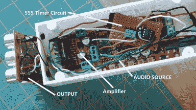

# 超声波发声枪精确瞄准你的音乐

> 原文：<https://hackaday.com/2020/04/30/ultrasonic-sound-gun-precisely-aims-your-music/>

当听音乐时，你有时无法避免这样的情况，其他人会感到恼火，因为他们觉得这扰乱了他们的重要活动，或者他们不喜欢你的前卫厄运金属。当然，人们可以只使用耳机。但是一个更简单的方法是建造一个参数扬声器，将声波聚焦成一个窄波束，就像谢恩用这个超声波枪所做的那样。

由于声波的方向性取决于声源的大小及其频率，因此定向波束实际上只能用超声波来实现。尽管我们无法感知约 20 kHz 以上的频率，但空气的非线性特性使我们有可能听到调制到超声波载波信号上的音频。他的 sound gun [Shane]受到了另一个参数扬声器项目的启发。他花了一些时间让 555 定时器电路以正确的频率振荡，他在试图增加输出音量的同时烧毁了一个廉价的蓝牙音频模块，但最终，他成功地让一切正常工作。正如项目名称所示，他还 3D 打印了一个枪形外壳。下面的视频显示，枪发出的声音非常类似于光束，例如，可以被其他物体反射。

如果你正在寻找其他灵感，这里有一个很酷的超声波项目清单，从距离传感器到声音悬浮。

 [https://www.youtube.com/embed/TQOabMOMGoE?version=3&rel=1&showsearch=0&showinfo=1&iv_load_policy=1&fs=1&hl=en-US&autohide=2&wmode=transparent](https://www.youtube.com/embed/TQOabMOMGoE?version=3&rel=1&showsearch=0&showinfo=1&iv_load_policy=1&fs=1&hl=en-US&autohide=2&wmode=transparent)

