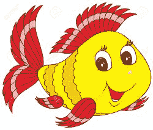

# Linux Fu:替代 Shells

> 原文：<https://hackaday.com/2020/05/21/linux-fu-alternative-shells/>

在 Unix——Linux 的前身——上有`/bin/sh`。与今天的 shells 相比，它很简单，但是它允许您输入命令，最重要的是，允许您执行命令列表。事实上，它是一种简单的编程语言，可以进行决策、循环和其他操作，允许您编写脚本，而不仅仅是要运行的程序列表。然而，它并不总是最容易使用的，所以在真正的 Unix 时尚中，人们开始编写新的 shells。在这篇文章中，我想指出除了无处不在的`bash`之外的几个 shells，T1 是旧的`sh`程序的继承者之一。

从第 7 版 Unix 开始，`sh`实际上是 Bourne shell，以其作者 Stephen Bourne 命名。它取代了 1971 年写的老版《汤普森外壳 T2》。该 shell 与现代 shell 有些相似，但并不是真正为脚本编写而设置的。不过，它确实有重定向和管道的标准语法。PWB 壳牌公司也是取代 Thompson 的早期竞争者，但所有这些壳牌公司几乎都消失了。

你可能会使用`bash`，老实说，读完这篇文章后，你可能会继续使用`bash`。但是有一些选择，对一些人来说，它们是值得考虑的。此外，即使您的主要 shell 是`bash`，您也很可能会遇到一些特殊用途的 shell。

## 两种哲学

当创建一个新的 shell 时，实际上有两条路可走。Unix 和 Linux 定制，以及几个标准，假设您将有`/bin/sh`可用于执行脚本。当然，shell 脚本也可以使用`#!`语法请求特定的解释器。这就是为什么你可以在《T2》这样的作品中写剧本。

这导致了两种不同的方法。您可以创建一个与`sh`兼容但被扩展的新 shell。这就是 Korn shell ( `ksh`)或 Bourne Again shell ( `bash`)采取的方法。另一方面，你可以用 C shell 这样的新东西来完全取代 shell(实际上，现在，`tcsh`已经差不多取代了 C shell)。这些外壳看起来一点也不像经典的外壳。当然，如果你看细节的话，`bash`也不会，但是从表面上看，你可以用`sh`做的大多数事情也可以用`bash`来做，但是`bash`增加了更多。

## 科恩壳牌公司

AT & T 的大卫·科恩写了一个以他名字命名的 shell。如果你只知道`bash`，你和`ksh`在一起会比和`sh`在一起舒服得多。这是一个兼容的外壳，但提供了我们今天认为理所当然的东西。例如，`ksh`提供了命令行编辑、协程和像`select`这样的新控制结构。它还借鉴了 C shell 的思想，比如历史、函数和别名。

唯一的问题是，多年来，美国电话电报公司(at )(美国电话电报公司)一直对其讳莫如深。因此，尽管今天没有多少人使用`ksh`，但是`ksh`中的思想传播到了其他 shells 中，并被广泛使用。有一个公共领域版本，`pdksh`，如果你想尝试一下。

## 灰烬和破折号

Almquist shell，或`ash`，基本上是由 Kenneth Almquist 编写的 Bourne shell 的克隆。没有增加很多功能，但是很小很快。这使得它成为小型 Linux 发行版(如 rescue disks 或嵌入式系统)的流行选择。1997 年，Herbet Xu 将`ash`移植到 Debian 上使用，它变成了`Dash`——Debian Almquist shell。如果你使用任何 Debian 衍生的发行版，你可能会发现`/bin/sh`是一个到`dash`的链接。

## 鱼

 `Fish`不是以任何人的名字命名的——甚至不是一个电视侦探。它代表友好的交互式外壳。与`ksh`、`ash`、`dash`、`bash`不同的是，`fish`并不试图兼容旧的经典 shell 程序。相反，它试图对用户非常友好。例如，当您键入内容时，它会自动给出建议。

`fish`的一大特点是它不隐式创建子 shell。考虑这个(人为的)例子:

`SUCCESS=0; cat /etc/passwd | if grep ^kirk: ; then SUCCESS=1; fi`

在您的 passwd 文件中为一个用户更改“kirk ”,并在`bash`下尝试这样做。然后打印出`$SUCCESS`，你会看到无论如何它都保持为零。原因是管道字符右边的命令部分产生了一个新的 shell。您在那个 shell 中设置了变量，然后该变量退出，您在其中启动的 shell 仍然将`SUCCESS`设置为零。对于鱼类，这种情况不会发生。

如果您正在为新用户设置 Linux，`fish`可能是他们默认 shell 的一个好选择。然而，对于大多数高级用户来说，他们希望坚持更传统的东西。如果你想了解更多，看看下面的视频。

 [https://www.youtube.com/embed/ux1SP9B5lSQ?version=3&rel=1&showsearch=0&showinfo=1&iv_load_policy=1&fs=1&hl=en-US&autohide=2&wmode=transparent](https://www.youtube.com/embed/ux1SP9B5lSQ?version=3&rel=1&showsearch=0&showinfo=1&iv_load_policy=1&fs=1&hl=en-US&autohide=2&wmode=transparent)

## z 外壳

Z 外壳较新，可追溯到 1990 年。这可能是这个榜单上`bash`之外最受欢迎的外壳了。最大的原因之一是它有一个插件架构，允许大量的定制，包括主题和非常复杂的命令行完成。您可以轻松编辑多行命令。一些插件甚至提供类似 FTP 客户端的东西。

许多你从`zsh`中得到的东西都可以添加到`bash`中，但是这将是一个很大的工作量。如果你把`zsh`作为`sh`启动，它会伪装成`sh`——很多高级炮弹都是这么做的。

因为插件架构，有一个类似于`zsh`的应用商店，叫做[哦，我的 ZSH](https://ohmyz.sh/) 如果你浏览它，你可能会尝试一下`zsh`。如果你问一个经验丰富的 Linux 用户——至少在 2020 年——他们使用什么 shell，他们不回答`bash`，他们可能会回答`zsh`。如果你有一个半小时可以消磨，你可能会喜欢下面的视频。

 [https://www.youtube.com/embed/MSPu-lYF-A8?version=3&rel=1&showsearch=0&showinfo=1&iv_load_policy=1&fs=1&hl=en-US&autohide=2&wmode=transparent](https://www.youtube.com/embed/MSPu-lYF-A8?version=3&rel=1&showsearch=0&showinfo=1&iv_load_policy=1&fs=1&hl=en-US&autohide=2&wmode=transparent)

## 还有更多

贝壳大概比较多，但最终还是个人喜好问题。我们正在看的一个是[怒壳](https://github.com/nushell/nushell)。它有一些关于在 Linux 中扩展管道和流的有趣想法。我还没有尝试过，但随着它变得更加稳定，我可能会尝试。如果你是一个`emacs`的粉丝，有`eshell`——我会在以后的帖子中谈到。

如果你好奇，维基百科有一个很好的[贝壳对比矩阵](https://en.wikipedia.org/wiki/Comparison_of_command_shells)。个人？我使用`bash`，但我总是想更好地学习`zsh`。这些我都用过，除了`fish`。你呢？给你最喜欢的 shell 留下评论，尤其是如果它不在这个列表中的话。