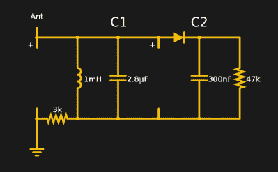
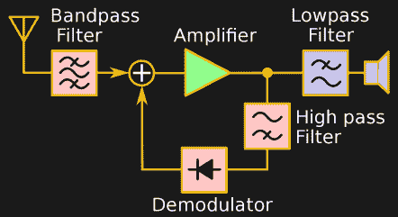
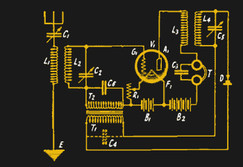

# 早期的无线电接收器是如何工作的

> 原文：<https://hackaday.com/2020/07/10/how-early-radio-receivers-worked/>

如果你曾经建造过水晶收音机，那么从遥远的地方凭空提取声音和音乐是一件神奇的事情。如果你还没有建立一个，也许你应该趁 AM 波段还有一些东西。当然，如今等同物可能是特别提款权。但是，除了计算机解决方案，没有多少方法可以将无线电波转化为智能。从袖珍收音机到高级雷达，再到轨道卫星，接收无线电波的方式都差不多。

然而，有许多方法可以调制和解调无线电波。当然，调幅收音机的工作原理与调频收音机不同。卫星数据下行链路的工作方式也不同。但是多年来，从空气中捕捉无线电波并将其转化为可供进一步处理的形式的过程并没有太大变化。

在本文中，我将讨论您可能在过去几年中见过的最常见的无线电接收机架构，下周我将讨论现代架构。无论如何，了解接收机架构将有助于您设计新的无线电或对其进行故障排除。

## 比较收音机

如果你要给一个接收器评级，有几件事是最重要的:

*   选择性——有大量的无线电波在你周围游动。选择性接收器可以只接收你想要的那一个。当有两个频率相近的强台站时，这一点尤其明显。
*   **灵敏度**–来自天线的信号可能非常微弱。接收器具有不同的灵敏度，更灵敏的接收器会接收到更弱的信号。
*   **噪底**–接收器会有一定量的噪声，这些噪声会掩盖微弱的信号。显然，噪底越低，弱信号的接收效果越好。

## 那个水晶收音机

[水晶收音机](https://hackaday.com/2020/01/28/eric-talks-crystal-radios/)是最简单的收音机设计之一，无需放大器，从无线电信号本身获得能量。你小时候建造的水晶收音机在设计上与最早的收音机非常相似。调谐电路选择频率，检波器(通常是二极管)直接解调信号。如果你算一下，调谐电路对所有频率都是低阻抗的，除了你调谐到的那个频率。在该频率下，线圈和电容有效地相互抵消，并且——如果元件完美——对目标信号呈现无穷大阻抗。这意味着与主信号相比，所有其他信号都将衰减。

这些无线电的原始设计可以追溯到没有好的方法来放大信号的时候，所以它不能。这意味着你需要一个强信号和一个大天线。您还受益于可靠的接地连接。没造过水晶收音机？我最喜欢的模拟器，法尔斯塔德，有一个水晶收音机，你可以[模拟](http://tinyurl.com/y9wsc285)。该模拟依赖于程序的天线组件，该组件具有 3 kHz、2.71 kHz 和 2.43 kHz 的 am 调制信号。

虽然储能电路提供了一些选择性，但不是很好。这个接收器的灵敏度也不是很好。实际应用中一般不会看到这样的电路。然而，有些人喜欢尝试推动水晶收音机的最佳性能，就像 Chris Wendling 在下面的视频中所做的那样。如果你决定建造一个，你可能想从更简单的东西开始。

 [https://www.youtube.com/embed/Bw4IiTR3Tqw?version=3&rel=1&showsearch=0&showinfo=1&iv_load_policy=1&fs=1&hl=en-US&autohide=2&wmode=transparent](https://www.youtube.com/embed/Bw4IiTR3Tqw?version=3&rel=1&showsearch=0&showinfo=1&iv_load_policy=1&fs=1&hl=en-US&autohide=2&wmode=transparent)

## TRF 和反射

水晶收音机的一个升级是 TRF 或调谐无线电频率架构。对于 TRF，你基本上有一个晶体收音机，在检波器前面有一些放大器，在某些频率上比其他频率放大得更好，本质上是带增益的滤波器。

如果你见过前面板上有许多调谐旋钮的 20 世纪 20 年代或 30 年代的收音机，那很可能是 TRF 的收音机。你必须把每个刻度盘调到正确的频率。

TRF 是一个不错的设计，特别是如果你能想出如何从一个单一的控制改变放大器的调谐。但它处于性能范围的低端。然而，许多廉价的收音机仍然使用 TRF，因为 1972 年的芯片和它的后继者将整个 TRF 收音机塞进一个小的集成电路封装中。

该设备看起来像一个晶体管，至少有一个变种里面有 10 个晶体管。它仅使用六个外部元件就能提供 RF 放大、检波甚至自动增益控制。最初的芯片需要一个外部线圈和电容、几个滤波电容和几个电阻来为器件供电并提供自动增益控制(AGC)功能。后来的型号也有一些音频放大阶段。

显然，一种三条腿的设备吸引了那些想制造小型廉价收音机的公司。说到便宜，另一个老版本的 TRF 是反射接收器。它可以追溯到 1914 年，尽管它至少在 20 世纪初的另一个时候被独立发现。

    

想法是使用一个放大器来放大 RF 和音频输出(参见随附的框图和原理图)。这是可能的，因为无线电频率比音频频率高得多，你可以使用滤波器来引导信号通过同一根管子。这种技术现在已经不多见了，但对于节省单个活动设备就能节省大量成本的时代来说，这是一种有趣的解决方案。

## 现代

虽然现在你看不到很多水晶和反射收音机，但仍然有 TRF 的设计，特别是基于许多这样工作的 IC。然而，如果你想做一个非常简单但可行的收音机，再生接收器可能是一个更好的选择。还有直接变频接收机，你可以看到很多软件定义的无线电设置。黄金标准是超外差接收机，这是今天绝大多数设备所使用的。

我将在下一篇文章中讨论这些架构以及其他一些架构。同时，看看你能做些什么来建造水晶收音机。如果没有合适的零件，可以用普通物品制作大部分[。如果你没有二极管，你可以使用刀片和铅笔，正如[RimstarOrg]——hack aday 自己的 Steven Dufresne 的 YouTube 频道——在下面的视频中所示。](https://hackaday.com/2016/05/26/phd-crystal-radio-has-pizza-capacitor/)

 [https://www.youtube.com/embed/eIdHsjfbckw?version=3&rel=1&showsearch=0&showinfo=1&iv_load_policy=1&fs=1&hl=en-US&autohide=2&wmode=transparent](https://www.youtube.com/embed/eIdHsjfbckw?version=3&rel=1&showsearch=0&showinfo=1&iv_load_policy=1&fs=1&hl=en-US&autohide=2&wmode=transparent)

鸣谢:大多数漂亮的框图和原理图图片都来自维基百科上的公共领域资源，尤其是来自[Chetvorno]。多么棒的资源。